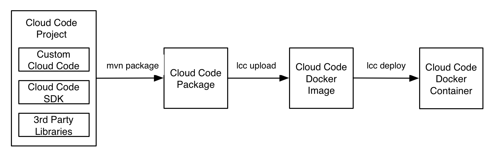

# LAS Cloud Code 使用指南

## Cloud Code简介

###什么是Cloud Code服务
Cloud Code是部署运行在Leap Cloud上的代码，您可以用它来实现较复杂的，需要运行在云端的业务逻辑。它类似于传统的运行在Web server上的Web Service或RESTful API。它对外提供的接口也是RESTful API，也正是以这种方式被移动应用调用。

###为什么需要Cloud Code服务

如果应用非常简单，我们可以将业务逻辑都放在客户端里面实现。然而，当应用需要实现比较复杂的业务逻辑，访问更多的数据或需要大量的运算时，我们便需要借助Cloud Code实现。Cloud Code有如下优势：

* 强大的运算能力：Cloud Code运行在Leap Cloud的Docker容器中，可以使用多个CPU和大容量内存进行计算
* 更高效：可以在一次调用中通过高速网络多次请求Cloud Data，大大提升效率
* 同一套代码可以为iOS，Android，web site等提供服务

###Cloud Code如何工作

<p class="image-wrapper">


一个Cloud Code项目包含Custom Cloud Code，Cloud Code SDK，3rd Party Libaries。开发完成后，用maven把项目打包成package，然后用Cloud Code命令行工具lcc上传到Leap Cloud，Leap Cloud会生成对应的docker image。用lcc deploy可以让Leap Cloud启动Docker container运行该Docker image。

目前Cloud Code支持Java环境，我们在近期会推出Python版本。
	  
##准备工作
####安装JDK
Cloud Code SDK支持 JDK6, 7, 8，推荐使用JDK8。

####安装Maven
######Eclipse:	
1.	点击"Help" >> "Install New Software.."
2.	在"Work with"中输入：`http://download.eclipse.org/technology/m2e/releases`，在列表中选择"Maven Integration for Eclipse"，即可安装Maven插件。

####安装Cloud Code Command Line Tools（Lcc）
######Linux 和 Mac OSX
下述命令将把名为"lcc"的工具安装至`/usr/local/bin/lcc`目录。完成后，您可直接在Terminal中使用lcc。

*［！！待选择！！］*

*	自动安装

	```shell
	curl -s https://******/installer.sh | sudo
	```

*	Git获取

	进入目录/usr/local/bin，运行git命令获取：
		
	```java
	cd /usr/local/bin
	git clone https://gitlab.ilegendsoft.com/zcloudsdk/zcc.git
	```

## 快速入门
### 创建Cloud Code项目
获取LAS Cloud Code Java项目模板

```shell
git clone https://gitlab.ilegendsoft.com/zcloudsdk/cloud-code-template-java.git
```

### 修改配置
在/src/main/resources/config（请确保此路径存在）中，添加global.json文件，并在其中添加如下配置：

```java
{
	"applicationName" : "helloword",
	"applicationId": "YOUR_APPLICATION_ID",
	"applicationKey": "YOUR_MASTER_KEY",
	"lang" : "java",
	"java-main": "Main",
	"package-hook" : "YOUR_HOOK_PACKAGE_NAME",
	"package-entity" : "YOUR_ENTITY_PACKAGE_NAME",
	"global": {
		"version": "0.0.1"
	}
}
```

根据创建应用时获取的key，修改下列键的值：
	
键|值|
------------|-------|
applicationName|LAS应用名称
applicationId|Application ID
applicationKey|Master Key
java-main|入口函数名
package-hook|Hook目录
package-entity|Class实体目录
version|当前Cloud Code项目版本号

### 定义一个简单的function

```Java
import as.leap.code.LASLoader;
import as.leap.code.Response;
import as.leap.code.impl.GlobalConfig;
import as.leap.code.impl.LoaderBase;
import as.leap.code.impl.Response;

public class Main extends LoaderBase implements Loader {
    @Override
    public void main(GlobalConfig globalConfig) {
    
    	//定义Cloud Function
        defineFunction("hello", request -> {
            Response<String> response = new Response<String>(String.class);
            response.setResult("Hello, " + request.parameter(Map.class).get("name") + "!");
            return response;
        });
    }
}
```
> **需注意：** 
>
Main class的main method是Cloud Code启动的入口（在global.json中指定），需要继承LoaderBase并实现Loader接口，在main方法中需要注册所有的cloud function和job。

### 打包

在当前项目根目录下运行Maven命令：

`mvn package`

我们将在项目根目录下的target文件夹中发现 *xxx-1.0-SNAPSHOT-mod.zip* 文件，这便是我们想要的package.

### 上传Cloud Code及部署
	1. 登录：lcc login <UserName>
	2. 选择所要部署的目标应用，作为后续操作的上下文：lcc use <AppName>
	3. 上传Package： lcc upload <PackageLocation>
	4. 部署Cloud Code：lcc deploy <VersionNumber>
> **需注意：** 
>
*	这里的VersionNumber定义在您Cloud Code项目中的global.json文件中（version字段的值）
*	请查看[lcc使用向导](...)，以获取lcc的更多信息。

### 测试

通过 curl，我们向部署好的Cloud Function发送如下POST请求，以测试我们的Function是否部署成功：

```shell
curl -X POST \
-H "X-LAS-AppId: YOUR_APPID" \
-H "X-LAS-APIKey: YOUR_APIKEY" \
-H "Content-Type: application/json" \
-d '{"name":"David Wang"}' \
https://api.leap.as/functions/hello
```
此时，我们将得到如下结果：

```shell
Hello, David Wang!
```
表明测试通过，部署成功。

>注意:

>X-LAS-APIKey的值为应用的API KEY，而非Cloud Code项目中使用的Master Key.

## Cloud Function
Cloud Function是运行在Leap Cloud上的代码。可以使用它来实现各种复杂逻辑，也可以使用各种3rd Party Libs。

###定义Cloud Function
每个Cloud Function需要实现 as.leap.code.Handler interface，该interface是典型的Functional Interface。

```Java
public interface Handler <T extends as.leap.code.Request, R extends as.leap.code.Response> {
    R handle(T t);
}
```
用JDK 8 lambda表达式可以如下定义一个function:

```Java
request -> {
    Response<String> response = new Response<String>(String.class);
    response.setResult("Hello, world!");
    return response;
}
```
JDK6和7可以如下定义:

```Java
public class HelloWorldHandler implements Handler {
    public Response handle(Request request) {
        Response<String> response = new ResponseImpl<String>(String.class);
        response.setResult("Hello, world!");
        return response;
    }
}
```
最后，需要在main class里注册该函数。

```Java
defineFunction("helloWorld", new HelloWorldHandler());
```
###通过Cloud Function访问Cloud Data

####定义Cloud Data Object（在管理界面中，称之为“Class”）
新建一个Cloud Data Object，并继承CloudObject类

```java
public class MyObject extends CloudObject {
    private String name;
    
    public String getName() {
        return name;
    }
    
    public void setName(String name) {
        this.name = name;
    }
    
}
```
定义Cloud Data Object需注意：

* 一个 Cloud Data Object 对应一个 Cloud Data class，Cloud Data Object 的类名必须和管理界面中创建的 class 名字一样
* 须将所有的 Cloud Data Object 放入同一个package中，推荐在/src/main/java下新建一个package，如：“data”
* 须配置global.json文件以识别该package，如：`"package-entity" : "data"`

####Cloud Data Object的CRUD

我们可以通过 EntityManager 操作 Cloud Data：

```java
public void doSomethingToCloudData(){
	EntityManager<MyObject> myObjectEntityManager = EntityManagerFactory.getManager(MyObject.class);
	MyObject obj = new MyObject();
	obj.setName("Awesome");
	String name = obj.getName();

	//新增Object
	SaveResult<MyObject> saveMsg = myObjectEntityManager.create(obj);
	String objObjectId = saveMsg.getSaveMessage().objectId().toString();
	
	//复制Object
	obj.setName(name + "_" + 2);
	SaveResult<MyObject> cloneSaveMsg = myObjectEntityManager.create(obj);
	
	//查询Object
	Query sunQuery = Query.instance();
	sunQuery.equalTo("name", name + "_" + 2);
	FindMsg<MyObject> findMsg = myObjectEntityManager.find(sunQuery);
	MyObject newObj = findMsg.results().get(0);
	
	//更新Object
	Update update = Update.getUpdate();
	update.set("name", name + "_new");
	UpdateMsg updateMsg = myObjectEntityManager.update(newObj.objectIdString(), update);
	
	//删除Object
	DeleteResult deleteResult = ninjaEntityManager.delete(objObjectId);
}
```

####使用Cloud Function

#####API方式调用
请求格式如下所示：

```shell
curl -X POST \
-H "X-LAS-AppId: YOUR_APPID" \
-H "X-LAS-APIKey: YOUR_APIKEY" \
-H "Content-Type: application/json" \
-d '{"name":"David Wang"}' \
https://api.leap.as/functions/hello
```
	
#####通过Android/iOS SDK调用：
Android SDK中：

```java
Map<String, Object> params = new HashMap<String, Object>();
params.put("key1", 1);
params.put("key2", "2");

CloudManager.callFunctionInBackground("hello", params, new FunctionCallback<JSONObject>() {
	@Override
	public void done(JSONObject object, Exception exception) {
		assertNull(exception);
	}
});
```
iOS SDK中：

```java
Map<String, Object> params = new HashMap<String, Object>();
params.put("key1", 1);
params.put("key2", "2");

CloudManager.callFunctionInBackground("hello", params, new FunctionCallback<JSONObject>() {

	@Override
	public void done(JSONObject object, Exception exception) {
		assertNull(exception);
	}
});
```

## Background Job
Cloud Code中，您还可以自定义后台任务，它可以很有效的帮助您完成某些重复性的任务，或者定时任务。如深夜进行数据库迁移，每周六给用户发送打折消息等等。您也可以将一些耗时较长的任务通过Job来有条不紊地完成。

###创建和监控Background Job
####在Cloud Code中定义并实现Job Handler
``` java
public class MyJobHandler implements Handler {
    public Response handle(Request request) {
        Response<String> response = new ResponseImpl<String>(String.class);
        response.setResult("Job done!");
        return response;
    }
}
```

然后进入主程序入口(main函数)，使用defineJob来定义Job

``` java
defineJob("myJob", new MyJobHandler());
```
###测试Background Job
我们可以利用curl测试Job是否可用

```shell
curl -X POST \
-H "X-ZCloud-AppId: YOUR_APPID" \		
-H "X-ZCloud-APIKey: YOUR_APIKEY" \
-H "Content-Type: application/json" \
https://api.leap.as/jobs/YOUR_JOBNAME
```

####在管理界面中设置 Job Schedule
img

表单项目|作用 
----|-------|
名称|任务的名字|
函数名|想要执行的Backgroud Job的名字
设置开始|从何时开始执行任务
设置重复|每隔多久重复执行任务
参数|提供数据给Backgroud Job

####在管理门户中查看状态
进入“开发者中心”，点击“任务” >> “任务状态”，您将能查看所有的任务列表，以及他们的状态概况。
选中您想要查看的任务，便可以查看任务详情。
img

## Hook for Cloud Data
Hook用于在对 Cloud Data 进行任何操作时（包括新建，删除及修改）执行特定的操作。例如，我们在用户注册成功之前，可以通过beforeCreate Hook，来检查其是否重名。也可以在其注册成功之后，通过afterCreate Hook，向其发送一条欢迎信息。Hook能很好地实现与数据操作相关的业务逻辑，它的优势在于，所有的业务在云端实现，而且被不同的应用/平台共享。

###创建和使用Hook
实现EntityManagerHook接口(建议直接继承EntityManagerHookBase类，它默认为我们做了实现，我们想要hook操作，只需直接重载对应的方法即可)

```java
@EntityManager("MyObject")
public class MyObjectHook extends EntityManagerHookBase<MyObject> {
	@Override
	public BeforeResult<MyObject> beforeCreate(MyObject obj) {
		EntityManager<MyObject> myObjectEntityManager = EntityManagerFactory.getManager(MyObject.class);
		//创建obj前验证是否重名了
		Query sunQuery = Query.instance();
		sunQuery.equalTo("name", obj.getName());
		FindMsg<MyObject> findMsg = myObjectEntityManager.find(sunQuery);
		if (findMsg.results() != null && findMsg.results().size() > 0)
			return new BeforeResult<>(obj,false,"obj name repeated");
		return new BeforeResult<>(obj, true);
	}
	
	@Override
	public AfterResult afterCreate(BeforeResult<MyObject> beforeResult, SaveMsg saveMessage) {
		EntityManager<MyObject> myObjectEntityManager = EntityManagerFactory.getManager(MyObject.class);
		//创建完obj后修改这个obj的ACL权限
		Map<String,Map<String,Boolean>> acl = new HashMap<>();
		Map<String,Boolean> value = new HashMap<>();
		value.put("read", true);
		value.put("write", true);
		acl.put(saveMessage.objectId().toString(), value);
		Update update = new Update().set("ACL", acl);
		myObjectEntityManager.update(saveMessage.objectId().toString(), update);
		AfterResult afterResult = new AfterResult(saveMessage);
		return afterResult;
	}
}
```

#####定义Hook需注意：

* 确保目标Cloud Data Object对应的class存在
* Hook类上需要添加`@EntityManager`注解，以便服务器能够识别该Hook是针对哪个实体的
* 须将所有的hook class放入同一个package中，推荐在/src/main/java下新建一个package，如：“hook”
* 须配置global.json文件以识别该package，如：`"package-hook" : "hook"`
* 内建class和自定义class均支持Hook，内建class原有的限制（ _User用户名和密码必填， _Installation的deviceToken和installationId二选一）依然有效。

### Hook类型

Cloud Code支持六种类型的Hook：
#### beforeCreate
在对应的 Cloud Data 被创建之前调用，可以用于验证输入的数据是否合法。

例如：在新建好友分组的时候，需要检查组名是否太长。

```java
@Override
public BeforeResult<FriendList> beforeCreate(FriendList list) {
	String name = list.getName();
	if (name.length() >= 10)
		return new BeforeResult<>(obj, false, "Cannot create a friend list with name longer than 10!");
	return new BeforeResult<>(obj, true);
}
```

#### afterCreate
在对应的 Cloud Data 被创建后调用，可以用于执行如 User 创建后给客户经理发封邮件这样的逻辑。

#### beforeUpdate
在对应的 Cloud Data 被更新之前调用，可以用于验证输入的数据是否合法。

例如：在修改好友分组的时候，需要检查组名是否已经存在。

```java
@Override
public BeforeResult<FriendList> beforeUpdate(FriendList list) {
	//定义查询条件：
	Query sunQuery = Query.instance();
	sunQuery.equalTo("Name", list.getName());
	//在“好友”表中执行查询
	EntityManager<Friend> friendEntityManager = EntityManagerFactory.getManager(Friend.class);
	FindMsg<Friend> findMsg = friendEntityManager.find(sunQuery);	
	if (findMsg.results() != null && findMsg.results().size() > 0)
		return new BeforeResult<>(obj, false, "Update failed because the name of the friend list already exists!");
	return new BeforeResult<>(obj, true);
}
```

#### afterUpdate
在对应的 Cloud Data 被更新之后调用，可以用于如用户更新密码后，给用户邮箱发封提醒邮件。

#### beforeDelete
在对应的 Cloud Data 被删除之前调用，可以用于验证删除是否合法。

例如：用户的每位好友都在某个分组下，在删除一个好友分组之前，需要检查这个分组内是否还存在好友。

```java
@Override
public BeforeResult<FriendList> beforeDelelte(FriendList list) {
	//定义查询条件：
	Query sunQuery = Query.instance();
	sunQuery.equalTo("listName", list.Name);
	//在“好友”表中执行查询
	EntityManager<Friend> friendEntityManager = EntityManagerFactory.getManager(Friend.class);
	FindMsg<Friend> findMsg = friendEntityManager.find(sunQuery);
	
	if (findMsg.results() != null && findMsg.results().size() > 0)
		return new BeforeResult<>(obj, false, "Cannot delete a friend list if any friend inside!");
	return new BeforeResult<>(obj, true);
}
```

#### afterDelete
在对应的 Cloud Data 被删除之后调用，可以用于如清除其他有关的数据。

## Logging
Cloud Code提供Logging功能，以便您能记录Function，Hook或者Job在运行过程中出现的信息。除此之外，Cloud Code的部署过程，也将被记录下来。您可以在管理界面中查看所有的日志。
###在Cloud Code中记录Log
您可以使用logger实例，记录3种级别的日志：Error，Warn和Info.

```java
public class MyClass {
	Logger logger = LoggerFactory.getLogger(myClass.class);

	public void myMethod(){
		logger.error("Oops! Error, caught you!");
		logger.warn("I'm Warning.");
		logger.info("I'm Information");
	}
}
```
使用Log需注意:

* 本地测试不会产生数据库记录，但发布后会产生记录，你可以在后端界面查看你的日志信息
* 如果您的Function调用频率很高，请在发布前尽量去掉调试测试日志，以避免不必要的日志存储
	
###系统自动记录的Log
除了手动记录的Log外，系统还将自动为您收集一些必要的日志，包括：

* Cloud Function的上传部署信息
* Hook Entities的Cache信息
* Cloud Code相关的API request信息
	
###查看Log
可以使用命令行工具lcc查看最近的log

```shell
lcc log -n 100
```
也进入“管理网站”，点击“开发者中心”－>“日志”，您便可查看该应用的所有日志。
img

## LCC － Cloud Code 命令行工具
LCC命令行工具是为Cloud Code项目的上传，部署，停止及版本管理而设计的。您可以利用它，将Maven项目生成的package上传到Leap Cloud，在云端，package将被制作成Docker Image，而部署过程，就是利用Docker Container将这个Image启动。而被上传到云端的每个版本的Cloud Code都将被保存，您可以自由地卸载某一个版本，而后部署另外一个版本的Cloud Code.
###登录:
```shell
lcc login <用户名>
```
`<用户名>` 为您登录LAS管理门户的账号，然后根据提示输入密码
###显示所有app：
```shell
lcc apps
```
查询账号下的所有应用，显示的信息为：AppId ：AppName
###选择应用:
```shell
lcc use <应用名>
```
`<应用名>`为目标应用名。选择之后，接下来的操作（上传/部署/停止/版本管理）都将以此应用为上下文。
###上传Cloud Code:
```shell
lcc upload <文件路径>
```
`<文件路径>`为你将部署的Cloud Code package（zip文件，由mvn package命令生成），它将被上传到步骤3指定的应用下。
上传的的代码会被制作成Docker镜像，版本号在Cloud Code项目里的global.json文件中指定：
```
"global": {
	"version": "0.0.1"
}
```
###显示所有云端Cloud Code版本:
```shell
lcc lv
```
即显示所有该应用下，用户上传过的Cloud Code的所有版本号。
###部署Cloud Code：
```shell
lcc deploy <版本号>
```
`<版本号>`为如lcc deploy 0.0.1，将部署指定应用下版本号为0.0.1的Cloud Code；如果部署不存在的版本，会提示错误："version of appId not exists"
###停止cloudcode：
```shell
lcc undeploy
```
停止该应用的Cloud Code，如果之前已经部署过一个版本，需要先停止，再部署。
###输出最近的日志：
```shell
lcc log [-l <info|error>] [-n <number of log>] [-s <number of skipped log>]

-l 指定输出日志的级别：info或是error
-n 指定log的数量
-s 指定跳过最近的log数量
```

## Cloud Code进阶
### 添加 Cloud Code 到已有的项目
####配置pom.xml
在pom中，我们将配置：

* 获取Cloud Code SDK
* 获取测试插件JUnit
* 获取编译打包插件

```Java
	//添加依赖，获取Cloud Code SDK及JUnit测试插件
    <dependencies>
        <dependency>
            <groupId>com.ilegendsoft</groupId>
            <artifactId>cloud-code-test-framework</artifactId>
            <version>2.2.1-SNAPSHOT</version>
        </dependency>
        <dependency>
            <groupId>junit</groupId>
            <artifactId>junit</artifactId>
            <version>4.11</version>
            <scope>test</scope>
        </dependency>
    </dependencies>
	
	//获取编译打包插件
    <build>
        <plugins>
            <plugin>
                <groupId>org.apache.maven.plugins</groupId>
                <artifactId>maven-dependency-plugin</artifactId>
                <executions>
                    <execution>
                        <id>copy-mod-dependencies-to-target</id>
                        <phase>process-classes</phase>
                        <goals>
                            <goal>copy-dependencies</goal>
                        </goals>
                        <configuration>
                            <outputDirectory>target/lib</outputDirectory>
                            <includeScope>compile</includeScope>
                        </configuration>
                    </execution>
                </executions>
            </plugin>
            <plugin>
                <artifactId>maven-assembly-plugin</artifactId>
                <configuration>
                    <descriptors>
                        <descriptor>src/main/assembly/mod.xml</descriptor>
                    </descriptors>
                </configuration>
                <executions>
                    <execution>
                        <id>assemble</id>
                        <phase>package</phase>
                        <goals>
                            <goal>single</goal>
                        </goals>
                    </execution>
                </executions>
            </plugin>
          <plugin>
            <groupId>org.apache.maven.plugins</groupId>
            <artifactId>maven-compiler-plugin</artifactId>
            <version>3.0</version>
            <configuration>
              <source>1.8</source>
              <target>1.8</target>
            </configuration>
          </plugin>
        </plugins>
    </build>
```

####配置打包规则

在/src/main/assembly中新建mod.xml文件，并在其中添加如下配置：

```Java
	<?xml version="1.0" encoding="UTF-8"?>
	<assembly xmlns="http://maven.apache.org/plugins/maven-assembly-plugin/assembly/1.1.2"
	          xmlns:xsi="http://www.w3.org/2001/XMLSchema-instance"
	          xsi:schemaLocation="http://maven.apache.org/plugins/maven-assembly-plugin/assembly/1.1.2 http://maven.apache.org/xsd/assembly-1.1.2.xsd">

	    <id>mod</id>
	    <formats>
	        <format>zip</format>
	    </formats>
	    <includeBaseDirectory>false</includeBaseDirectory>
	    <fileSets>
	        <fileSet>
	            <outputDirectory>/config</outputDirectory>
	            <directory>src/main/resources/config</directory>
	            <includes>
	                <include>**</include>
	            </includes>
	        </fileSet>
	        <fileSet>
	            <outputDirectory>/cloud/public</outputDirectory>
	            <directory>src/main/resources/public</directory>
	            <includes>
	                <include>**</include>
	            </includes>
	        </fileSet>
	        <fileSet>
	            <outputDirectory>/cloud/lib</outputDirectory>
	            <directory>target</directory>
	            <includes>
	                <include>${project.artifactId}-${project.version}.jar</include>
	            </includes>
	        </fileSet>
	        <fileSet>
	            <outputDirectory>/cloud/lib</outputDirectory>
	            <directory>target/lib</directory>
	            <excludes>
	                <exclude>jackson-*.jar</exclude>
	                <exclude>vertx-*.jar</exclude>
	                <exclude>log4j-*.jar</exclude>
	                <exclude>slf4j-*.jar</exclude>
	                <exclude>cloud-code-base-*.jar</exclude>
	                <exclude>cloud-code-sdk-client-*.jar</exclude>
	                <exclude>cloud-code-test-framework-*.jar</exclude>
	                <exclude>netty-*.jar</exclude>
	                <exclude>rxBus-*.jar</exclude>
	                <exclude>rxjava-*.jar</exclude>
	                <exclude>sun-client-api-*.jar</exclude>
	                <exclude>hazelcast-*.jar</exclude>
	                <exclude>junit-*.jar</exclude>
	            </excludes>
	        </fileSet>
	    </fileSets>
	</assembly>
```

请注意：如果您选择将打包配置文件放在其他路径下，您则需要更新pom.xml文件中的以下部分，将`src/main/assembly/mod.xml`替换为您自定义的路径：

```java
	<plugin>
		<artifactId>maven-assembly-plugin</artifactId>
		<configuration>
			<descriptors>
				<descriptor>src/main/assembly/mod.xml</descriptor>
			</descriptors>
		</configuration>
	</plugin>	
```