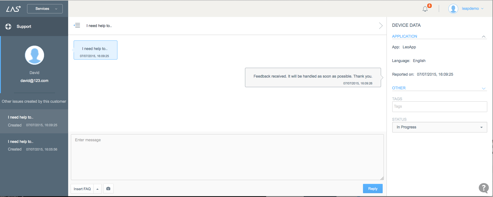

# Customer Support
## Introduction
Customer Support Service provide App with the ability to show App FAQs to users and collect Issue reported by user, witch makes Customer Service more convinient for App Operation. For more information on how to set up Customer Support Service in App, you can refer to [LAS Support SDK Guide](..).

## FAQ

#### What is FAQ
FAQ contains a list of Frequently Asked Questions about the App, which can be devided into different categories and languages. Each of the FAQ item will be created in Console and passed to App, and users can refer to those FAQs when they need help. FAQ can also be used as a reference when tech support team are solving issues reported by users.
	
#### How to Create FAQ
?? REMOVED FROM CONSOLE ??

#### Where to Use FAQ

All the FAQ created in Console will be shown in App with below interface:

	

	
	
	
## Issue

#### What is Issue

Issue is the feedback information from App User, which is submitted within App and handled in Console by tech support team.

FAQs can solve most problems for users, but when it comes to the circumstance that the problem users encountered can’t be found in FAQs, users can submit an Issue.

#### Submit Issue in App

1. Click the *Contact Us* button in FAQs interface and enter the Conversation page. 

	

	

2. Complete Issue details with information: name, email address and issue description:

	

3. Submit. And this issue will be shown in Console, pending resolution from tech support team.

	

#### Handle Issue in Console

##### List all issues
Go to LAS Console >> Support, and you will see all the issues reported by users, which is divided into four categories: New Issues, Open Issues, Closed Issues and All Issues. The issues will be placed in New Issues firstly and then the Open Issues after you replied it. This issue will end up in the Close Issues when you solved the problem or just couldn’t figure it out. The three categories we just mentioned are all available in All Issues.

	

##### Handle an issue
By clicking the Issue, you can see the details of the issue:
 
Username and issue info on the left with username, email address, issue name, issue creation date and processing status;
 
main interface and user dialog box in the middle for you to check the chat history, send text, imagesor insert an existed FAQ;
 
device and app info on the right for your to add tags or edit status for this issue.
 
You can mark the issue as Resolved if you already solved it, Rejected if you refuse to answer it or Closed if you fixed it.
 

	
 
 
 
 
 
 
 
 