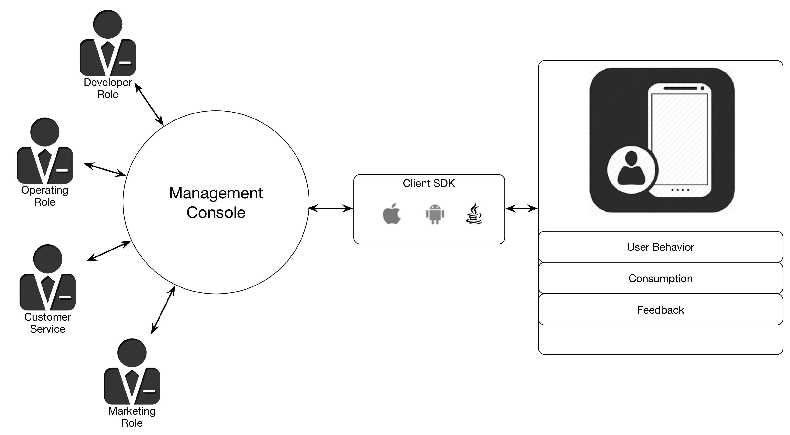
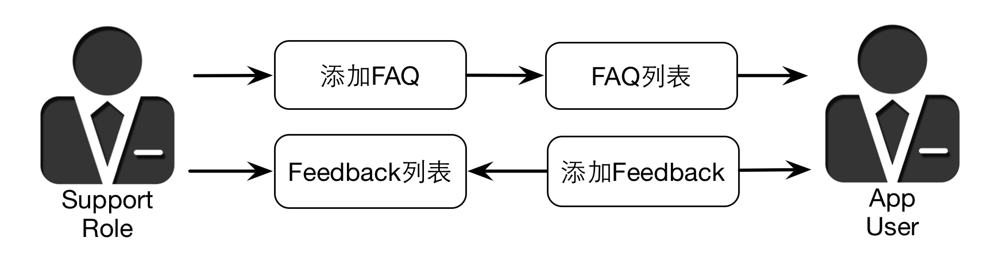

#Overview of MaxLeap Service

##What is MaxLeap Service

MaxLeap Service provides **a Package Solution of MBaaS** for app development, mobile operation, marketing and customer service. MaxLeap provides cloud storage, cloud code, push notification, analytics, user management and support with client SDK and back-end management website.

* Developer: Get rid of IT infrastructure, as well as the implementation & testing of corresponding backend services;
* Operator: Optimize operation strategies with comprehensive operation analytics;
* Marketer: Improve conversion with precise marketing campaign;
* Support: Improve customer satisfaction by handling feedback timely and efficiently.

With all strategies aforementioned, MaxLeap Service can help you transfer your concept into a real app and imporve your user engagament and business with efficient operation and marketing campaign. 

##Development: Expedited Launch
Traditional app developer may be caught by the 80-20 Law during the app development: 80% time are spent in improving the user experience and other events that are not related to the revenue, while only 20% time are spent in invention realization and revenue expansion.

#####Invention
The trational app development includes:

* Buy Server: Data server/Back-end server
* Construct database and develop back-end service
* Develop mobile SDK for all platforms
* Extensive test: the stability of database and server, the accuracy of SDK
* Realize app invention

While, MaxLeap Service removed all obstacles for you and your invention. You have already got the necessary back-end system and mobile SDK for developers, the powerful back-end management system for developers/operators/marketers/support team on starting MaxLeap Service.

#####Safety
The back-end infrastructure architecture provided by MaxLeap has supported app with billions of users and greatly guaranteed its stability and safety.

##Data: Professional Analytics

The mobile app market is no longer about the quiet efforts. Along with the app popularity, the acquisition and analysis of data is the only way to realy get to know users and operation status, thus make appropriate  strategies.

The Analytics provided by MaxLeap can comprehensively analyze your operation status, get a deep understanding of typical users, optimize operation strategies and finnaly realize the ability to:

*	Penetrate the overview and trend of your operation: You can understand the operation status and iteration effect with properties from new users, active users, session amount, versions to user actions, properties and behaviors.
*	Penetrate user actions: Reproduce the screenflow of each user and get to know the engagement, retention and conversion.
*	Improve user experience: Define user segments and assign customized experience for each segment.
*	Improve Revenue: Track the payment trend, make marketing campaign and maximize your marketing effect.

#####Segment
You can create a user segment based on analysis results and any combination of user properties. Then you can analyze different behavior of certain user segment and customize app experience and marketing campaign.

##Marketing: Precise Promotion
Your marketing campaign will be more effective and precise with MaxLeap Service. A typical MaxLeap app marketing can be summarized as follows:

1. Marketers check analysis report and plan a campaign based on marketing history, current user engagement and payment.
2. Send different push notifications or in-app messages to different segments.
3. Schedule or reschedule the marketing campaign.
4. Check marketing campagin list in real time and timely modify it.

As mentioned above, MaxLeap Service can easily help you make reasonable marketing strategies, check marketing status in real time and greatly improve your business.

##Users: Timely Support

In order to improve customer satisfaction, MaxLeap provide you with a standard customer service system. This project provides complete FAQ page and feedback chat window in clients and an easy-to-use FAQ management and feedback handling page in Console. 

 

##Next

* Please go back to [Documents](ML_DOCS_GUIDE_LINK_PLACEHOLDER_DOCHOME) for more detailed information about MaxLeap Service.
* Please check [iOS Guide](ML_DOCS_GUIDE_LINK_PLACEHOLDER_IOS)or [Android Guide](ML_DOCS_GUIDE_LINK_PLACEHOLDER_ANDROID) for SDK Guide.

