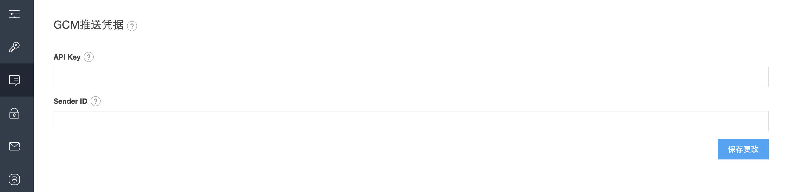
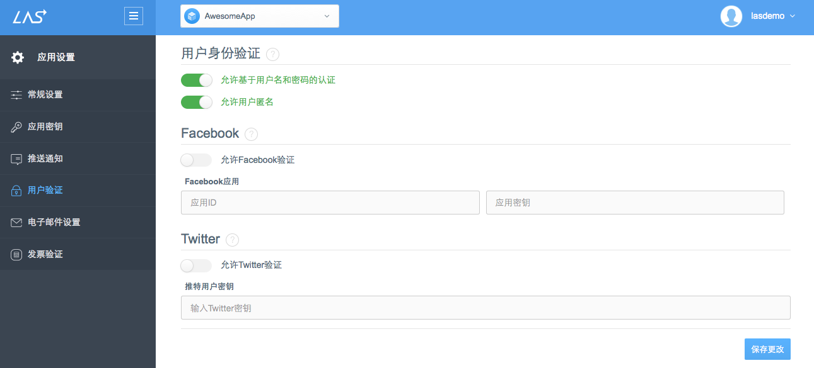
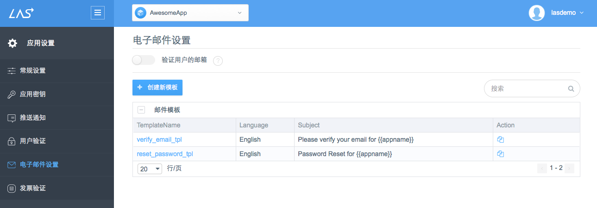
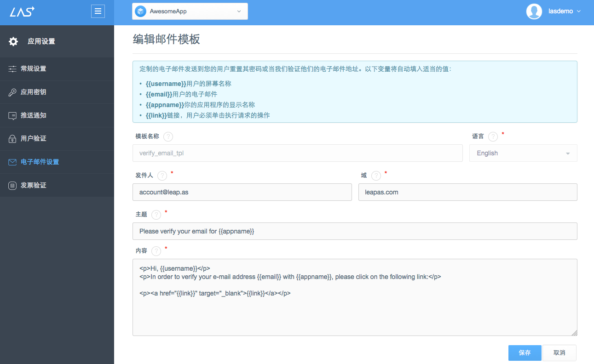

# App Settings
##Introduction
You can get and modify the relative settings of your app in App Settings:

* Application Keys
* Product Release Information: inlcuding URL Schema, App Store ID and etc.
* App Config: including Push Notifications, User Authentication, Email Settings, App Permission, etc.

##General Settings
You can config following information of an app in General Settings:

####Basic Info
* Leap Cloud App Name:
* URL:??
* Default language: ？？
* Description: ？？

####Release Product
Android：

* Android URL Schema
* Android Package Name
* Google Play Store
* App Icon:

####Delete Application
You can delete the app by clicking the bottom-left button to delete the app and all of its data permanently. 

##Application Keys
The Applications Keys you can check includes:

* Application ID：
* Client Key：
* Javascript Key：
* REST API Key：
* Master Key：

##Push Notification

Fill GCM Push Credentials:

Please check [Push Guide](..) for more detailed information of Push Notification.

##User Authentication
You can turn on/off the authentications below:

* Allow username and password-based authentication
* Allow anonymous users
* Allow third-party authentication: including Facebook and Twitter.

Please check [User Authentication Guide](..) for more detailed information of User Authentication.

##Email Settings 
Leap Cloud can send emails automatically in following conditions: 
* **Email Verification**: You can decide whether your users need to verfiy their email when sign up or change email address by turning on/off "Verify user's email address".
* Password Reset

Meanwhile, you can customize the templates of the emails.

