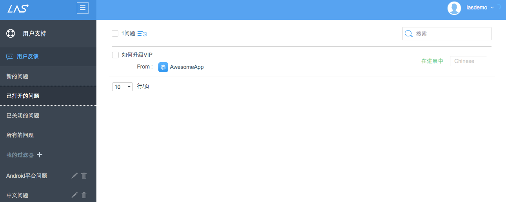
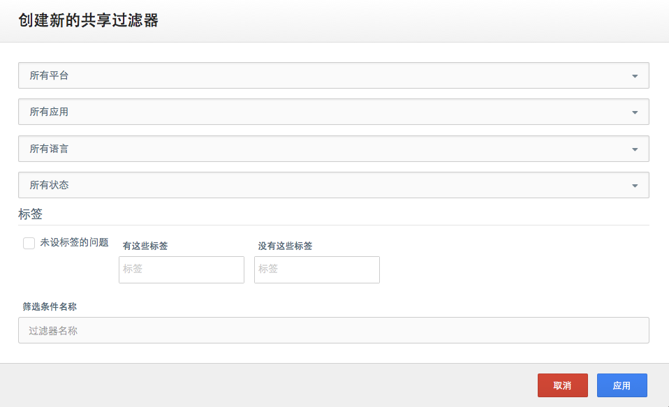
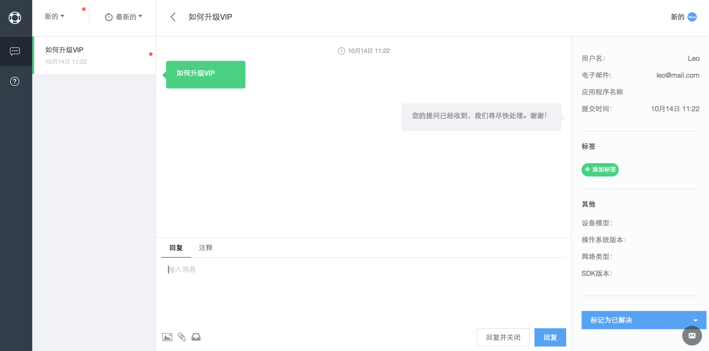
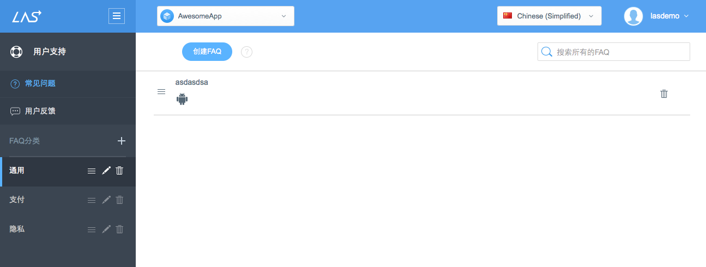
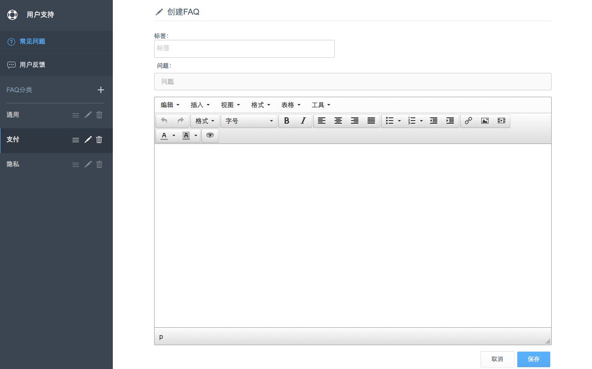

#Support
##Introduction
Support is a comprehensive customer service project provided by Leap Cloud for developers.This project provides complete FAQ page and feedback chat window in clients. Support service also provides FAQ list management and feedback handling interface in Console.

**If you want to learn more about LAS Support Service SDK, please check [iOS Guide － Support](LAS_DOCS_GUIDE_LINK_PLACEHOLDER_IOS#SUPPORT_EN) or [Android Guide － Support](LAS_DOCS_GUIDE_LINK_PLACEHOLDER_ANDROID#SUPPORT_EN) for more detail.**

##App Issues

###Check App Issue List
The app issues can be devided into 4 categories:

* New Issues: the unread issues 
* My Open Issues: the issues that are been handling
* My Closed Issues: the resolved issues 
* All Issues 

You can check the overview of each issue in the list, including: title, relative app, status and language.

Besides, you can filter the issues by adding **My Filters**: 

###Handle App Issues

You can enter the issue detail page by clicking on it and find informations below:

* All issues created by this user
* Chat window with this user: the message you send here will show in user's client in real time
* Resource: the relative app
* Tag: you can add tags for issues to categorize them for creating filters later some time 

Notice:

You can send images or existing FAQs when communicating with users or handling issues. （Please check contents below for FAQ）

##FAQ
###Check FAQ List
All FAQs will be stored in different sections and synchorized between client and Console. LAS will create 3 default sections for you: General, Billing and Privacy.

You can add customized FAQ section by clicking the "+" button on top of the FAQ list. Besides, you can drag, edit or delete any section. 

###Add FAQ 

You can add FAQ in any section by clicking the "+ FAQ" button.

## Next 

**If you want to learn more about LAS Support Service SDK, please check [iOS Guide － Support](LAS_DOCS_GUIDE_LINK_PLACEHOLDER_IOS#SUPPORT_EN) or [Android Guide － Support](LAS_DOCS_GUIDE_LINK_PLACEHOLDER_ANDROID#SUPPORT_EN) for more detail.**
