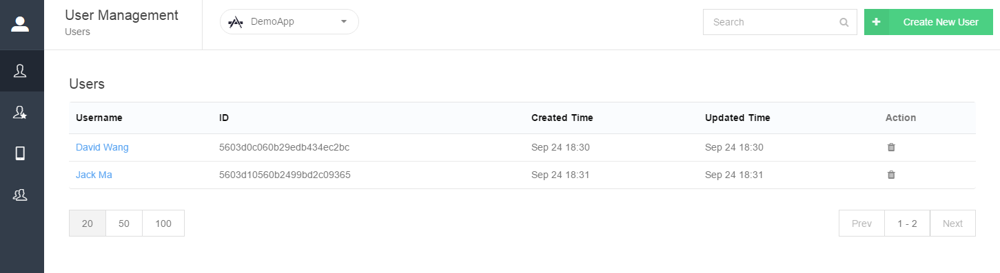
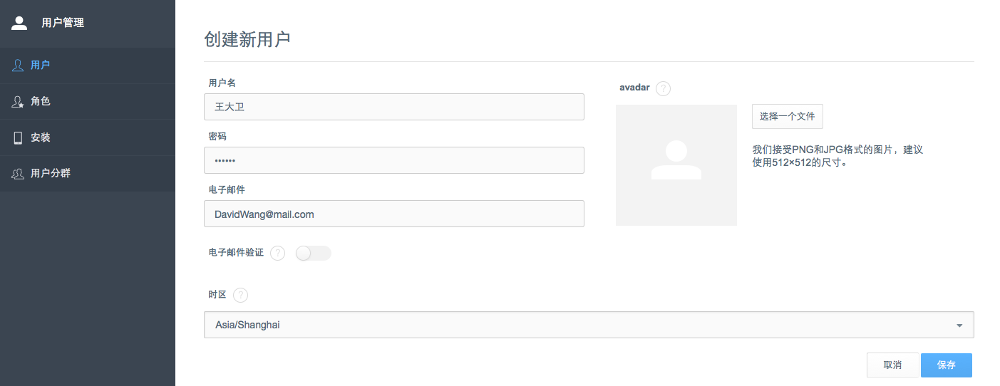
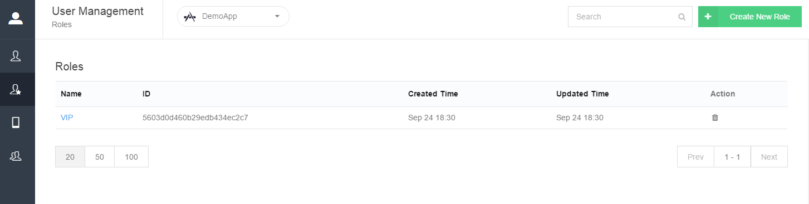
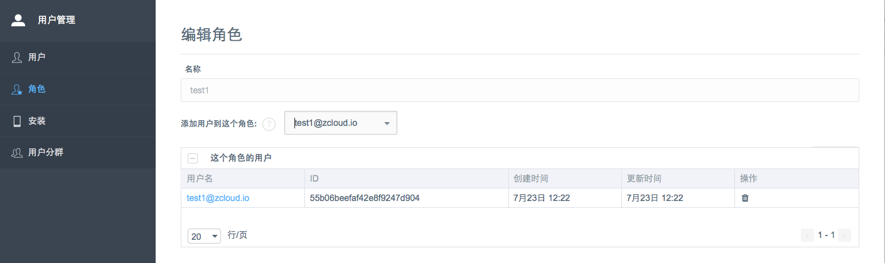
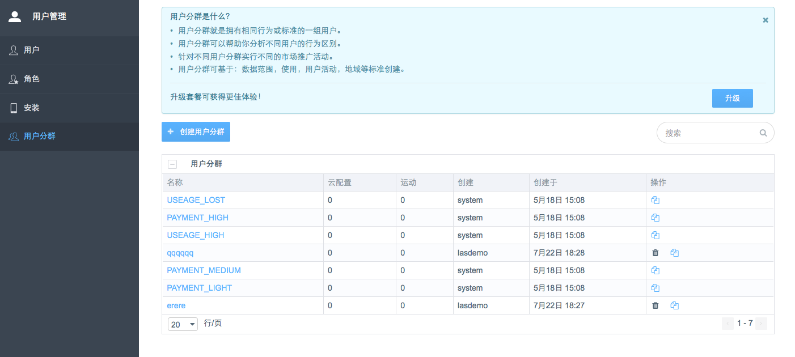
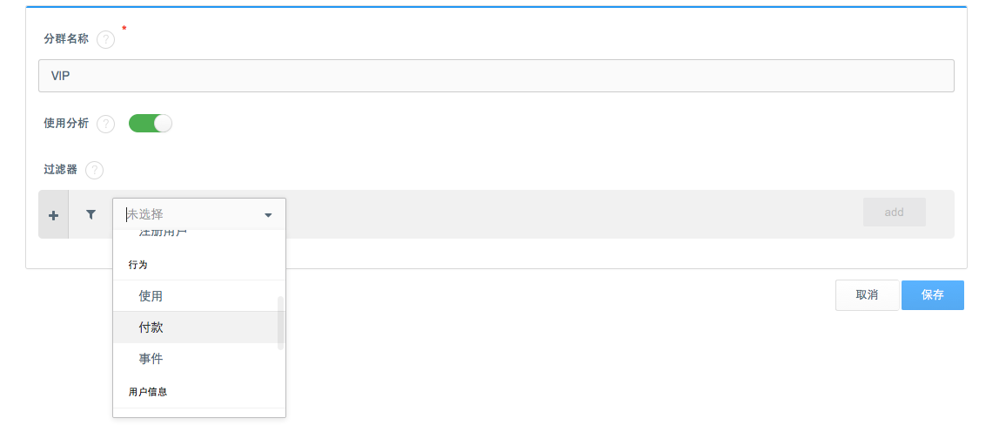
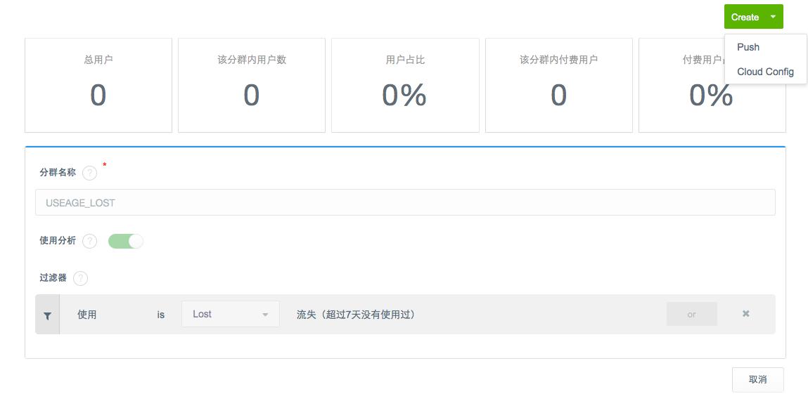

# User Management
In User Management, you can manage users, roles and segments as well as check and maintain all installation records. You can manage your users with ease and realize meticulous management with user segments.

**If you want to learn more about MaxLeap User Management Service SDK, please check [iOS Guide － User Management](ML_DOCS_GUIDE_LINK_PLACEHOLDER_IOS#USER_ZH) or [Android Guide － User Management](ML_DOCS_GUIDE_LINK_PLACEHOLDER_ANDROID#USER_ZH).**

##Users
MaxLeap will generate the `MLUser` instance and show it in User management after user's signup.
####Check User List

####Create New User
You can create a new user quickly by providing username, password and email address.

You can enable Emai Verify to send verification email to user after the creation and record the verification result.

####Edit User
You can enter the Edit User page by clicking on username and change the password, email and avatar.

##Roles
Every role contains a group of users and it can be used to manage the user permission.
####Chech Role List

####Create New Role

You can create new role by clicking the button and providing role name.

####Edit Role
You can enter the Edit Role page by clicking on role name and add more users there.

##Installations

##Segments

####Check Segment List

MaxLeap provides you 5 default user segments:

####Create a Segment

You need to set filters which define the user catagory they may belong to before creating a user segment. The filters can be summarized as follows:

* Common: High Paid Users, Medium Paid Users, Light Paid Users, Lost Users, Registered Users.
* Behavior: Usage, Payment, Events.
* User Info: Country, Language, Created Time, Last Access Time, Channel, App Version.

After the filter setup ("and" relation), MaxLeap will add all eligible users to the segment.

####Check/Edit Segment
You can enter the Edit Segment page by clicking on segment name and edit the content. You can also check the user quantity and other analytics of this segment:

Besides, you can send push notifications or in-app messages to certain segment in here.

## Next
**If you want to learn more about MaxLeap User Management Service SDK, please check [iOS Guide － User Management](ML_DOCS_GUIDE_LINK_PLACEHOLDER_IOS#USER_ZH) or [Android Guide － User Management](ML_DOCS_GUIDE_LINK_PLACEHOLDER_ANDROID#USER_ZH).**
