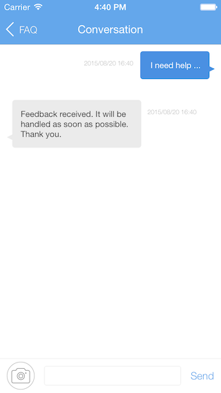

# Install the SDK

1. Download & unzip the SDK

	Make sure you are using the latest version of Xcode (5.0+) and targeting iOS 6.0 or higher.
	
	<a class="download-sdk" href="https://raw.githubusercontent.com/LeapAppServices/Leap Cloud-SDK-Release/master/iOS/v1.5.0/Leap CloudAll-v1.5.0.zip">Download SDK</a>


2. Add the SDK to your app

	Drag the `Leap Cloud.framework` you downloaded into your Xcode project folder target. Make sure the "Copy items to destination's group folder" checkbox is checked.
	
	<p class="image-wrapper">
	

	Drag `LCHelpCenter.embeddedframework` into Xcode project with the same method.

3. Add the dependencies

	Click on Targets → Your app name → and then the 'Build Phases' tab.</br>
	Expand 'Link Binary With Libraries' as shown.
	
	<p class="image-wrapper">
	
	
    Make sure "Enable Modules (C and Objective-C)" and "Link Frameworks Automatically" build settings are YES.
    
    <p class="image-wrapper">
    
    
	Click the + button in the bottom left of the 'Link Binary With Libraries' section and add the following libraries:
	
	StoreKit.framework</br>
	MobileCoreServices.framework</br>
	CoreTelephony.framework</br>
	SystemConfiguration.framework</br>
	libsqlite3.dylib</br>
	libz.dylib</br>

# Connect Leap Cloud App

Open up your `AppDelegate.m` file and add the following import to the top of the file:

```objc
#import <Leap Cloud/Leap Cloud.h>
```

Then copy following code into `application:didFinishLaunchingWithOptions:` method:

```objc
[Leap Cloud setApplicationId:@"your_application_id" clientKey:@"your_client_id"];
```

Replace `your_application_id` and `your_client_id ` with the one of your Leap Cloud app.

Then enable HelpCenter module:

```
#import <LCHelpCenter/LCHelpCenter.h>

- (BOOL)application:(UIApplication *)application didFinishLaunchingWithOptions:(NSDictionary *)launchOptions
{
	[Leap Cloud setApplicationId:@"your_application_id" clientKey:@"your_client_key"];
	[LCHelpCenter install];
}
```

Compile and run!

# Quick Test

1. Test the Connection to Leap Cloud App

	We can add following code in `application:didFinishLaunchingWithOptions:` in `appDelegate.m` to test if we can connect Leap Cloud Services with the app:


	```objc
	#import <Leap Cloud/Leap Cloud.h>

	- (BOOL)application:(UIApplication *)application didFinishLaunchingWithOptions:(NSDictionary *)launchOptions
	{
		[Leap Cloud setApplicationId:@"your_application_id" clientKey:@"your_client_key"];

		// Create a piece of data
		LCObject *testObject = [LCObject objectWithClassName:@"Person"];
		testObject[@"foo"] = @"bar";
		[LCDataManager saveObjectInBackground:testObject block:nil];
	}
	```

	This code is used to create a piece of `Person` data. If there is no `Person` class in cloud, then it will create the class first and then insert data. 

Run you app and you can see the data just created in Dev Center -> Data.

	

2. Test if HelpCenter Module works well: 
	
	Add following code in `viewDidAppear:` in `ViewController.m`:
	
	```
	[[LCHelpCenter sharedInstance] showFAQs:self];
	```
	
	Run the template project just configured, and you can see the following interface:
	
	
	
	The FAQ of a new app contains General, Billing and Privacy. If this interface shows these 3 sections, then the connection is working properly.
	
	Click the top right "Feedback" button in FAQ page:
	
	
	
	Then fill the short description and title and click top right "Send" button. You may receive a auto response and it indicates that HelpCenter module is intergrated successfuly.
	
	
	
	You can see this feedback in Support -> App Issues -> New Issues in Leap Cloud website.
