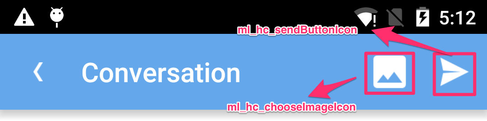
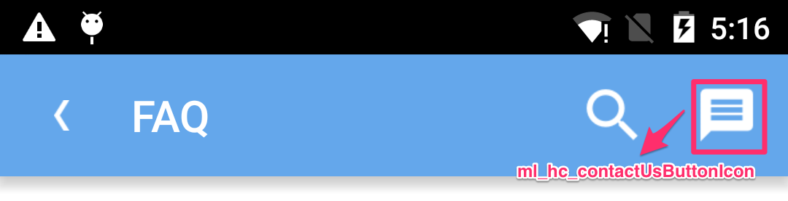
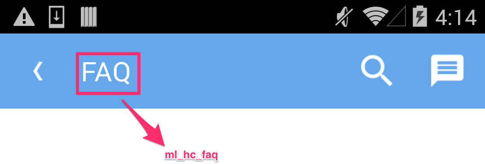
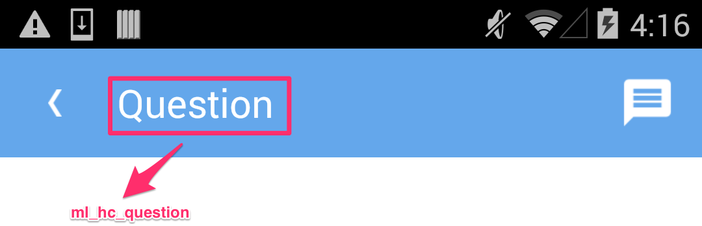

# 用户支持

## 简介

用户支持服务是 MaxLeap 为开发者提供的一套标准应用客服方案。在客户端，此方案提供完整的 FAQ 的显示页面及问题反馈对话页面。在 Console 端，用户支持服务提供 FAQ 的管理及用户反馈的处理界面。

## 准备工作

1. 安装并配置 MaxLeap Core SDK。详细步骤请查看 [QuickStart - Core SDK](ML_DOCS_LINK_PLACEHOLDER_SDK_QUICKSTART_ANDROID)

2. 安装并配置 HelpCenter SDK。详细步骤请查看 [QuickStart - HelpCenter](ML_DOCS_LINK_PLACEHOLDER_SDK_QUICKSTART_ANDROID)

## 进入 FAQ 页面

调用下面的方法可以进入 FAQ 界面

```java
MLHelpCenter.openFaqs(context);
```

## 进入用户反馈页面

调用下面的方法可以进入 Issue 界面

```java
MLHelpCenter.openConversation(context);
```

## 自定义 UI

### 全局样式


- values/ml_hc_styles.xml
	- MLHelpcenter.Theme
		- `colorAccent` - 用于设置获得焦点的控件的颜色

### ActionBar 样式

#### 通用样式


- values/ml_hc_styles.xml
	- MLHelpcenter.Theme
		- `homeAsUpIndicator` - 用于设置 UP 按钮图标

    - MLHelpcenter.Theme.ActionBar
		- `background` - 用于设置 ActionBar 背景色

    - MLHelpcenter.Theme.ActionBar.Title
		- `android:textColor` - 用于设置 title 字体颜色
		- `android:textSize` - 用于设置 title 字体大小

#### SearchView 样式


- values/ml_hc_styles.xml
	- MLHelpcenter.Theme
		- `ml_hc_searchActionButtonIcon` - 用于设置 Search 按钮图标


- values/ml_hc_styles.xml
	- MLHelpcenter.Theme
		- `searchIcon` - 用于设置 search hint 的图标
		- `ml_hc_searchHintTextColor` - 用于 设置 search hint 的文字颜色

- values/ml_hc_strings.xml
	- `ml_hc_search_hint` - 用于设置 search hint 文字


#### 其它 Action Button 样式



- values/ml_hc_styles.xml
	- MLHelpcenter.Theme 样式
		- `ml_hc_chooseImageIcon` - 用于设置选择图片按钮的图标
		- `ml_hc_sendButtonIcon` - 用于设置发送按钮的图标



- values/ml_hc_styles.xml
	- MLHelpcenter.Theme 样式
		- `ml_hc_contactUsButtonIcon` - 用于设置联系按钮的图标


- values/ml_hc_styles.xml
	- MLHelpcenter.Theme 样式
		- `ml_hc_messageCountBackground` - 用于设置新消息个数的背景图片
		- `ml_hc_messageCountTextColor` - 用于设置新消息个数的文字颜色
		- `ml_hc_messageCountTextSize` - 用于设置新消息个数的文字大小

### 各画面单独的样式

#### FAQ 画面



- values/ml_hc_strings.xml
	- `ml_hc_faq` - 用于设置 FAQ 标题文字

#### All Questions 画面


- values/ml_hc_strings.xml
	- `ml_hc_allQuestions` - 用于设置 ALL Questions 标题文字

#### Question 画面



- values/ml_hc_strings.xml
	- `ml_hc_question` - 用于设置 Question 标题文字

#### Conversions 画面


- values/ml_hc_strings.xml
	- `ml_hc_conversation` - 用于设置 Conversion 标题文字

- values/ml_hc_styles.xml
	- `ml_hc_leftChatBubbleBackground` - 用于设置左边气泡的背景
	- `ml_hc_leftChatBubbleTextColor` - 用于设置左边气泡的字体颜色
    - `ml_hc_leftChatBubbleTextSize` - 用于设置左边气泡的字体大小
	- `ml_hc_rightChatBubbleBackground` - 用于设置右边气泡的背景
	- `ml_hc_rightChatBubbleTextColor` - 用于设置右边气泡的字体颜色
	- `ml_hc_rightChatBubbleTextSize` - 用于设置右边气泡的字体大小

#### Album 画面


- values/ml_hc_styles.xml
	- `ml_hc_album` - 用于设置 Album 标题文字

#### Drawing 画面


- values/ml_styles.xml
	- `ml_hc_drawing` - 用于设置 Drawing 标题文字


