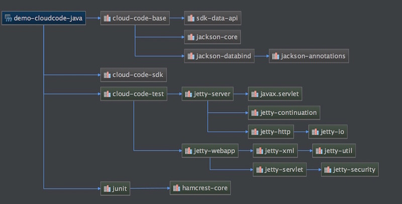

# SDK 简介

目前 MaxLeap Java SDK 仅支持 **云代码** 服务，更多服务敬请期待。

## SDK介绍

云代码 Java SDK 主要包含三个依赖包，他们的依赖关系如下:

- cloud-code-base
  - sdk-data-api
  - jackson-*
- cloud-code-sdk
  - cloud-code-bask
- cloud-code-test
  - cloud-code-sdk
  - jetty-server
  - jetty-webapp

### cloud-code-base
基础 SDK,云代码的云端和开发者本地都依赖的同一套基础 SDK,提供基础数据功能

### cloud-code-sdk
开发者本地 SDK,云代码的云端和开发者本地基于 cloud-code-base 实现的不同环境的功能SDK,主要实现功能：数据存储服务、云函数、后台任务、Hook操作、消息推送、分布式计数器/锁、日志.

### cloud-code-test
开发者本地 SDK 测试框架,本地环境SDK基于 cloud-code-sdk 实现的单元测试和集成测试框架,主要实现功能：提供本地单元测试框架、提供本地 Http Server方便用户本地调用API测试

### 完整结构
如下图所示：

