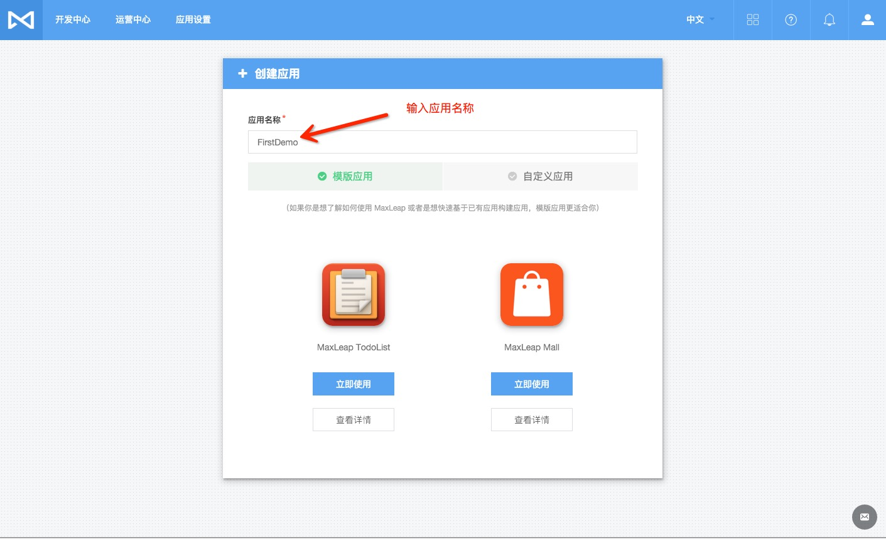

# 使用 MaxLeap 实现一个 TODO 应用

本文示范使用 MaxLeap 创建一个简单的应用 TODO 的完整流程。

## 需求

### 账号系统

使用用户名和密码，注册、登录

### TODO 管理

#### TODO 分类

- 用户拥有多分类，分类为私有，其他用户不可见
- 用户可以管理分类，增删改查

#### TODO 列表

- 待办事项属于某一个分类
- 可以标记，重命名，删除

## 服务器配置

1. 注册／登录

	前往 [MaxLeap 官网](https://maxleap.cn) , 如果还没有 MaxLeap 帐号，点击右上角的注册按钮注册；如果已经有 MaxLeap 帐号，点击登录按钮登录

2. 创建后台应用

	进入 `我的应用`，点击右侧的创建应用按钮，会弹出下面的界面：

	

	可以看到有两个选项卡：模版应用和自定义应用, 选择自定义应用，然后记录 AppId 和 ClientKey.
	
	*选择模版应用会创建项目模版和数据模版，可以点击各模版的 查看详情 按钮查看模版的详细信息。
	选择自定义应用会创建一个空白应用，本文使用这个选项。*
	
3. 创建后台表结构

	云数据库控制台的操作可以查阅[这篇文档](https://maxleap.cn/s/web/zh_cn/guide/usermanual/clouddata.html#数据存储-简介)。
	
	用户系统 MaxLeap 已经内置，可以直接使用。那么我们就只需要两个类（数据表）：Lists 和 Items。Lists 类存放所有用户的代表事项分类，Items 类中存放用户的待办事项。
	
	我们先创建 Items 类，并把类权限设置为 `私有(创建者可读可写，其他不可读不可写)`，类结构如下： 
	
	字段名    | 类型                     | 说明
	---------|-------------------------|-------
	name     | String                  | 事项的标题
	completed| Boolean                 | 是否完成
	
	再创建 Lists 类，权限同样设置为`私有`，结构如下：
	
	字段名 | 类型                    | 说明
	------|------------------------|------
	name  | String                 | 列表名
	items | Relation, 目标类：Items | 列表中的待办事项 
	
	上面的设计看不出 Lists 类与用户有什么联系，那怎么把这个类中的数据与用户关联起来呢？一个简单的实现是借助 MaxLeap 的权限管理系统，把表访问权限改成 `私有`，只有创建者可读可写，其他不可读不可写。这样用户查询的时候只能看到自己创建的数据，不用额外的代码就将数据与用户关联起来了，十分简单。
	
	而为了把 List 与 Items 关联起来，我引入了 MaxLeap 平台定义的 [Relation](https://maxleap.cn/s/web/zh_cn/guide/devguide/ios.html#数据存储-cloud-object-关系数据)，它可以关联多条 Item 数据，并且能够很方便地查询到。

4. 至此，我们拥有了一个可用的强大的后台，接下来就可以进行客户端的开发了。

## 客户端开发

MaxLeap 提供了 iOS，Android，javascript， react－native 客户端 SDK。 下面以 iOS 开发为例讲解客户端与后台交互, 其他平台 SDK 的接口与 iOS 类似。

**首先，参照[MaxLeap iOS 新项目环境准备文档](https://maxleap.cn/s/web/zh_cn/quickstart/ios/core/new.html)集成 MaxLeap iOS SDK。**

### 用户系统

1. 用户注册示例代码：

	```objc
	- (void)myMethod {
	    MLUser *user = [MLUser user];
	    user.username = @"my_name";
	    user.password = @"my_password";
	    user.email = @"email@example.com";
	    // 还可以设置其他自定义数据
	    user[@"mobilePhone"] = @"415-392-0202";
	    [user signUpInBackgroundWithBlock:^(BOOL succeeded, NSError *error) {
	        if (error) {
	            NSString *errorString = [error userInfo][@"error"];
	            // Show the errorString somewhere and let the user try again.
	        } else {
		        // Hooray! Let them use the app now.
	        }
	    }];
	}
	```

	*MaxLeap 后台会保证 username 和 email 的唯一性，对于 username, password 的格式校验都非常宽松，你可以灵活添加自己的密码合法性校验。*

2. 登录也很简单：

	```objc
	[MLUser logInWithUsernameInBackground:@"myname" password:@"mypass" block:^(MLUser *user, NSError *error) {
	    if (user) {
	        // Do stuff after successful login.
	    } else {
	        // The login failed. Check error to see why.
	    }
	}];
	```

*想要更深入地了解 MaxLeap 内建的用户系统，[请参阅帐号服务文档](https://maxleap.cn/s/web/zh_cn/guide/devguide/ios.html#账号服务)*

### 待办事项分类

1. 刚刚注册的用户，还没有待办事项列表，他可能想创建一个列表：

	*注：用户登陆以后，使用 SDK 进行数据操作时，会自动带上用户的身份标识。*
	
	```objc
	MLObject *list = [MLObject objectWithClassName:@"Lists"];
	list[@"name"] = @"会议";
	[list saveInBackgroundWithBlock:^(BOOL succeeded, NSError *error) {
	    if (succeeded) {
	        // refresh the todo list
	    } else {
			 // check the error to see what happend
	    }
	}];
	```

2. 用户成功登陆以后，需要显示用户的待办事项列表，而拉取这些数据很简单，示例如下：

	```objc
	MLQuery *query = [MLQuery queryWithClassName:@"Lists"];
	// 按照更新时间排序，最近更新的排在前面
	[query orderByDescending:@"updatedAt"];
	// Run the query
	[query findObjectsInBackgroundWithBlock:^(NSArray *lists, NSError *error) {
		if (error) {
			// The query failed, check the error to see why.
		} else {
			// display user todo lists
	   }
	}];
	```

3. 显示列表项的时候需要取这些分类的名字，这就像从字典中取值一样方便：

	```objc
	MLObject *list = [lists firstObject];
	NSString *listTitle = list[@"title"];
	```

### 待办事项

1. 获取一个分类下的待办事项：

	```objc
	MLObject *list; // 上面拿到的 lists 中的一个对象
	
	// 这个 @"items" 字段就是之前在后台定义的类型为 Relation 的字段
	MLRelation *itemsRelation = [list relationForKey:@"items"];
	MLQuery *query = [itemsRelation query];
	
	[query orderByDescending:@"updatedAt"];
	
	[query findObjectsInBackgroundWithBlock:^(NSArray *objects, NSError *error) {
	    if (error) {
			// The query failed, check the error to see why.
		} else {
			// display user todo items
	   }
	}];
	```

2. 获取事项的状态：

	```objc
	BOOL isCompleted = [item[@"completed"] boolValue];
	```

3. 把某个待办事项标记为已完成:

	```objc
	MLObject *item; // 用户想要标记为已完成的 item，要求是上面查询到的 items 中的一个
	MLObject *list; // 这个 item 所属的列表, 这个对象必须要有 objectId
	
	item[@"completed"] = @YES;
	
	[item saveInBackgroundWithBlock:^(BOOL succeeded, NSError *error) {
	    if (succeeded) {
	    
	        // item 保存成功，把这个 item 跟 list 关联起来
	        
	        MLRelation *itemsRelation = [list relationForKey:@"items"];
	            [itemsRelation addObject:item];
	            [list saveInBackgroundWithBlock:^(BOOL succeeded, NSError *error) {
	                if (succeeded) {
	                    // 关联成功
	                } else {
	                    // 出错了，检查错误看看为什么失败
	                }
	            }];
		    item[@"list"] = list;
	    } else {
	        // The operation failed, check the error to see why.
	    }
	}];
	```

*想要更深入了解数据存储，可以参阅[MaxLeap 帮助中心的数据存储文档](https://maxleap.cn/s/web/zh_cn/guide/helpcenter.html)*


