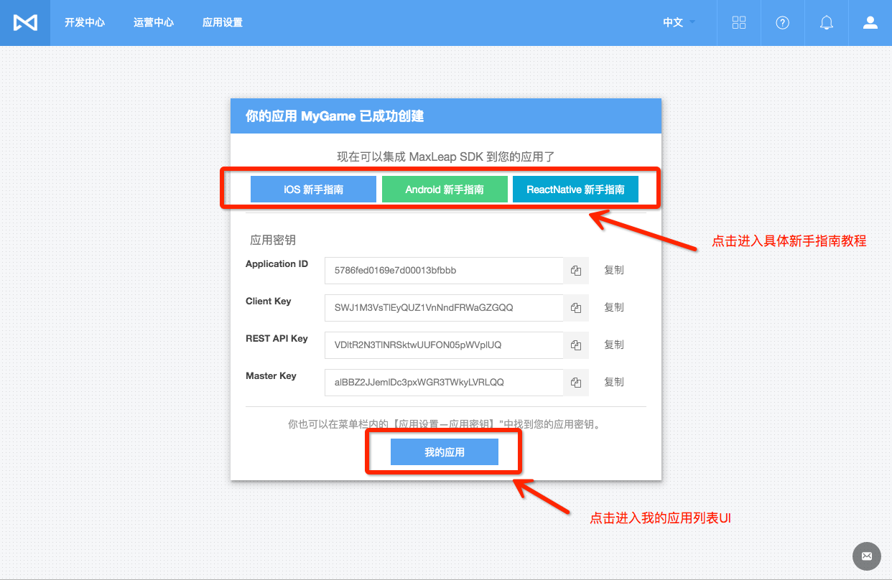
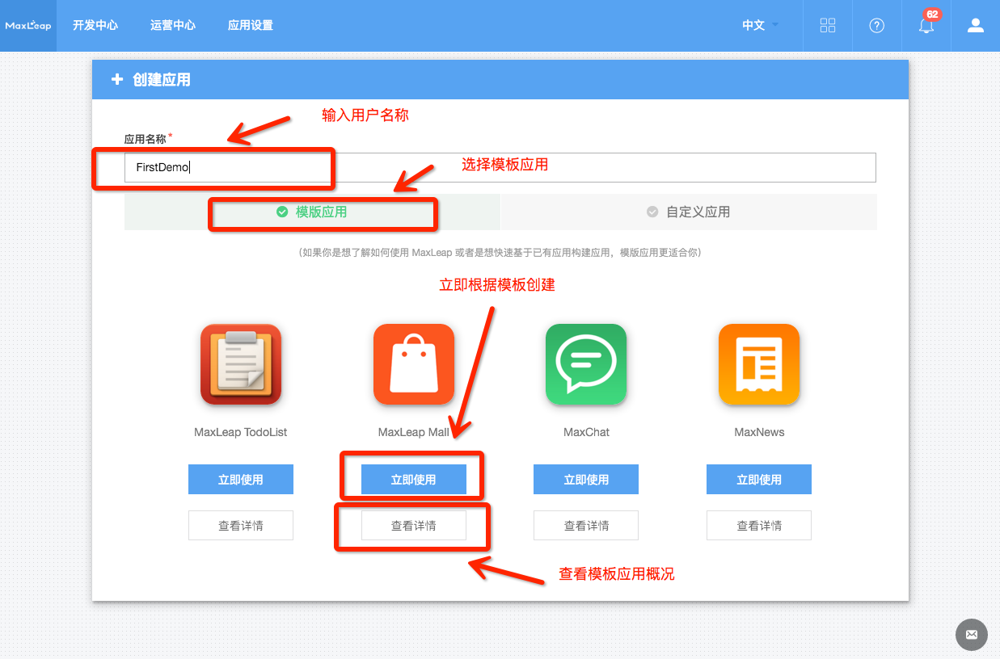
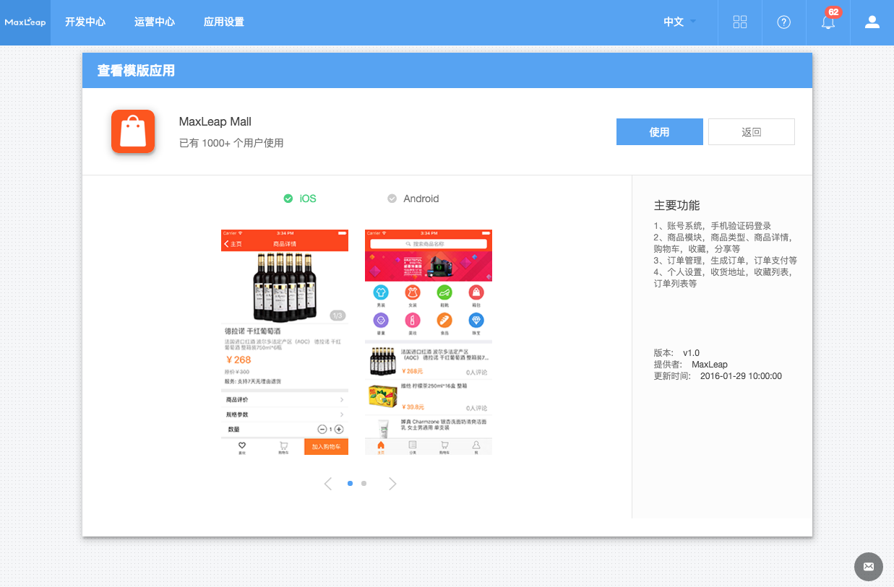
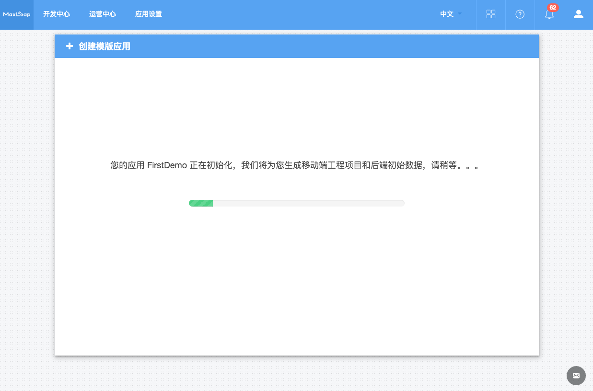
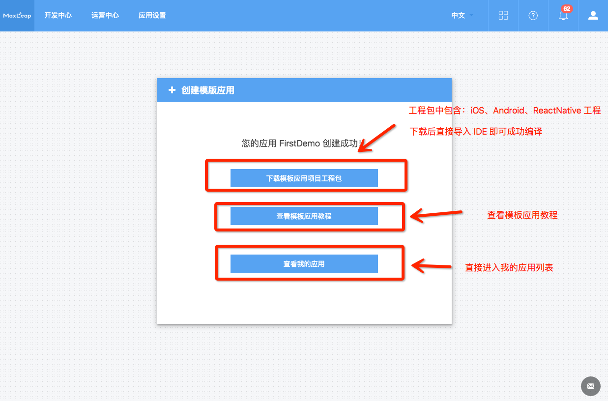
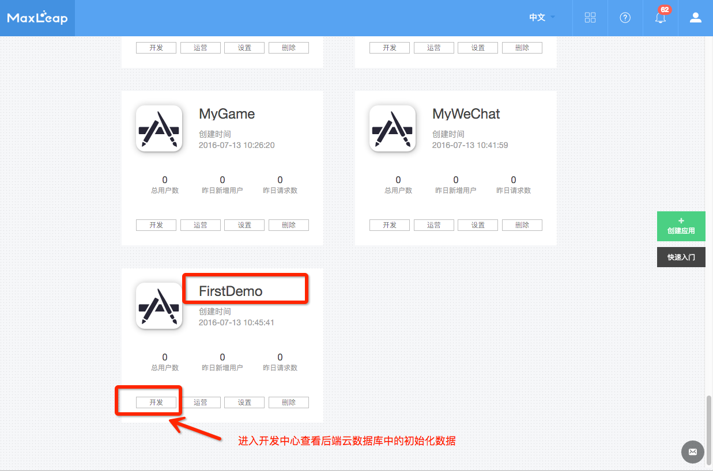
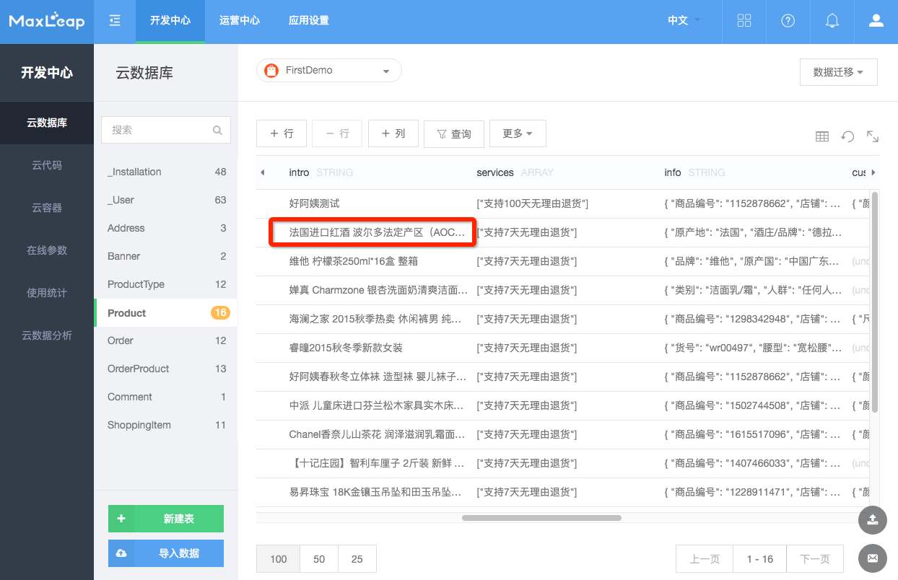
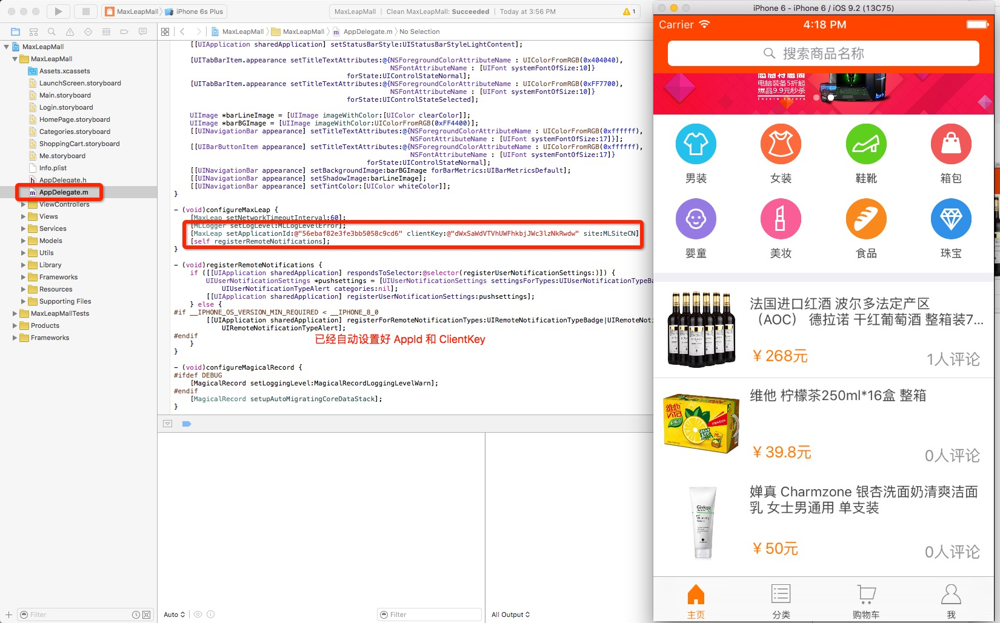
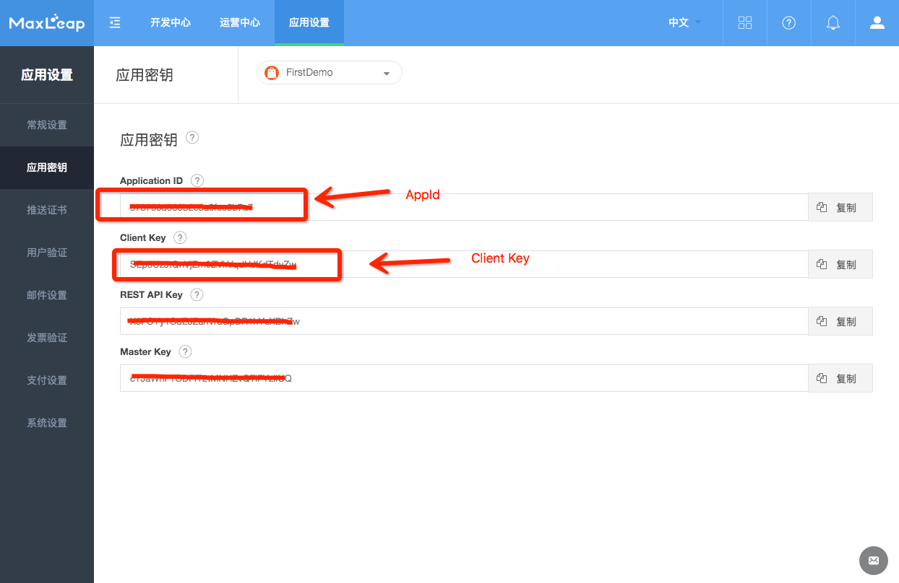

# Android 快速入门
## 创建应用
MaxLeap 提供两种模式创建应用
### 自定义应用
用户自行创建工程项目并配置，根据具体业务设计数据库表结构和对应逻辑。

1、点击创建应用后，进入如下页面，输入应用名称并选择自定义应用，然后点击创建按钮

2、点击创建按钮后，应用创建成功，如果下图所示，可以应用相关密钥信息、移动端新手指南入口和我的应用列表入口

新手指南如下：[iOS 新手指南 ](https://maxleap.cn/s/web/zh_cn/quickstart/ios/core/new.html) ，[Android 新手指南 ](https://maxleap.cn/s/web/zh_cn/quickstart/android/core/new.html) ，[React Native 新手指南 ](https://maxleap.cn/s/web/zh_cn/quickstart/android/core/new.html) 


### 模板应用
直接基于 MaxLeap 提供的模板应用快速开发，模板应用包括配置好的移动端工程项目、后端工程项目（视具体模板应用而定，不一定都有）以及云端初始化数据，您可以基于模板应用开发您的应用。


1、点击创建应用，并输入用户名，下面选择模板应用

2、模板应用可以查看详情或者立即根据此模板创建，点击查看详情进入如下UI

3、点击立即使用后，MaxLeap 会自动生成配置好的移动端工程项目、后端工程项（视具体模板应用而定，不一定都有）和后端初始化云数据

4、生成好以后，您可以下载项目工程，里面包括：iOS、Android、ReactNative 等移动端工程，如果有后端工程项目（视具体模板应用而定），也会包含

5、可以直接进入我的应用列表页面查看刚创建好的应用

6、点击开发选择进入开发中心云数据库查看云端初始化数据

7、工程项目下载完成后解压出工程项目（以 iOS 为例）并导入Xcode，直接运行即可查看模板应用，AppId 和 ClientKey 已经自动配置完成

8、可以在应用设置下的应用密钥中查看应用的相关key，包括 AppId 和 ClientKey 等


 Ok，是不是很简单呢，您可以直接基于我们的模板应用快速构建您自己的应用，Happy Coding!!!!

## 全新项目

###	使用模板创建 MaxLeap 项目

1.	获取项目模板，并解压缩至您的 Workspace

    <a class="download-sdk" href="https://github.com/MaxLeap/StarterProject-Android/archive/master.zip" target="_blank">下载 Android 项目模板</a>

2.	打开项目模板

    **Android Studio**

    1. 	打开 Android Studio，点击 “Import project”
    2. 	进入项目模板根目录，选择 `setting.gradle`
    3. 	按照默认配置点击下一步，直到完成

###	配置 MaxLeap 项目

1. 连接项目与 MaxLeap 应用

	在 `Application` 的 `onCreate()` 方法中，调用 `MaxLeap.initialize` 来设置您应用的 `Application ID` 和 `REST API Key`：

    ```java
    import android.app.Application;
    import com.maxleap.MaxLeap;

    public class MyApplication extends Application {
        @Override
        public void onCreate() {
            super.onCreate();
            MaxLeap.initialize(this, "{{appid}}", "{{restapikey}}", MaxLeap.REGION_CN);
        }
    }
    ```

2. 权限配置

	在 `AndroidManifest.xml` 中，给予应用以下权限：

    ```xml
    <uses-permission android:name="android.permission.READ_PHONE_STATE" />
    <uses-permission android:name="android.permission.ACCESS_WIFI_STATE" />
    <uses-permission android:name="android.permission.ACCESS_NETWORK_STATE" />
    <uses-permission android:name="android.permission.INTERNET" />
    ```

    权限|用途|是否必需
    ---|---|---
    `ACCESS_NETWORK_STATE`|		检测联网方式，区分用户设备使用的是2G、3G或是WiFi| 必需
    `INTERNET`| 	允许应用程序联网，以便向我们的服务器端发送数据| 必需
    `READ_PHONE_STATE`| 	获取用户设备的IMEI，通过IMEI来唯一的标识用户| 可选
    `ACCESS_WIFI_STATE`| 	获取用户设备的MAC地址，通过MAC地址来唯一的标识用户| 可选

3. 配置用户渠道

	在 `AndroidManifest.xml` 中配置用户渠道，渠道名可以是 `google_play` 之类的任意字符串。

    ```xml
	<application>
       <meta-data
            android:name="ml_channel"
            android:value="google_play"/>
    </application>
	```

4. 快速测试项目配置

    为了测试项目是否已经注册至 MaxLeap，我们可以向 `Application` 的 `onCreate()` 方法中添加以下代码：

    ```java
    import android.app.Application;
    import com.maxleap.MaxLeap;
    import com.maxleap.MLQueryManager;
    import com.maxleap.MLQuery
    import com.maxleap.MLObject;

    public class MyApplication extends Application {
        @Override
        public void onCreate() {
            super.onCreate();
            MaxLeap.initialize(this, "{{appid}}", "{{restapikey}}", MaxLeap.REGION_CN);

            //测试项目配置：
            MLDataManager.fetchInBackground(MLObject.createWithoutData("foobar", "123"),
                        new GetCallback<MLObject>() {
                            @Override
                            public void done(MLObject mlObject, MLException e) {
                                if (e != null && e.getCode() == MLException.INVALID_OBJECT_ID) {
                                    Log.d("MaxLeap", "SDK 成功连接到你的云端应用！");
                                } else {
                                    Log.d("MaxLeap", "应用访问凭证不正确，请检查。");
                                }
                            }
                        });
        }
    }
    ```

    
    运行应用，查看 Logcat 的输出日志，没有错误的话，您已经完成 MaxLeap SDK 的安装与必要的配置。


## 已有项目

1. 安装 SDK
	[下载 SDK](下载链接)

2. 将 SDK 添加至项目

    将解压后的所有 `maxleap-*.jar` 文件，拖拽至项目的 `libs` 目录中。如果你们的项目没有 `libs` 目录，那么就在项目的根目录下创建一个：通过右键点击项目 `Project`，选择 `New`，接下来点击 `Directory` 菜单即可创建新目录。

    **Android Studio**

    在 `build.gradle` 文件中添加下述依赖：

    ```gradle
    dependencies {
      compile fileTree(dir: 'libs', include: 'maxleap-*.jar')
    }
    ```

###	配置 MaxLeap 项目

1. 连接项目与 MaxLeap 应用

	在 `Application` 的 `onCreate()` 方法中，调用 `MaxLeap.initialize` 来设置您应用的 `Application ID` 和 `REST API Key`：

    ```java
    import android.app.Application;
    import com.maxleap.MaxLeap;

    public class MyApplication extends Application {
        @Override
        public void onCreate() {
            super.onCreate();
            MaxLeap.initialize(this, "{{appid}}", "{{restapikey}}", MaxLeap.REGION_CN);
        }
    }
    ```

2. 权限配置

 	在 `AndroidManifest.xml `中，给予应用以下权限：

    ```xml
    <uses-permission android:name="android.permission.READ_PHONE_STATE" />
    <uses-permission android:name="android.permission.ACCESS_WIFI_STATE" />
    <uses-permission android:name="android.permission.ACCESS_NETWORK_STATE" />
    <uses-permission android:name="android.permission.INTERNET" />
     ```

    权限|用途|是否必需
    ---|---|---
    `ACCESS_NETWORK_STATE`|		检测联网方式，区分用户设备使用的是2G、3G或是WiFi| 必需
    `INTERNET`| 	允许应用程序联网，以便向我们的服务器端发送数据| 必需
    `READ_PHONE_STATE`| 	获取用户设备的IMEI，通过IMEI来唯一的标识用户| 可选
    `ACCESS_WIFI_STATE`| 	获取用户设备的MAC地址，通过MAC地址来唯一的标识用户| 可选

3. 配置用户渠道

	在 `AndroidManifest.xml` 中配置用户渠道，渠道名可以是 `google_play` 之类的任意字符串。

    ```xml
	<application>
       <meta-data
            android:name="ml_channel"
            android:value="google_play"/>
    </application>
	```

4. 快速测试项目配置

    为了测试项目是否已经注册至 MaxLeap，我们可以向 `Application` 的 `onCreate()` 方法中添加以下代码：

	```java
    import android.app.Application;
    import com.maxleap.MaxLeap;
    import com.maxleap.MLQueryManager;
    import com.maxleap.MLQuery
    import com.maxleap.MLObject;

    public class MyApplication extends Application {
        @Override
        public void onCreate() {
            super.onCreate();
            MaxLeap.initialize(this, "{{appid}}", "{{restapikey}}", MaxLeap.REGION_CN);

            //测试项目配置：
            MLDataManager.fetchInBackground(MLObject.createWithoutData("foobar", "123"),
                        new GetCallback<MLObject>() {
                            @Override
                            public void done(MLObject mlObject, MLException e) {
                                if (e != null && e.getCode() == MLException.INVALID_OBJECT_ID) {
                                    Log.d("MaxLeap", "SDK 成功连接到你的云端应用！");
                                } else {
                                    Log.d("MaxLeap", "应用访问凭证不正确，请检查。");
                                }
                            }
                        });
        }
    }
    ```

    运行应用，查看 Logcat 的输出日志，没有错误的话，您已经完成 MaxLeap SDK 的安装与必要的配置。
##下一步
至此，您已经完成 MaxLeap SDK 的安装与必要的配置。请移步至 [Android SDK 开发指南](https://maxleap.cn/s/web/zh_cn/guide/devguide/android.html) 以获取 MaxLeap 的详细功能介绍以及使用方法，开启 MaxLeap 云服务之旅。