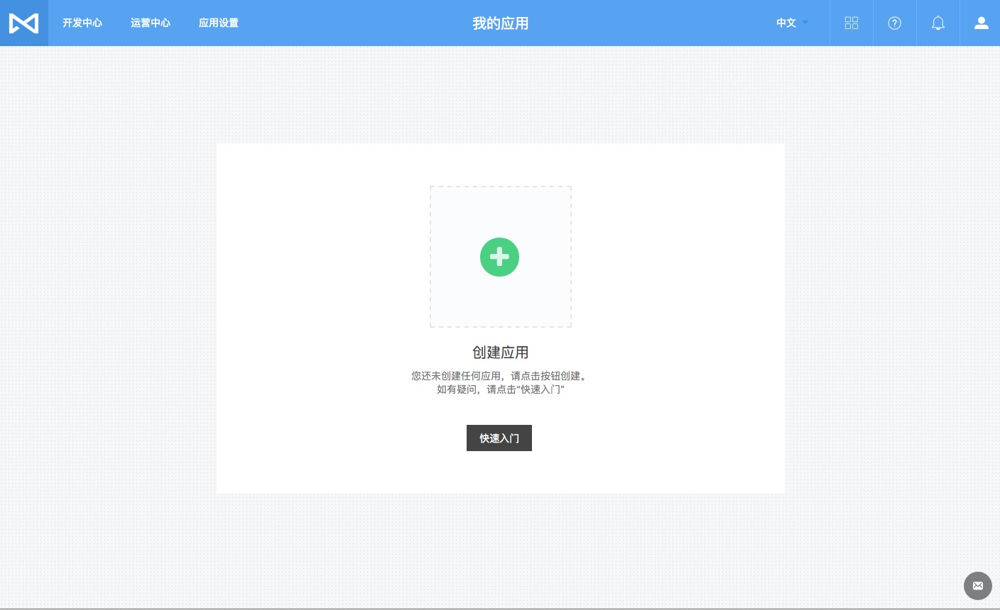

# Python 快速入门
## 注册并登录 MaxLeap
首次登录会进入如下未创建过 App 页面



## 创建应用
### 自定义应用
用户自行创建工程项目并配置，根据具体业务设计数据库表结构和对应逻辑。

1、点击创建应用后，进入如下页面，输入应用名称并选择自定义应用，然后点击创建按钮

2、点击创建按钮后，应用创建成功，如果下图所示，可以应用相关密钥信息、移动端新手指南入口和我的应用列表入口

新手指南如下：[iOS 新手指南 ](quickstart/iosquickstart.html) ，[Android 新手指南 ](quickstart/androidquickstart.html) ，[React Native 新手指南 ](quickstart/reactnativequickstart.html)  


目前 MaxLeap Python SDK 仅支持 **云代码** 服务，更多服务敬请期待。

MaxLeap Python SDK 基于 Python 2.x 开发，在 Python 3.x 环境下使用仍然有一些兼容性问题。我们会尽快改善这一问题的。

## 全新项目
### 安装SDK

你可以使用 `pip` 或者 `easy_install` 安装 Python SDK

```sh
pip install maxleap-sdk
```

or

```sh
easy_install maxleap-sdk
```

根据你的环境，命令之前可能还需要加上 `sudo` 。

**注意**：如果您的 Python 版本低于 2.7.9，您可能会遇到如下的 Warning：ML

```
/usr/lib/python2.7/site-packages/requests-2.6.0-py2.7.egg/requests/packages/urllib3/util/ssl_.py:79: InsecurePlatformWarning: A true SSLContext object is not available. This prevents urllib3 from configuring SSL appropriately and may cause certain SSL connections to fail. For more information, see https://urllib3.readthedocs.org/en/latest/security.html#insecureplatformwarning.
InsecurePlatformWarning
```

建议您升级您的 Python 版本，或者通过安装 PyOpenSSL 来解决：

```sh
pip install pyopenssl ndg-httpsclient pyasn1
```

### 使用模板创建 MaxLeap 云代码项目

获取 MaxLeap 云代码 Python项目模板

[下载模板项目](https://github.com/MaxLeap/Demo-CloudCode-Python/archive/master.zip)

### 一个python cloudcode项目的目录树应该如下：

```
├── app                     #cloudcode主目录 (必备)
│   ├── requirements.txt    #cloudcode所依赖的pip库（可选）
│   ├── function            #function目录（可选）
│   │   └── demo.py
│   ├── hook                #hook目录（可选）
│   ├── job                 #job目录（可选）
|   └── tests               #tests目录（可选）
├── config                  #cloudcode配置文件目录（必备）
│   └── global.json         #cloudcode配置文件（必备）
└── lib                     #cloudcode所依赖的lib（可选）
```

### 目录加载顺序

1. 拷贝lib依赖
2. pip安装requirements.txt
3. 加载程序文件，顺序为：config -> hook -> job -> function

### 修改配置
在/config（请确保此路径存在）中，添加global.json文件，并在其中添加如下配置：

```python
{
	"applicationName" : "HelloWorld",
	"applicationId": "YOUR_APPLICATION_ID",
	"applicationKey": "YOUR_MASTER_KEY",
	"lang" : "python",
	"version": "0.0.1"
}
```

根据创建应用时获取的key，修改下列键的值：

键|值|
------------|-------|
applicationName|MaxLeap应用名称
applicationId|Application ID
applicationKey|Master Key
version|当前云代码项目版本号

### 定义一个简单的function
在`/function`目录下新建文件demo.py中

```python
from ML import Server
from ML import Response
@Server.Function
def helloword(request):
    return Response("hello world")

```

### 打包

在当前项目根目录下运行zip命令：

`zip -r <ProjectLocation> ./*`

`ProjectLocation`便是我们想要的package.

### 云代码的上传及部署
MaxLeap 管理后台提供可视化的运维界面，包括上传、部署等。 

####上传云代码
登录 MaxLeap 管理后台，选择您的应用，进入【开发中心->云代码->版本】，点击【上传云代码】按钮，在弹出的文件选择框中选中生成的zip文件，点击上传。 


####部署

上传成功后，点击应用版本【操作】列下的【部署】按钮，在弹出的窗口中，您需要选择想要的部署策略（选择资源类型和对应启动的实例数量）来完成部署


####正常运行
部署成功后，您的云代码版本如下图所示：


### 测试

通过 curl，我们向部署好的Cloud Function发送如下POST请求，以测试我们的Function是否部署成功：

```shell
curl -X POST \
-H "X-ML-AppId: YOUR_APPID" \
-H "X-ML-APIKey: YOUR_APIKEY" \
-H "Content-Type: application/json" \
 https://api.maxleap.cn/2.0/functions/helloword
```
此时，我们将得到如下结果：

```shell
hello world
```
表明测试通过，部署成功。

注意:

* X-ML-APIKey的值为应用的API KEY，而非云代码项目中使用的Master Key.

 至此，您已经完成 MaxLeap SDK 的安装与必要的配置。

## 已有项目

### 安装SDK

你可以使用 `pip` 或者 `easy_install` 安装 Python SDK

```sh
pip install maxleap-sdk
```

or

```sh
easy_install maxleap-sdk
```

根据你的环境，命令之前可能还需要加上 `sudo` 。

**注意**：如果您的 Python 版本低于 2.7.9，您可能会遇到如下的 Warning：ML

```
/usr/lib/python2.7/site-packages/requests-2.6.0-py2.7.egg/requests/packages/urllib3/util/ssl_.py:79: InsecurePlatformWarning: A true SSLContext object is not available. This prevents urllib3 from configuring SSL appropriately and may cause certain SSL connections to fail. For more information, see https://urllib3.readthedocs.org/en/latest/security.html#insecureplatformwarning.
InsecurePlatformWarning
```

建议您升级您的 Python 版本，或者通过安装 PyOpenSSL 来解决：

```sh
pip install pyopenssl ndg-httpsclient pyasn1
```

### 一个python cloudcode项目的目录树应该如下：

```
├── app                     #cloudcode主目录 (必备)
│   ├── requirements.txt    #cloudcode所依赖的pip库（可选）
│   ├── function            #function目录（可选）
│   │   └── demo.py
│   ├── hook                #hook目录（可选）
│   ├── job                 #job目录（可选）
|   └── tests               #tests目录（可选）
├── config                  #cloudcode配置文件目录（必备）
│   └── global.json         #cloudcode配置文件（必备）
└── lib                     #cloudcode所依赖的lib（可选）
```

### 目录加载顺序

1. 拷贝lib依赖
2. pip安装requirements.txt
3. 加载程序文件，顺序为：config -> hook -> job -> function


### 集成已有项目
1. 你可以把以后的项目按照module的形式copy到lib目录。这样你可以在你的function、job、hook中访问它。
2. 你也可以在`/app`目录下面添加你已有的项目。然后在function、job、hook中访问它。

### 修改配置
在/config（请确保此路径存在）中，添加global.json文件，并在其中添加如下配置：

```python
{
	"applicationName" : "HelloWorld",
	"applicationId": "YOUR_APPLICATION_ID",
	"applicationKey": "YOUR_MASTER_KEY",
	"lang" : "python",
	"version": "0.0.1"
}
```

根据创建应用时获取的key，修改下列键的值：

键|值|
------------|-------|
applicationName|MaxLeap应用名称
applicationId|Application ID
applicationKey|Master Key
version|当前云代码项目版本号

### 定义一个简单的function
在`/function`目录下新建文件demo.py中

```python
from ML import Server
from ML import Response
@Server.Function
def helloword(request):
    return Response("hello world")

```

### 打包

在当前项目根目录下运行zip命令：

`zip -r <ProjectLocation> ./*`

`ProjectLocation`便是我们想要的package.

### 云代码的上传及部署
MaxLeap 管理后台提供可视化的运维界面，包括上传、部署等。 

####上传云代码
登录 MaxLeap 管理后台，选择您的应用，进入【开发中心->云代码->版本】，点击【上传云代码】按钮，在弹出的文件选择框中选中生成的zip文件，点击上传。 


####部署

上传成功后，点击应用版本【操作】列下的【部署】按钮，在弹出的窗口中，您需要选择想要的部署策略（选择资源类型和对应启动的实例数量）来完成部署


####正常运行
部署成功后，您的云代码版本如下图所示：


### 测试

通过 curl，我们向部署好的Cloud Function发送如下POST请求，以测试我们的Function是否部署成功：

```shell
curl -X POST \
-H "X-ML-AppId: YOUR_APPID" \
-H "X-ML-APIKey: YOUR_APIKEY" \
-H "Content-Type: application/json" \
 https://api.maxleap.cn/2.0/functions/helloword
```
此时，我们将得到如下结果：

```shell
hello world
```
表明测试通过，部署成功。

注意:

* X-ML-APIKey的值为应用的API KEY，而非云代码项目中使用的Master Key.

至此，您已经完成 MaxLeap SDK 的安装与必要的配置。

##下一步
至此，您已经完成 MaxLeap SDK 的安装与必要的配置。请移步至[云代码 SDK开发教程](https://maxleap.cn/s/web/zh_cn/guide/devguide/python.html)以获取 MaxLeap 云代码 SDK 的详细功能介绍以及使用方法。