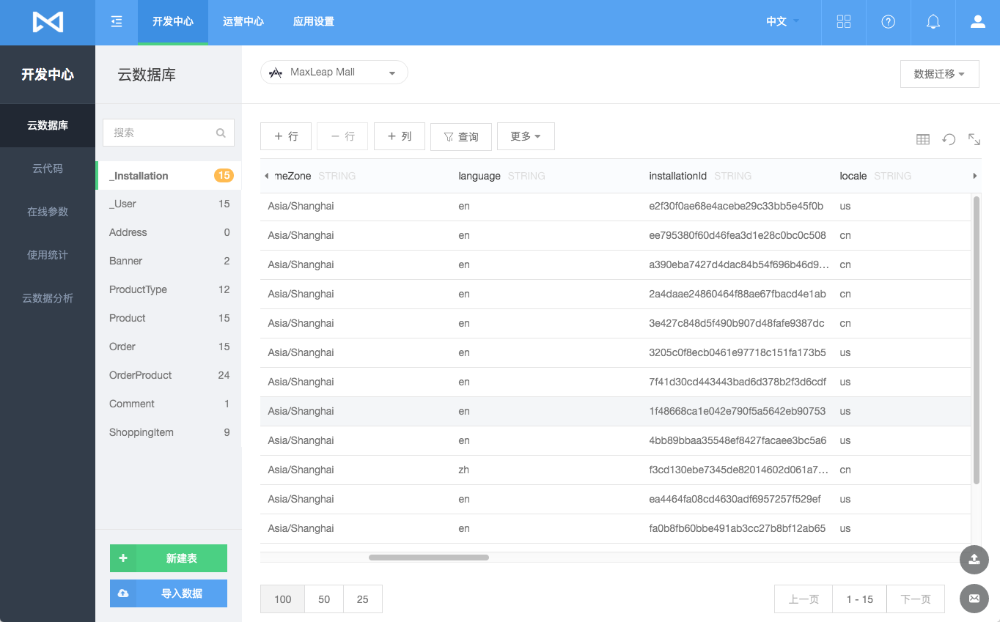
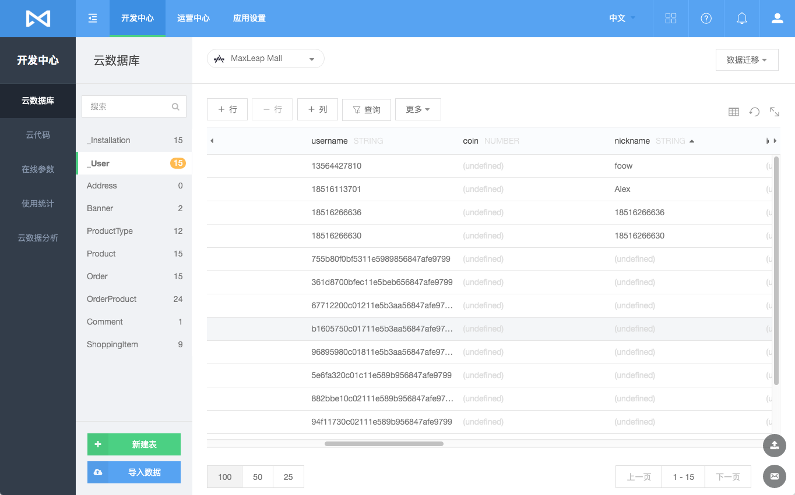

# 账号服务

MaxLeap 为应用提供内建的账号系统，支持常规的用户名加密码账号登录注册，还支持手机验证码登录，短信验证，第三方登录等。

## 用户模型
### Installation(设备)
* 代表 App 的一个使用终端，一个 App 在一个终端下载安装后会创建一个 Installation
* 同一个终端对同一个 App 卸载后再次安装会产生新的 Installation

### User（用户）

包含如下两种用户：

 * **注册用户**，代表一个通过用户名加密码、第三方社交平台认证信息或者手机号加验证码登录注册的明确用户，用户名、邮箱、手机号唯一；
 * **匿名用户**，代表一个还没明确的用户，MaxLeap 会自动创建一个匿名用户和一个 Installation（设备）永久关联
 
注册用户和匿名用户关系

  * 注册用户通过匿名用户转换过来，且仅在注册时转换
  
### Installation 与 User 关系
 * **Installation 和 注册用户**，多对多
  1. 即一个 Installation 可以关联一个或者多个注册用户，也就是不同的注册用户在同一个设备终端上登录使用同一个 App
  2. 即一个注册用户可以关联一个或者多个 Installation，也就是一个人可以在不同设备终端上登录使用同一个 App
 * **Installation 对于 匿名用户**，一对一
   1. 即一个匿名用户仅关联一个设备，也就是说不管多少人在同一个设备终端上使用同一个 App，产生的行为数据都划归到同一个匿名用户里
   2. App 卸载后再次安装使用，会产生新的 Installation 和 对应关联的匿名用户
 

## 用户数据
MaxLeap 会自动为您的应用在云数据库中创建对应的数据表，包括 **`_User`** 和 **`_Installation`** 两个表，您还可以新增自定义列存储其他信息。

### _Installation（设备）

### _User（用户）
 

## 用户名、邮箱注册登录

支持通过用户名、邮箱注册和用户名登录等

## 第三方社交平台登录

为简化用户的注册及登录流程，并且集成 MaxLeap 应用与第三方社交平台登录应用的服务。
### 国内
目前支持，微信、新浪微博、QQ。其他渠道敬请期待。
### 国外
目前支持，Facebook，Twitter。其他渠道敬请期待。
## 短信登录
MaxLeap 还支持通过手机加验证码快速登录。
## 短信验证码验证
MaxLeap 还提供短信验证码服务，用户执行一些敏感操作（比如支付）时，可以使用短信来验证是否是本人操作
## FAQ
内容更新中

## SDK 集成

### 基础 API 库 MaxLoginLib
MaxLoginLib 是不含界面的基础能力库，封装注册和登录，包括用户名邮箱注册登录，手机验证码登录注册，第三方登录等API，引用到 App 工程中后，需要开发者自己实现 UI 界面，相对较轻量，适用于对 UI 有较高订制需求的开发者。

[iOS 开发指南](ML_DOCS_GUIDE_LINK_PLACEHOLDER_IOS#ACCOUNT_SYSTEM_ZH)

[Android 开发指南](ML_DOCS_GUIDE_LINK_PLACEHOLDER_ANDROID#ACCOUNT_SYSTEM_ZH)

<!--
[Javascript 开发指南](ML_DOCS_GUIDE_LINK_PLACEHOLDER_JS#ACCOUNTSYSTEM_ZH)
-->
### 界面组件 MaxLoginKit
MaxLoginKit 是将注册和登录，包括用户名邮箱注册登录，手机验证码登录注册，第三方登录等功能封装为 UI 组件，通过简短的代码，您就可以直接将以上界面集成到您的 App 产品中，省去大量的开发调试时间，并且您可以修改标准 UI 组件代码。您也可以针对自己界面需求自由设计开发。

#### iOS
[Module-MaxLogin-iOS](https://github.com/MaxLeap/Module-MaxLogin-iOS)

#### Android
[Module-MaxLogin-Android](https://github.com/MaxLeap/Module-MaxLogin-Android)
