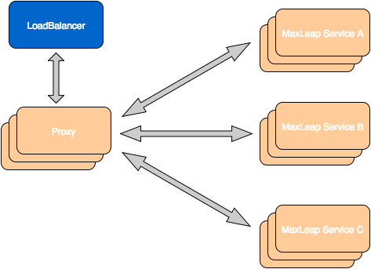
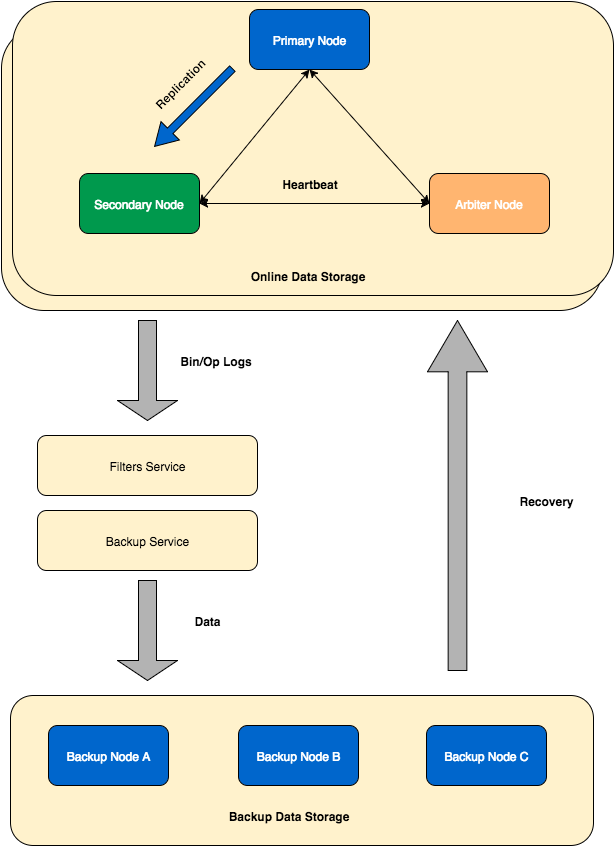
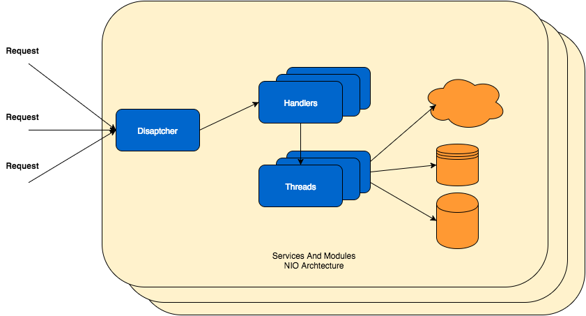

#优势

##稳定、可靠

###数据和服务
####服务高可用
 - 所有服务均有负载均衡节点
 - 实时、动态水平扩展，灵活应对各种流量激增、瞬间访问压力
 - 微服务架构、服务之间隔离，完全无影响
 

####数据备份和灾难恢复
 - 数据和文件均有多个存储节点，存储节点之间相互备份
 - 多机房、多城市间容灾，对数据进行实时备份，能够在灾难发生时快速恢复

 

####无间断数据迁移
 - 提供数据迁移服务，随时导出数据或者迁移到其他系统中

###云代码
####多实例
 - 允许运行多个云代码实例，负载均衡，提高可靠度

####无间断升级
云代码版本切换无间隙
 1. 启动新版本云代码并设定实例数量
 2. 设定负载均衡参数
 3. 服务无异常后，停止旧版本的实例
 
 

##高性能
####快速响应
 - 正常访问时长在几十毫秒内
 - 前后端系统采用100%异步架构
 - 网络、协议、架构层进行优化，多级缓存机制
 
 

####高并发
 - 请求接入层和服务层采用NIO设计
 - 根据服务的压力，弹性扩容
 
 

####实时数据分析
 - 基于Lambda架构
 - 对数据进行流式处理，采用增量计算实现数据视图，高吞吐、低延时
 
 

##灵活、弹性
####资源伸缩
根据业务的发展趋势，您可随时对云资源进行横向和纵向的伸缩，杜绝资源浪费

####动态扩展实例数量

##安全

###隔离
####数据隔离
 - 不同公司之间，不同应用之间的数据在物理层完全隔离
 - 每个应用有独立的数据和文件存储空间

####云代码隔离
 - 不同应用的云代码通过容器技术进行隔离
 - 通过启用SeLinux和防火墙，保障容器的网络安全

###加密和脱敏
####访问协议
 - 数据访问通过https，报文内容100%被加密
 - 防止攻击者通过监听等手段，或者开发者账号和应用的敏感信息

####数据加密
 - 对密码、账号信息等敏感信息进行不对称加密存储

####应用层数据脱敏
 - 应用层隐藏密码、支付等敏感信息
 - 对有联系方式、地址等有脱敏需求的数据，可通过云代码进行控制

###安全机制
####访问安全

####数据安全
####ACL

