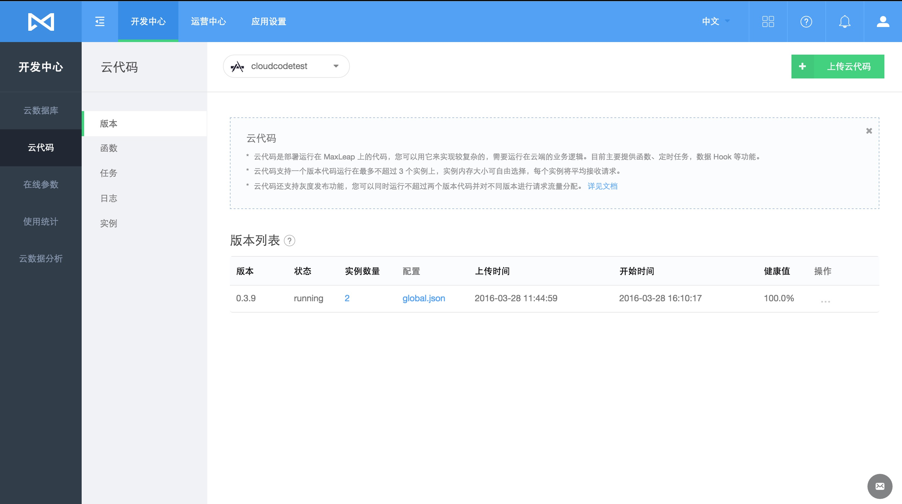
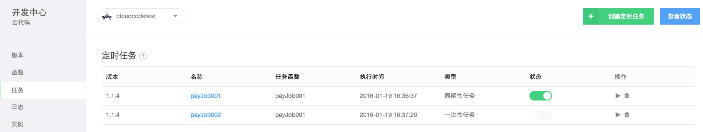
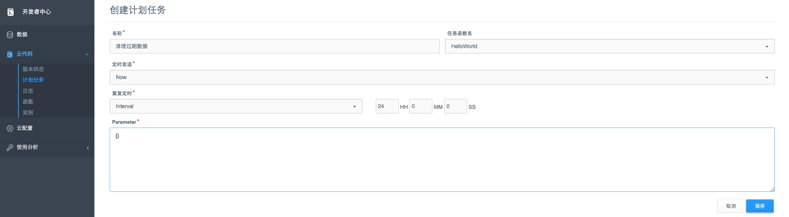
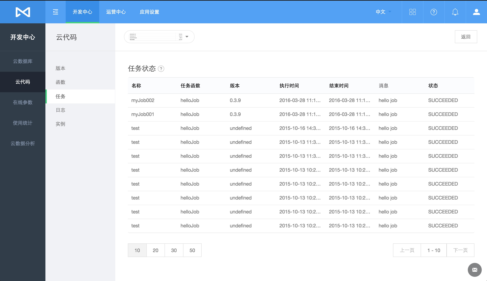
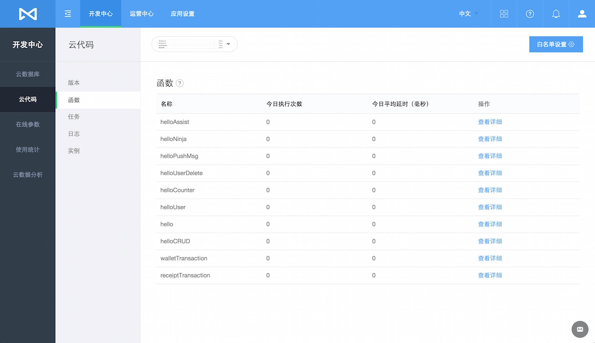
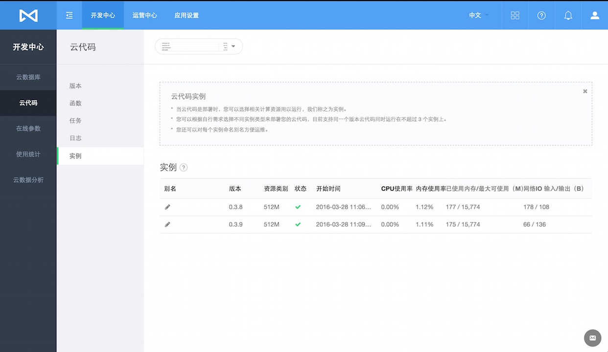

# 云代码
##简介
###什么是云代码服务
云代码是部署运行在MaxLeap中的代码，您可以用它来实现较复杂的，需要运行在云端的业务逻辑。它类似于传统的运行在Web server上的Web Service或RESTful API。它对外提供的接口也是RESTful API，也正是以这种方式被移动应用调用。

###为什么需要云代码服务

如果应用非常简单，我们可以将业务逻辑都放在客户端里面实现。然而，当应用需要实现比较复杂的业务逻辑，访问更多的数据或需要大量的运算时，我们便需要借助云代码服务实现。其优势在于：

* 强大的运算能力：云代码运行在MaxLeap的Docker容器中，可以使用多个CPU和大容量内存进行计算
* 更高效：可以在一次调用中通过高速网络多次请求 Cloud Data，大大提升效率
* 同一套代码可以为iOS，Android，web site等提供服务

在应用管理页面中，您可以查看，新建和管理各个版本的云代码及相应的日志。

**如果您希望进一步了解 MaxLeap 云代码服务SDK，请参考[Java开发指南 － 云代码](ML_DOCS_GUIDE_LINK_PLACEHOLDER_JAVA)。**

##版本状态
在"版本状态"报表中，我们可以查看上传至该应用下的所有的云代码。该报表包含以下列：

* 版本号：每份上传的云代码，都有一个唯一的版本号标识，定义在云代码项目中的global.json中
* 状态：对应版本号的云代码是否被部署并处于正常运行状态
* 配置：查看云代码的配置文件global.json. 包括 应用名，应用信息(App ID/MasterKey)，Cloud Code项目信息(编写语言/入口函数名/Hook包名/Entity包名)及版本号等信息。
* 上传时间

##任务计划
任务计划是指将云代码中某个任务指定在某个时间运行。

####查看任务计划列表
通过任务计划报表，我们可以查看当前已经被安排的任务，点击每个任务计划，可以修改计划信息。

####新建任务计划
您可以通过“创建任务计划”，运行云代码中的任务。创建时，您需要提供

* 名称：任务计划名
* 函数名：云代码中定义的任务名
* 安排时间：设置任务的开始运行时间
* 安排重复：设置任务的重复运行模式
* 参数：传递至云代码任务的JSON参数

####查看计划执行状态
任务状态中，您可以查看任务计划，每次执行任务后的状态和结果。包括执行时间，结束时间以及是否成功。

##日志
您可以通过日志，查看以下信息：

* Cloud Function的上传部署信息
* Hook Entities的Cache信息
* 云代码API请求信息
* 在云代码中通过日志API记录的其他日志

日志被分为三种类型：Info（信息），Error（错误）及Warn（警告）。

##函数
在函数中，您可以查看所有云代码中的任务的执行概况：

* 今日执行次数
* 今日平均延时：执行时间与计划之间的延时
* 操作：该函数历史调用次数，成功次数及失败次数

##实例
为了确保云代码健康运行，MaxLeap 将会自动为每个版本的云代码分别一个或多个实例。您可以查看每个实例的运行状况，包括：

* 请求队列
* 拒绝次数
* CPU/内存使用率
* 内存使用及上限
* 网络IO输入及输出

##白名单
可以将函数的某个调用方法添加至白名单，添加后，当请求调用该函数时，将不进行Http请求头中X-ML-AppId和X-ML-APIKey的校验。

## 下一步

**如果您希望进一步了解MaxLeap 云代码服务SDK，请参考[Java开发指南 － 云代码](ML_DOCS_GUIDE_LINK_PLACEHOLDER_JAVA)。**
