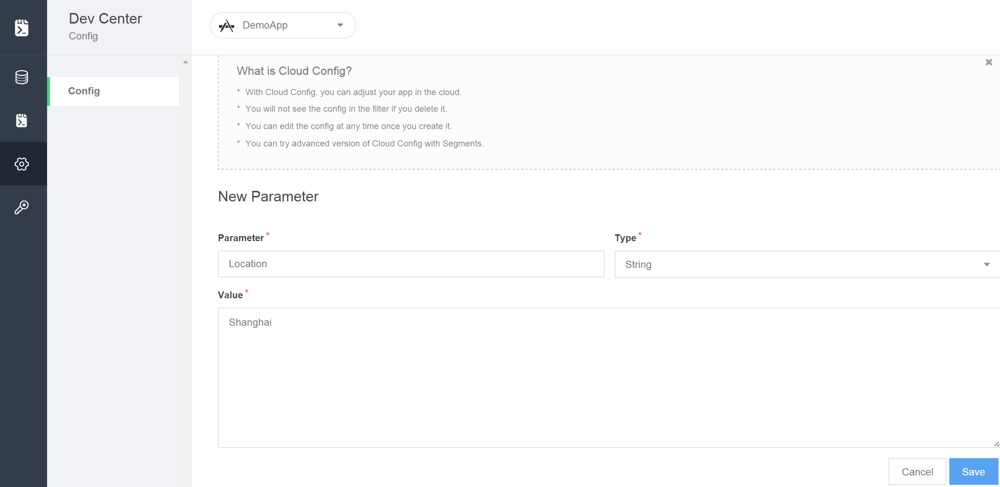

# 云配置
## 简介
###什么是Cloud Config
每个应用在云端都有一个对应的`LASCloudConfig`对象，用以存储该应用的参数。Cloud Config服务帮助您访问和操作云端参数。您可以通过Console在Leap Cloud中配置应用参数，并且使用iOS/Android SDK读取云端的参数。
###为何需要Cloud Config
将应用的部分配置放置在云端的优势在于：

* **动态配置：**
* **个性化用户体验：**在云端，您可以根据Segment配置参数，使不同用户群有不同的用户体验

##云参数列表
在开发者中心"云配置"中，我们可以查看该应用下所有的云参数的列表。该列表包含以下列：

列名|描述
-------|-------
Parameter|参数名
Type|参数类型
Value|参数的值
Detail|(修改/删除按钮)

###新建云参数
点击左上角"＋新建参数"按钮，提供参数名，参数类型及参数的值，便可以完成云参数的新建：

###修改/删除云参数
在Detail列中选择修改按钮，即可进入修改页面。

在Detail列中选择修改按钮，点击确认，即可删除该云参数。
