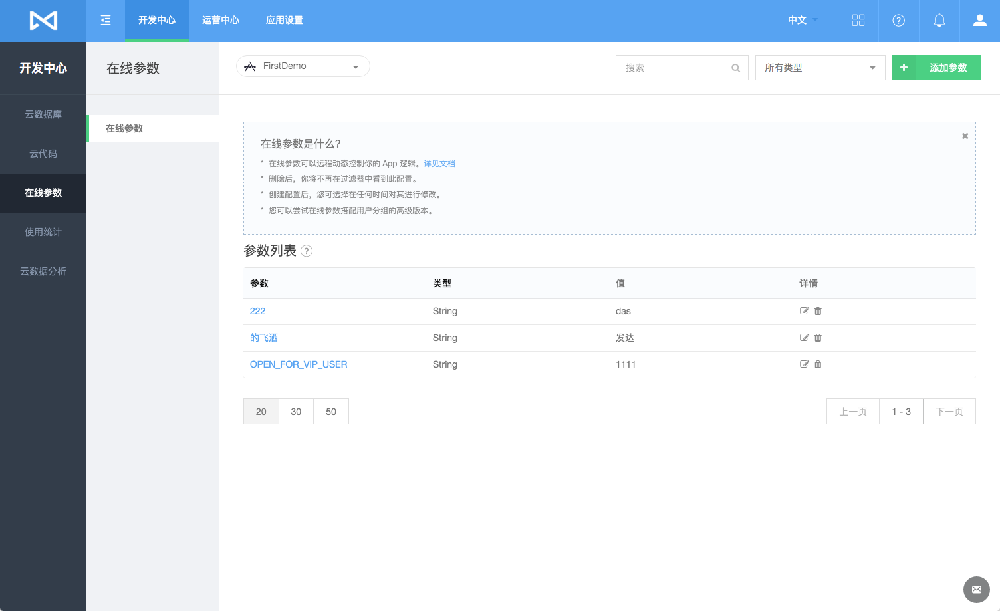
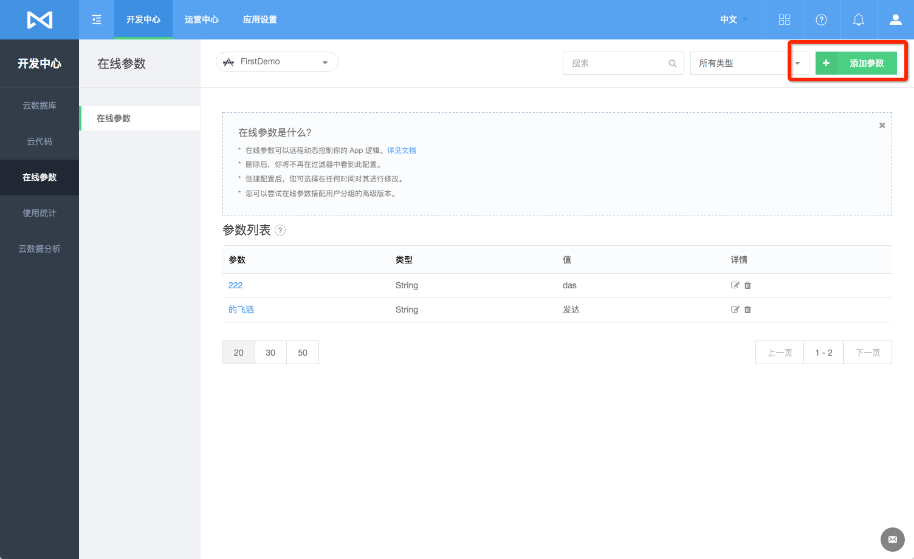
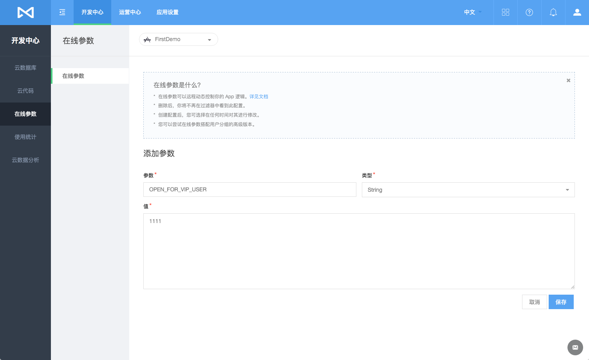
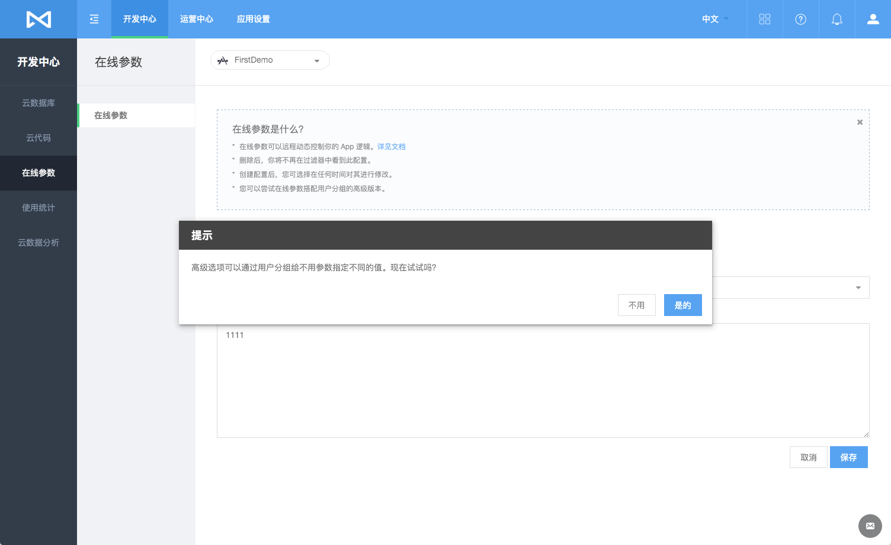
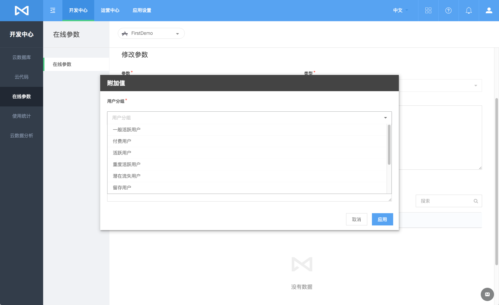
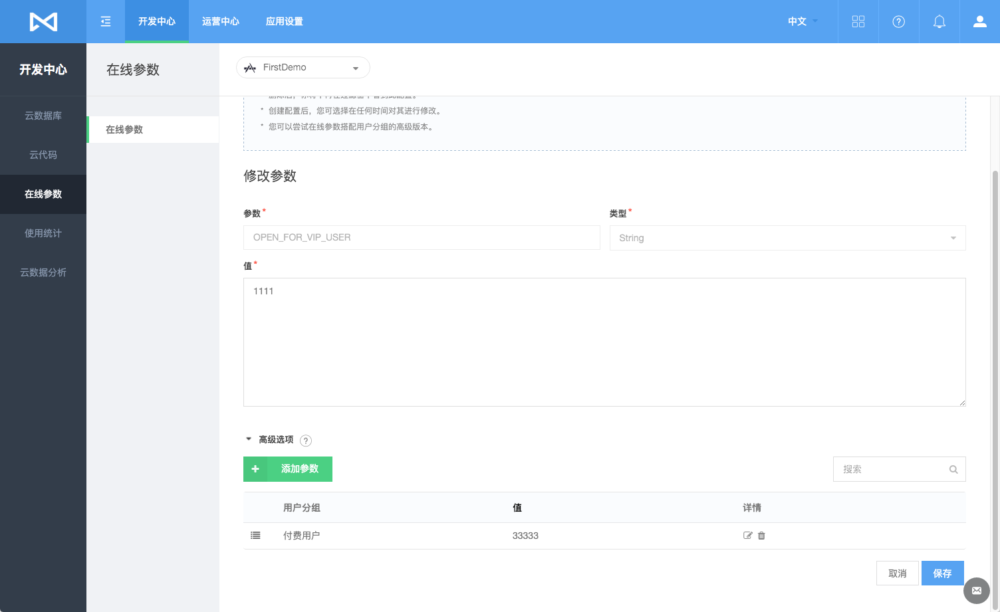

# 在线参数
## 简介
### 什么是在线参数
每个应用在云端都有一个对应的`MLCloudConfig`对象，用以存储该应用的参数。在线参数服务帮助您访问和操作云端参数。您可以通过 Console 在 MaxLeap 中配置应用参数，并且使用 iOS/Android SDK 读取云端的参数。
### 为何需要在线参数
将应用的部分配置放置在云端的优势在于：

* **动态配置：**
* **个性化用户体验：**在云端，您可以根据用户分组配置参数，使不同用户群有不同的用户体验

##在线参数列表
在开发者中心"在线参数"中，我们可以查看该应用下所有的在线参数的列表

##### 该列表包含以下列，及描述

列名|描述
-------|-------
Parameter|参数名称
Type|参数类型
Value|参数的值
Detail|(修改/删除按钮)

##添加参数
点击左上角"＋添加参数"按钮，提供参数名，参数类型及参数的值，便可以完成云参数的新建：

在线参数新建完毕后，系统将提示您，是否向不同的用户分组的用户设置不同的值：

点击确定后，您将进入在线参数的修改界面：

点击“添加参数”，您便可以不同的用户组设定不同的参数值：

添加成功后，您的在线参数的值将随着不同的用户分组而具有不同的值，非该用户组下的用户看到是默认值，如下图所示，对于：**`OPEN_FOR_VIP_USER`** 这个参数，付费用户将看到是：**`33333`**，而非付费用户组的用看到的是：**`1111`**

## 修改 / 删除在线参数
在Detail列中选择修改按钮，即可进入修改页面。

在Detail列中选择删除按钮，点击确认，即可删除该云参数。

## FAQ

内容更新中

## SDK 开发指南

[iOS开发指南](ML_DOCS_GUIDE_LINK_PLACEHOLDER_IOS#CLOUD_CONFIG_ZH)

[Android开发指](ML_DOCS_GUIDE_LINK_PLACEHOLDER_ANDROID#CLOUD_CONFIG_ZH)
