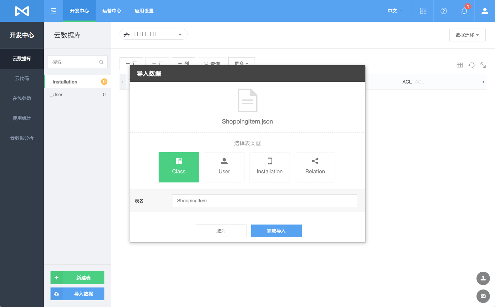

# 数据存储
## 简介

### 什么是数据存储服务
 Cloud Data是 MaxLeap 提供的数据存储服务，它建立在对象`MLObject`的基础上，每个`MLObject`包含若干键值对。所有`MLObject`均存储在 MaxLeap 上，您可以通过 iOS/Android Core SDK 对其进行操作，也可在Console中管理所有的对象。此外 MaxLeap 还提供一些特殊的对象，如`MLUser`(用户)，`MLRole`(角色)，`MLFile`(文件)，`MLGeoPoint`(地理位置)，他们都是基于`MLObject`的对象。

### 为何需要数据存储服务
数据存储服务将帮助您解决数据库基础设施的构建和维护，从而专注于实现真正带来价值的应用业务逻辑。其优势在于：

* 解决硬件资源的部署和运维
* 提供标准而又完整的数据访问API
* 不同于传统关系型数据库，向云端存储数据无需提前建表，JSON 格式的对象随存随取，高并发访问轻松无压力
* 可结合代码托管服务，实现云端数据的 Hook （详见 [MaxLeap 云代码](ML_DOCS_LINK_PLACEHOLDER_USERMANUAL#CLOUD_CODE_ZH)）

## 数据表

### 所有表
在开发中心的云数据库中，我们可以查看该应用下所有的表的列表：


若某个字段的类型为 `MLRelation`，即关联了其他 `MLObject`，该列的值会显示为"查看 Relations"。


点击 “查看 Relation” 进入详细页面，便可查看该属性关联的所有 `MLObject`.


### 新建/修改 表
点击"＋新建表"按钮，输入表名，便可以完成表的新建，您同时可以设置表的权限：


新建表完毕后，您可以选中改表后，对其进行如下修改：

* 新建列：对当前表新增列
* 新建行：添加一条数据
* 筛选表格数据显示：点击沙漏图标
* 选择表格显示列：点击右上角表格图标
* 更多按钮下，还可以删除列、删除表、对表进行权限设置

### 删除表
在表列表中选中要删除的表，在右侧选择 **更多** >> **删除表** ，确认即可。


## 数据迁移

### 简介

数据迁移是可以对用户数据进行备份，平台迁移。

##### 包括
* 数据导入
* 数据导出
* 操作历史

### 需求场景

* 数据备份
* 从其他平台迁移到 MaxLeap

### 操作入口

**数据迁移** 按钮下包含：**数据导入**、**数据导出**、**操作历史** 的入口。


### 数据导入

我们提供通过 JSON 文件导入数据的功能。

##### JSON文件格式

JSON 格式要求 JSON 对象包含 results 字段，对应的是一个对象数组。

一个包含普通对象的文件看来像这样：

``` javascript
{ "results": [
  {
    "createdAt" : "2015-09-15T06:12:38.476Z",
    "number" : 2,
    "name" : "lisi",
    "class" : {
     "__type" : "Pointer",
     "className" : "class",
     "objectId" : "55f7b6435ed2179e2736beb4"
   },
   "age" : 13,
   "objectId" : "55f7b6d660b20b05f9ff86ce",
   "updatedAt" : "2015-09-15T09:50:54.589Z"
}]
}
```

关联 Relation 数据的导入，需要填写导入的表名称，导入后的字段名称，关联的表名称等信息，才能完整导入，示范的 relation 数据类似

``` json
{"results":[
  {
    "owningId" : "55f7b6a05ed2179e2736bebf",
    "relatedId" : "55f7e78560b20b05f9ff87ae"
  }
]}

```

其中：

* owningId 是将要导入的表内已经存在的对象的 objectId。
* relatedId 是将要关联的表里的对象的 objectId。

例如 Post 有一个字段 comments 是 relation 类型，对应的表是 Comment，那么 owningId 就是已存在的 Post 的 objectId，而 relatedId 就是关联的 Comment 的 ObjectId。

#### 导入数据

在云数据库中点击 **数据迁移** >> **导入数据**，或者直接在左下角点击 **导入数据** ，选择您所要导入的 JSON 文件：


#### 选择表类型



##### 说明
* 如果是无 Relation 类型列的数据表，直接选择 Class 完成导入，默认使用文件名作为表名称
* 如果表存在列类型为 Relation，在目标列中可以填入已有的字段类型为 Relation 的名称。如果不存在，系统则会自动创建。

##### 注意事项

* 导入文件最大支持`100M`,如果超过可以分多次导入
* 数据 objectId 重复，会忽略该记录
* 一次导入如果产生`500`条以上失败日志系统将终止导入进程

### 数据导出

数据导出可以将 MaxLeap 平台数据导出到本地。导出任务完成后用户会收到通知邮件，内容会包含文件下载链接，也可以在 **数据迁移** >> **操作历史** 里面下载

#### 导出数据

点击 **数据迁移** >> **导出数据**，所选的表的数据就会被导出为 JSON 格式的文件，并发送至您的邮箱：


##### 注意事项

* 数据文件默认使用表名称命名，同时导出多个表，将生成多个对应表名的 JSON 数据文件
* 导出时数据文件存储在 MaxLeap 平台上，保留 7 天，并同时发送至注册邮箱，请及时下载
* 导出支持最多`1000`万条记录

### 操作历史

您还可以进入 **数据迁移** >> **操作历史** 查看导入或者导出的历史纪录

并且还可以

* 下载导出数据
* 查看导入/导出日志


## 数据安全
MaxLeap 目前提供类级别的安全授权机制，行级别的安全授权机制将在下个版本支持。

### 类级别安全设置

在管理界面的云数据界面创建类的时候，可以选择如下的级别

类安全级别|数据创建者|其他应用用户|公司管理员或 MasterKey
---|---|---|---
共享|读/创建/修改/删除|读/创建|读/创建/修改/删除
公开|读/创建/修改/删除|读/创建/修改/删除|读/创建/修改/删除
私有|读/创建/修改/删除|创建|读/创建/修改/删除
只读|读|读|读/创建/修改/删除

云数据库的每一行记录都有一个 ACL 字段，该字段是一个 Json 格式的数据，里面包含该行数据的 creator。判断某个请求对应的用户是否为数据创建者就是根据 ACL字段里的 creator 判断的。从移动端和 web console 发出的数据插入请求在MaxLeap 后端处理的时候，会自动创建 ACL 并设置对应的 creator。

下面是这四种类安全级别的一些使用场景。

* 共享：论坛的帖子，回复，文章，共享图片等对所有人都可读，但只允许创建者修改
* 公开：公共编辑的信息列表，所有人都能够创建，修改，读取和删除
* 私有：备忘录，个人敏感信息等只对创建者本人可读，可修改和删除
* 只读：如产品类别这样的信息，所有人都只能读，需要更新这些信息的时候只有管理员能更新

## 在线 SQL 分析
MaxLeap 为您的应用数据提供在线分析功能，您可以使用类SQL的查询语句对自己的数据进行高效的查询和导出。

详情查看 [云数据在线 SQL 分析](ML_DOCS_LINK_PLACEHOLDER_USERMANUAL#CLOUD_DATA_OFFLINE_ANALYZE_ZH)

## FAQ
内容更新中

## SDK 开发指南
[iOS开发指南](ML_DOCS_GUIDE_LINK_PLACEHOLDER_IOS#CLOUD_DATA_ZH)

[Android开发指南](ML_DOCS_GUIDE_LINK_PLACEHOLDER_ANDROID#CLOUD_DATA_ZH)
