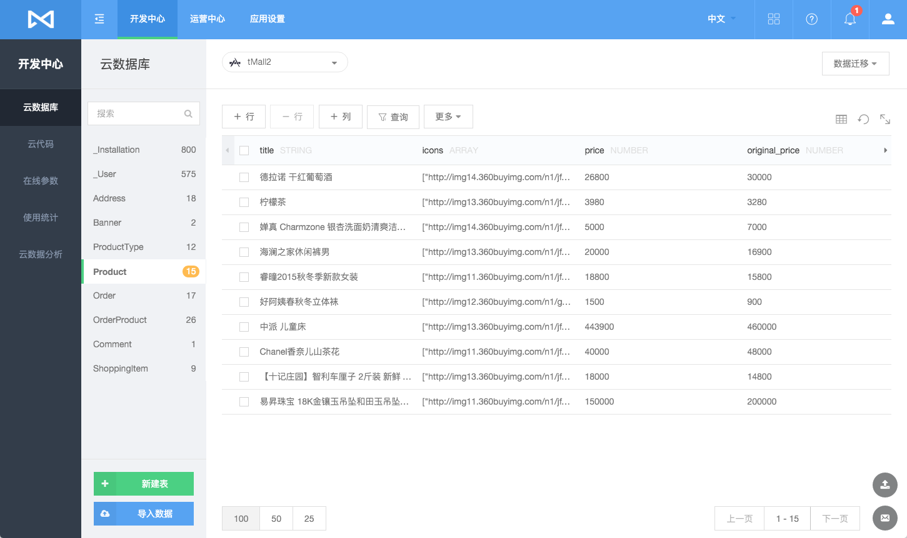
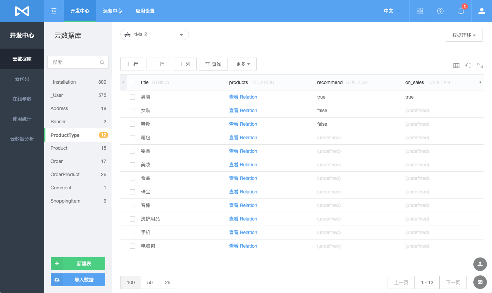
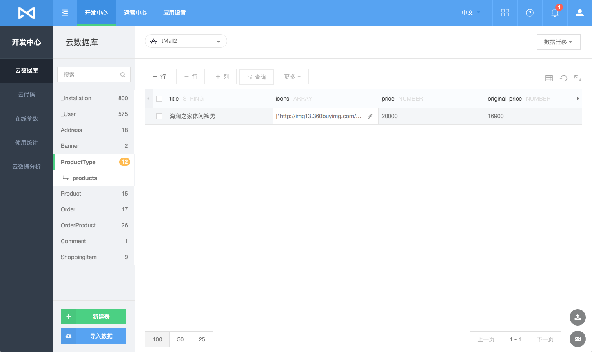
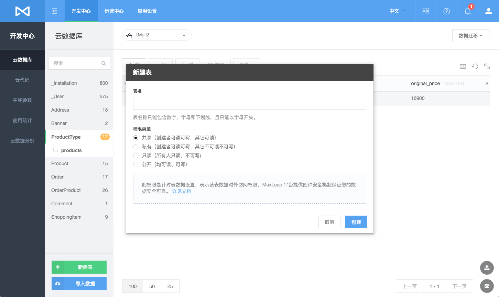
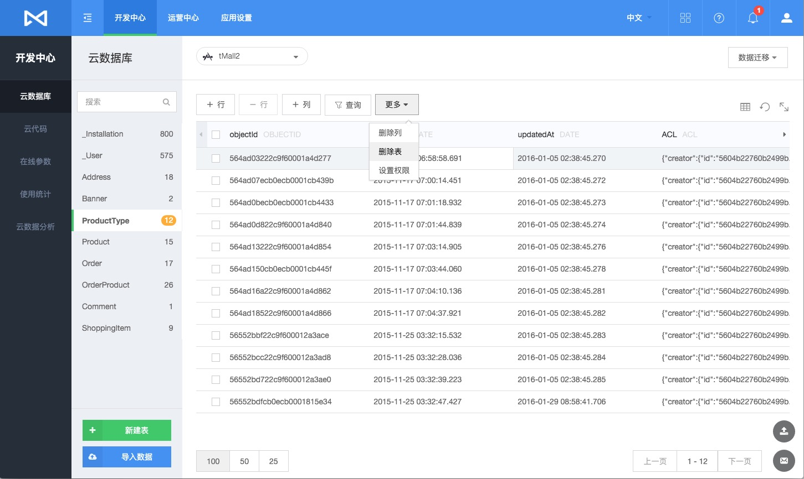
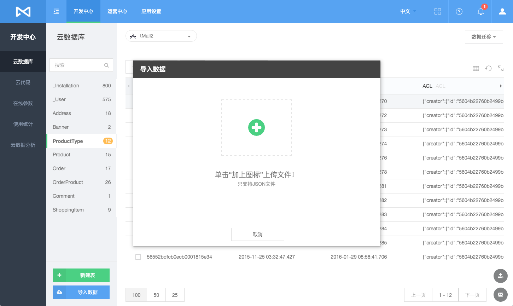
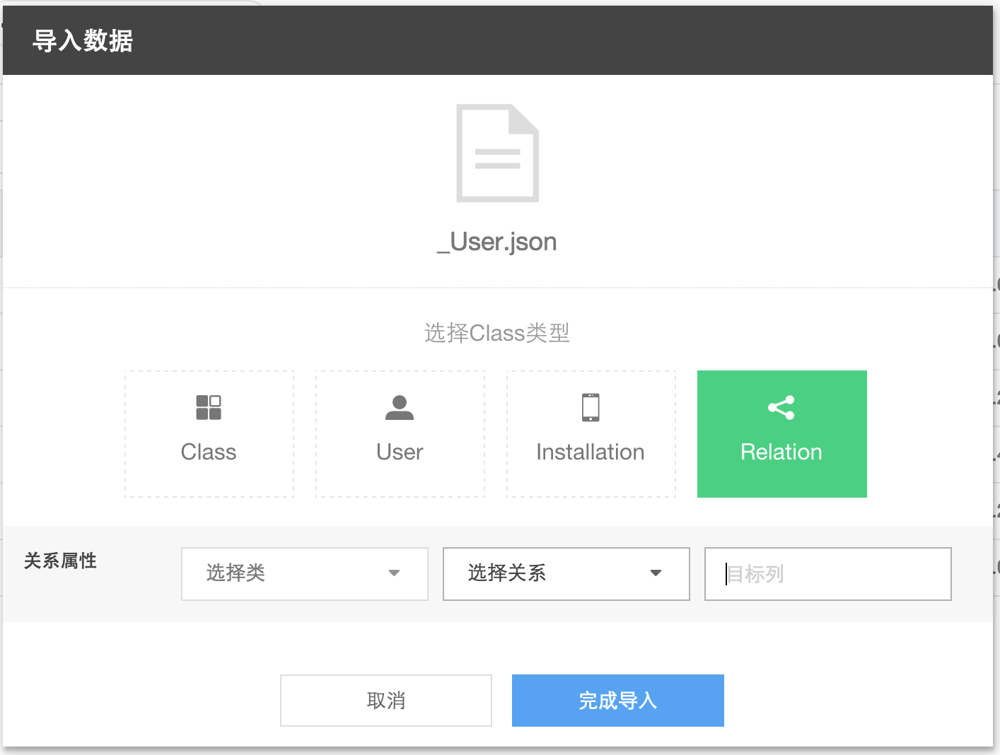
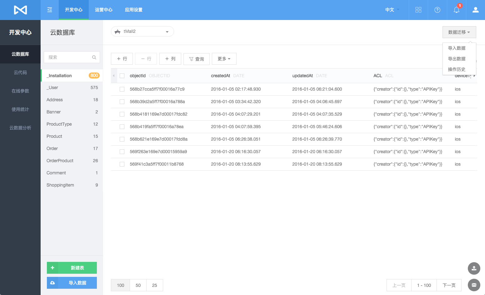
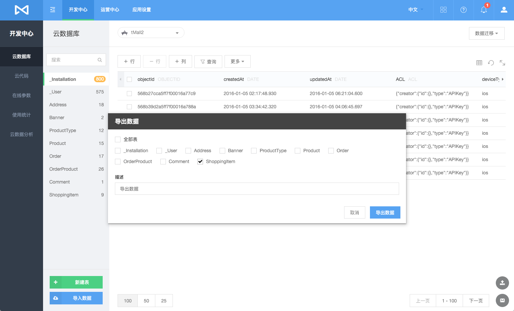
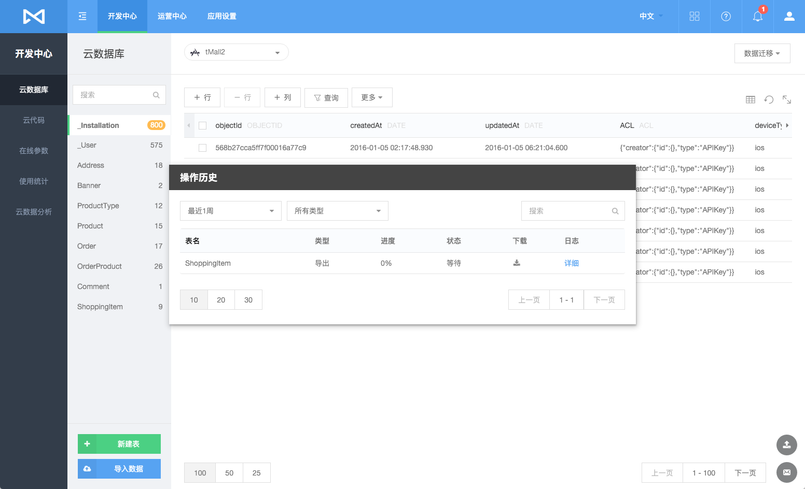

# 数据存储
## 简介

### 什么是数据存储服务
 Cloud Data是 MaxLeap 提供的数据存储服务，它建立在对象`MLObject`的基础上，每个`MLObject`包含若干键值对。所有`MLObject`均存储在MaxLeap上，您可以通过iOS/Android Core SDK对其进行操作，也可在Console中管理所有的对象。此外MaxLeap还提供一些特殊的对象，如`MLUser`(用户)，`MLRole`(角色)，`MLFile`(文件)，`MLGeoPoint`(地理位置)，他们都是基于`MLObject`的对象。

### 为何需要数据存储服务
数据存储服务将帮助您解决数据库基础设施的构建和维护，从而专注于实现真正带来价值的应用业务逻辑。其优势在于：

* 解决硬件资源的部署和运维
* 提供标准而又完整的数据访问API
* 不同于传统关系型数据库，向云端存储数据无需提前建表，JSON 格式的对象随存随取，高并发访问轻松无压力
* 可结合代码托管服务，实现云端数据的 Hook （详见 [MaxLeap 云代码](ML_DOCS_LINK_PLACEHOLDER_USERMANUAL#CLOUD_CODE_ZH)）

## 数据表
在开发者中心的"数据"分类中，我们可以查看该应用下所有的class的列表：



若某个字段的类型为MLRelation，即关联了其他MLObject，该列的值会显示为"View Relations".点击后，便可查看该属性关联的所有MLObject.





### 新建/修改 表
点击"＋添加类"按钮，输入class名，便可以完成class的新建：



新建class完毕后，您可以选中改class后，对其进行如下修改：

* 新建列：添加class属性
* 新建行：添加一条数据
* 筛选表格数据显示：点击沙漏图标
* 选择表格显示列：点击右上角表格图标

### 删除 表
在Claas列表中选中要删除的class，在右侧选择 更多 >> 删除类，确认即可。



## 数据迁移

### 简介

数据迁移是可以对用户数据进行备份，平台迁移。

### 需求场景

* 数据备份
* 从其他平台迁移到MaxLeap

### 功能介绍

#### 数据导入

我们提供通过 JSON 文件导入数据的功能。

##### JSON文件格式

JSON格式要求JSON对象包含results字段，对应的是一个对象数组。

一个包含普通对象的文件看来像这样：

``` javascript
{ "results": [
  {
    "createdAt" : "2015-09-15T06:12:38.476Z",
    "number" : 2,
    "name" : "lisi",
    "class" : {
     "__type" : "Pointer",
     "className" : "class",
     "objectId" : "55f7b6435ed2179e2736beb4"
   },
   "age" : 13,
   "objectId" : "55f7b6d660b20b05f9ff86ce",
   "updatedAt" : "2015-09-15T09:50:54.589Z"
}]
}
```

关联Relation数据的导入，需要填写导入的class名称，导入后的字段名称，关联的class名称等信息，才能完整导入，示范的relation数据类似

``` json
{"results":[
  {
    "owningId" : "55f7b6a05ed2179e2736bebf",
    "relatedId" : "55f7e78560b20b05f9ff87ae"
  }
]}

```

其中：

* owningId 是将要导入的class表内已经存在的对象的objectId。
* relatedId 是将要关联的class里的对象的objectId。

例如Post有一个字段comments是relation类型，对应的Class是Comment，那么owningId就是已存在的Post的objectId，而relatedId就是关联的Comment的ObjectId。

##### 导入流程

在云数据中点击 数据迁移 >> 导入数据，选择您所要导入的 JSON 文件：



导入数据：

  

如果 Class 类型为Relation,在目标列中可以填入已有的字段类型为relation的名称。如果不存在，系统则会自动创建。

##### 注意事项

* 导入文件最大支持`100M`,如果超过可以分多次导入
* 数据objectId重复，会忽略该记录
* 一次导入如果产生`500`条以上失败日志系统将终止导入进程

#### 数据导出

数据导出可以将MaxLeap平台数据导出到本地。导出任务完成后用户会收到通知邮件，内容会包含文件下载链接。

##### 数据迁移


##### 导出流程

点击 数据迁移 >> 导出数据，所选的 Class 就会被导出为 JSON 格式的文件，并发送至您的邮箱：



##### 注意事项

* 导出时数据文件存储在云服务器，并保留7天，发邮件通知，请及时下载
* 导出支持最多`1000`万条记录，能够区分公司账号，用`AdminConsole`可以设置

#### 操作历史

您还可以进入 数据迁移 >> 操作历史 查看导入或者导出的历史纪录：



## 在线 SQL 分析
MaxLeap 为您的应用数据提供在线分析功能，您可以使用类SQL的查询语句对自己的数据进行高效的查询和导出。

详情查看 [云数据在线 SQL 分析](ML_DOCS_LINK_PLACEHOLDER_USERMANUAL#CLOUD_DATA_OFFLINE_ANALYZE_ZH)

## FAQ
内容更新中

## SDK 开发指南
[iOS开发指南](ML_DOCS_GUIDE_LINK_PLACEHOLDER_IOS#CLOUD_DATA_ZH)

[Android开发指南](ML_DOCS_GUIDE_LINK_PLACEHOLDER_ANDROID#CLOUD_DATA_ZH)
