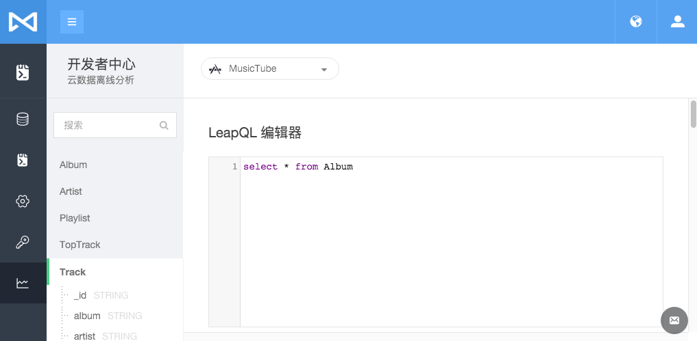
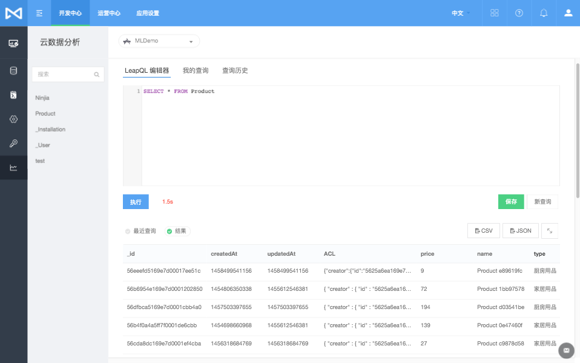

## 云数据离线分析
##### _Author: Jeff Tsai
##### _Github: https://github.com/jjeffcaii
### 简介
MaxLeap 云数据离线分析旨在为用户提供一种处理自有应用数据的方式，用户可以使用类SQL的查询语句对自己的数据进行高效的查询和导出。该功能的数据源为截止今日凌晨的历史数据。
### 背景及目标
现有的云数据功能无法完成一些超大规模数据量下的聚合统计型的查询，不同的表之间也是相互隔离，无法相互连接。很多用户渴望能以一种熟悉的查询方式来分析自己的数据，比如：一个音乐类的应用，想查询最火热的歌手Top10，其在我们的云数据离线分析平台上可以轻松快捷地获取。
为了达到易用和高效的平衡，我们致力于实现以下目标：

- 提供类SQL的业界通用查询方式
- 鲁棒性，确保我们的系统是稳定健壮的
- 查询结果的优雅展示
- 丰富的文件格式导出
- 人性化的服务 （比如耗时长的任务我们会邮件通知，避免您不必要的等待）
 
### 技术架构
- 基于业界比较成熟的解决方案，核心SQL采用SparkSQL，SparkSQL对比Hive拥有巨大的性能优势，我们在小型的测试环境中对千万级数据的聚合查询仅2分钟。
- 我们的攻城狮实现了一套自有的ETL工具用于数据的转换，通过tail数据库的日志到Kafka，再入库到HBase形成全量数据，最后dump成高效的列式存储格式文件。
- 对于SQL的请求和响应，我们基于Redis的PubSub定制了一套小型的消息系统。
- 以下是我们大致的架构图


### 启用设置
- 第一次使用，请进入应用设置页面，打开“云数据离线分析”开关，系统会在后台导入您的云数据，泡杯咖啡，耐心等待


- 打开“开发者中心”-“云数据离线分析”页面，如果您的数据已经导入完成，页面会在左侧列出当前的所有表结构



- 在右侧的编辑器中撰写您的LeapQL语句，点击执行，等待片刻后，页面将会返回执行结果。



### 功能介绍

#### 查询结果
查询结果包含实时和离线查询

- 实时：页面上直接渲染
- 离线：系统会自动在完成查询后将查询结果以邮件方式发送到您的邮箱。（当然您也可以重复提交您的查询直至页面返回查询结果）

##### 实时结果
当您的查询表数据规模比较小，或者您的数据已经被预热，此时您的查询速度快速，会在几秒至几十秒内返回响应。
##### 离线结果
当您的查询表数据规模比较大，或者您的数据为第一次加载的冷数据，此时您的查询有可能会需要几分钟的处理时间，为了避免浪费您宝贵的时间，我们推荐耐心等待系统将查询结果发送到您的邮箱。

#### LeapQL 支持语法
##### 基础SQL
请参考基础SQL语法。支持`select`,`join`,`group by`,`order by`,`limit`等

##### UDFs

| 函数名 | 功能 | 示例 | 备注 |
|-|-|-|-|
| = | 等值比较 | select * from tbl where age = 18 | |
| > | 大于比较 | select * from tbl where age > 18 | |
| < | 小于比较 | select * from tbl where age < 18 | |
| >= | 大于等于比较 | select * from tbl where age >= 18 | |
| <= | 小于等于比较 | select * from tbl where age <= 18 | |
| <>,!= | 不等值比较 | select * from tbl where age <> 18 | |
| is null | 空值判断 | select * from tbl where name is null | |
| is not null | 非空判断 | select * from tbl where name is not null | |
| like | 相似比较 | select * from tbl where name like '_abc%' | 占位符说明: '%'表示任意数量的字符，而'_'表示单个任意字符 |
| regexp | 正则比较 | select * from tbl where name regexp '^T.*my$' | |
| array[0] | 数组访问 | select favorites[0] from tbl | 仅适用于array类型 |
| size | 获取大小 | select size(playlists) from tbl | 仅适用于array类型 |
| length | 获取长度 | select length(name) from tbl | 仅适用于字符串类型 |
| from_unixtime | 日期格式化 | select from_unixtime(startTimeMills/1000,'yyyy-MM-dd HH:mm:ss') as date_str from tbl | |
| to_date | 返回字符串的日期部分(年月日) | selet to_date(date_str) from tbl | 备注: '2015-01-01 12:25:00' 将会被转换成 '2015-01-01' |


请参考Spark官网的SQL部分：[http://spark.apache.org/docs/latest/sql-programming-guide.html](http://spark.apache.org/docs/latest/sql-programming-guide.html)


#### 查询样例
##### 简单样例
查询位于上海市区的用户

```sql
    select
        * 
    from
        _User 
    where
        timezone='Asia/Shanghai'

```

##### 一般样例
查询Top10的安装语言

```sql
    select
        language,
        count(1) as totals 
    from
        _Installation 
    group by
        language 
    order by
        totals limit 10

```

##### 复杂样例
查询Top50的最受欢迎的艺人（假设已经存在艺人和歌曲两张表）

```sql
    select
        Artist.name as artist_name,
        count(1) as track_num 
    from
        Artist 
    left join
        Track 
            on Track.artist=Artist.name 
    group by
        Artist.name 
    order by
        track_num desc,
        artist_name asc limit 50
        

```
