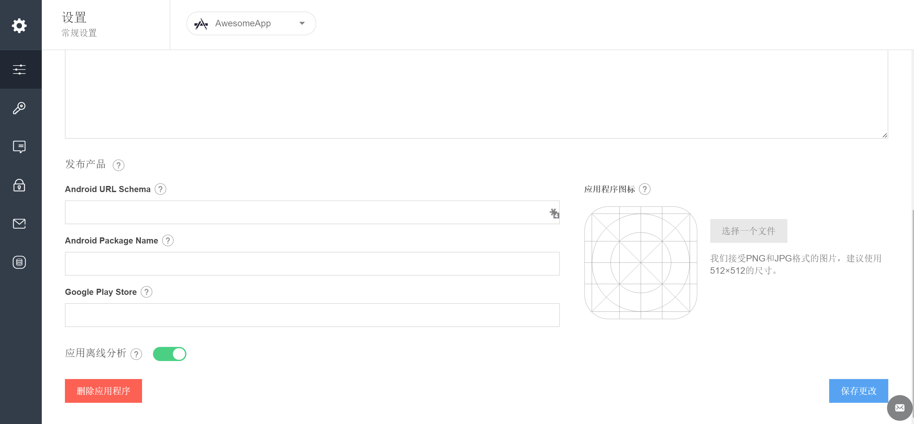
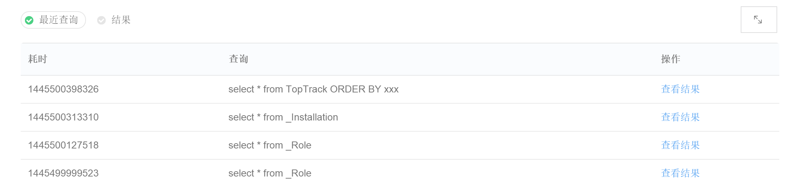

## 离线数据分析

### 简介
这里说明什么是 MaxLeap 离线数据分析，可参考需求文档
### 背景及目标
可参考需求文档
### 技术架构
描述技术架构优势
### 启用设置
离线数据分析服务的默认状态是关闭的。为启用它，可进入 设置 >> 常规设置 的最底部，将“应用离线分析”勾选即可：

### 功能介绍

#### 查询结果
描述两种结果大概情况及原因
##### 实时结果
详细描述实时结果原因，流程
##### 离线结果
详细描述离线结果原因，流程，邮件相关

#### DSL 查询语言 LeapQL
文档可参考leancloud
https://leancloud.cn/docs/leaninsight_guide.html#类似_SQL_的查询分析语法

#### 查询样例
进入 云数据 >> 离线数据分析，你可以在此处输入自定义 SQL 语句，对所有云数据进行查询：

此外，所有的查询历史都将被保存，方便你随时查看：

