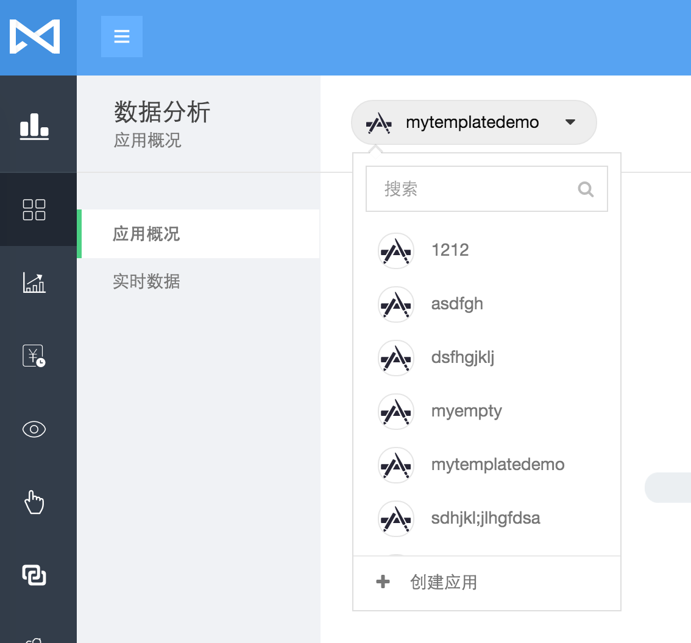
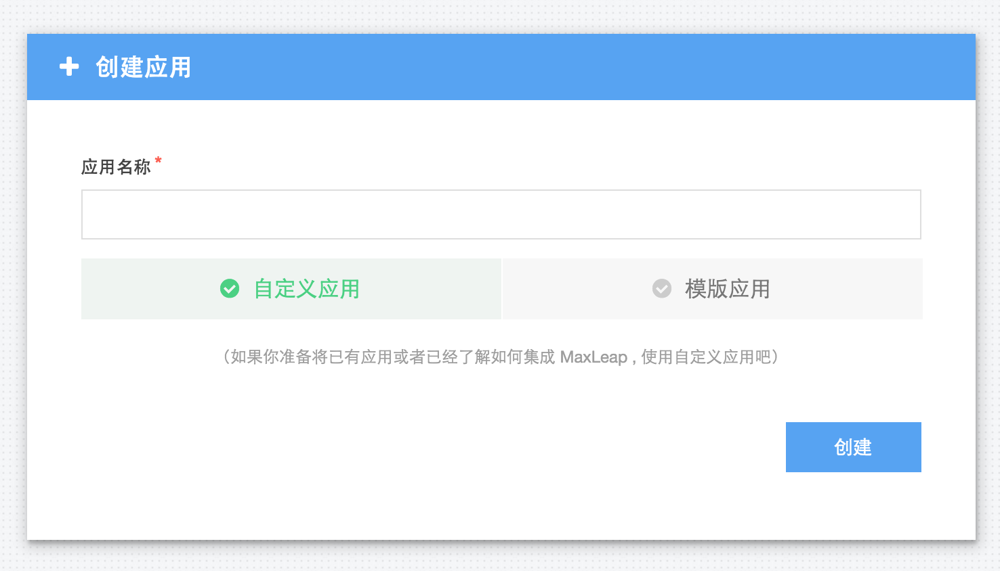
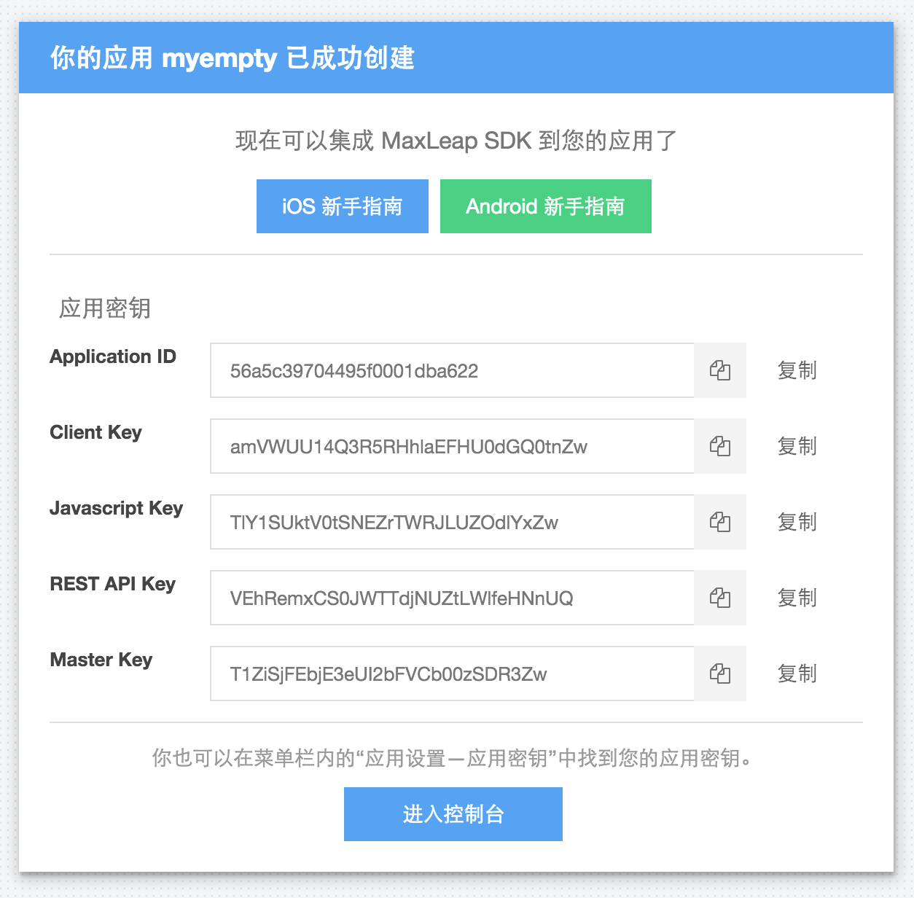
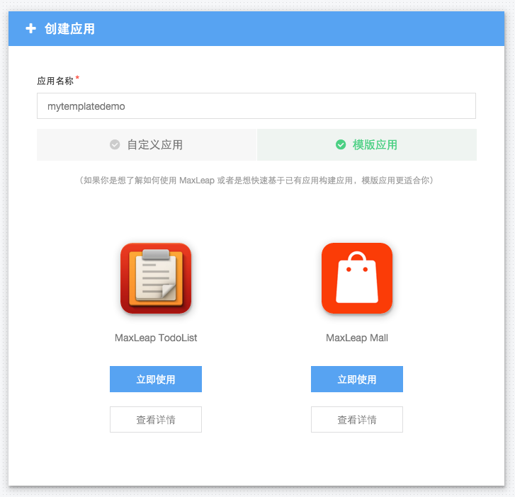
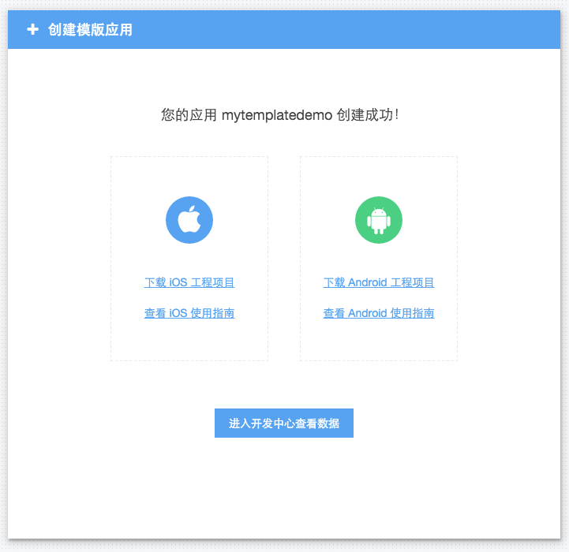

# 创建应用

如果移动应用想使用 MaxLeap 云服务，就需要在 MaxLeap 中创建对应的应用。
如果你准备将已有应用或者已经了解如何集成 MaxLeap，你可以使用自定义应用。
如果你是想了解如何使用 MaxLeap 或者是想快速基于已有应用构建应用，模版应用更适合你。

可以在每个页面的应用选择器中创建应用：

## 创建自定义应用

创建自定义应用非常简单，只需要输入应用的名字即可：

自定义应用创建完成后会有 MaxLeap SDK 集成的相关指导：

## 创建模版应用

MaxLeap 内置了一些典型场景的模版，以方便开发者快速集成 MaxLeap SDK:

模版应用创建完成后就可以下载对应平台的项目工程了，同时也可以查看相关集成指南：
