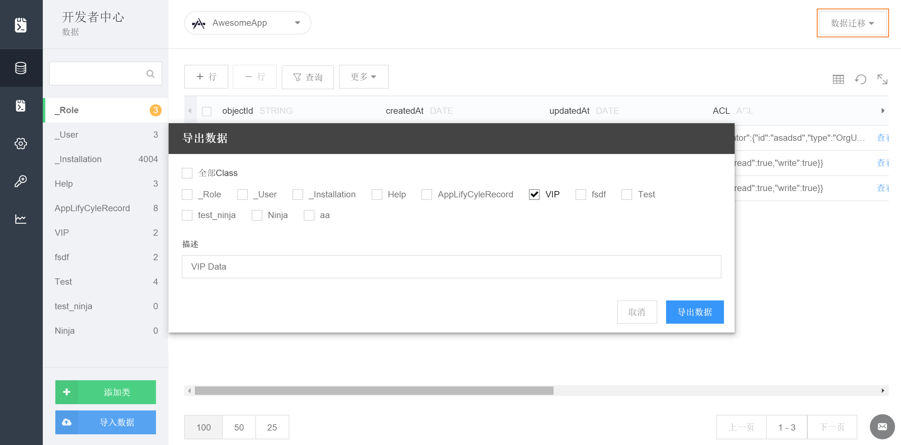
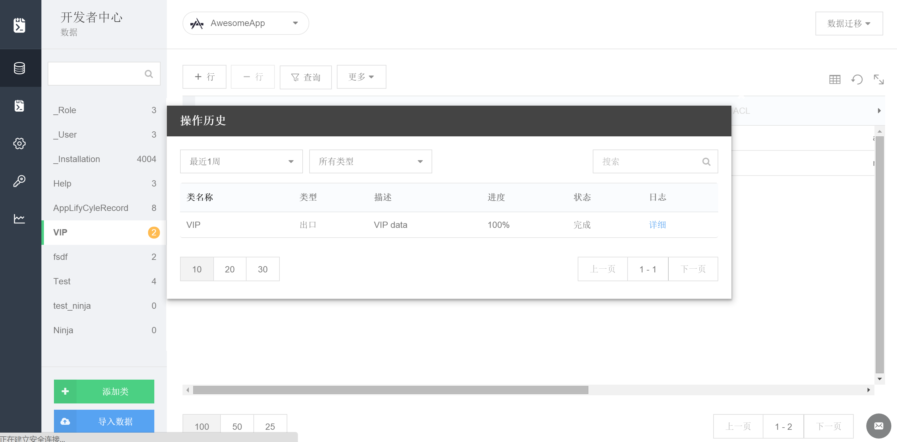

## 数据迁移

### 简介

数据迁移是可以对用户数据进行备份，平台迁移。

### 需求场景

* 数据备份
* 从其他平台迁移到MaxLeap

### 功能介绍

#### 数据导入

我们提供通过 JSON 文件导入数据的功能。

##### JSON文件格式

JSON格式要求JSON对象包含results字段，对应的是一个对象数组。

一个包含普通对象的文件看来像这样：

``` javascript
{ "results": [
  {
    "createdAt" : "2015-09-15T06:12:38.476Z",
    "number" : 2,
    "name" : "lisi",
    "class" : {
     "__type" : "Pointer",
     "className" : "class",
     "objectId" : "55f7b6435ed2179e2736beb4"
   },
   "age" : 13,
   "objectId" : "55f7b6d660b20b05f9ff86ce",
   "updatedAt" : "2015-09-15T09:50:54.589Z"
}]
}
```

关联Relation数据的导入，需要填写导入的class名称，导入后的字段名称，关联的class名称等信息，才能完整导入，示范的relation数据类似

``` json
{"results":[
  {
    "owningId" : "55f7b6a05ed2179e2736bebf",
    "relatedId" : "55f7e78560b20b05f9ff87ae"
  }
]}

```


其中：

* owningId 是将要导入的class表内已经存在的对象的objectId。
* relatedId 是将要关联的class里的对象的objectId。

例如Post有一个字段comments是relation类型，对应的Class是Comment，那么owningId就是已存在的Post的objectId，而relatedId就是关联的Comment的ObjectId。

##### 导入流程


在云数据中点击 数据迁移 >> 导入数据，选择您所要导入的 JSON 文件：

# 

导入数据：

  


如果 Class 类型为Relation,在目标列中可以填入已有的字段类型为relation的名称。如果不存在，系统则会自动创建对应字段名称。


##### 注意事项

* 导入文件最大支持`100M`,如果超过可以分多次导入
* 数据objectId重复，会忽略该记录
* 一次导入如果产生`500`条以上失败日志系统将终止导入进程

#### 数据导出

 数据导出可以将MaxLeap平台数据导出到本地。导出任务完成后用户会收到通知邮件，内容会包含文件下载链接。

##### 导出流程

点击 数据迁移 >> 导出数据，所选的 Class 就会被导出为 JSON 格式的文件，并发送至您的邮箱：




##### 注意事项

* 导出时数据文件存储在云服务器，并保留7天，发邮件通知，请及时下载
* 导出支持最多`1000`万条记录，能够区分公司账号，用`AdminConsole`可以设置

#### 操作历史


您还可以进入 数据迁移 >> 操作历史 查看导入或者导出的历史纪录：

