# 推送营销
## 简介
###什么是 MaxLeap 推送营销服务

推送营销服务是 MaxLeap 提供的营销和信息发布功能。目前提供两种消息模式：推送消息 和 应用内消息。您可以通过推送消息方式向指定人群推送消息，也可以通过应用内消息，在应用内向有某种行为的用户显示特定内容。您还可以在消息中设置用户点击后的目标 Activity。消息的创建，设置和发送均在Console中完成。

### 为何需要 MaxLeap 推送营销服务

结合 MaxLeap 数据分析服务提供的分析数据，以及用户分组，您可以高效地制定营销策略，并且通过推送营销服务实施您的策略。MaxLeap 推送营销服务的优势在于：

* **提高转化率：**随时向用户发布营销活动，维持用户活跃度并提高转化率
* **保障用户体验：**选择向指定用户分群发送消息，更具有针对性
* **动态内容管理：**应用内消息和推送消息中的内容均在 Console 中设置，用户所见内容可实时更新

## 营销活动列表
在"推送营销"报表中，我们可以查看该应用下所有的活动（包括**应用内消息活动**和**推送消息活动**）的列表：

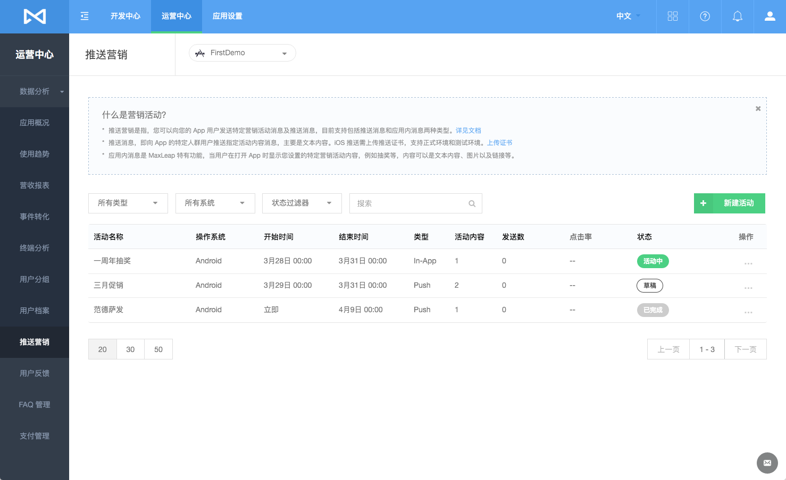

## 推送消息

### 新建推送活动

点击"＋创建活动"按钮，选择活动类型为**`推送`**即可进入创建推送消息界面：

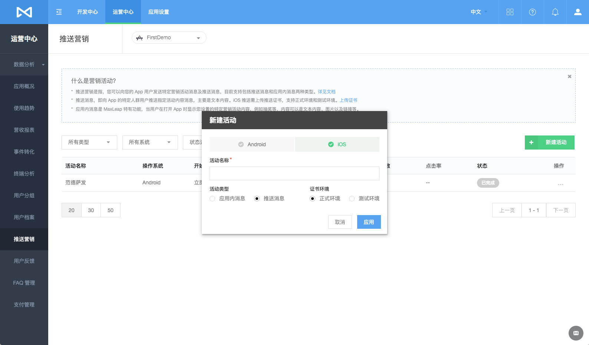

### 1、选择目标人群
选择接受推送的目标用户为下列三种类型之一：

* 所有用户
* 指定用户群体（**通过数据分析用户分组设置**）
* 指定设备过滤

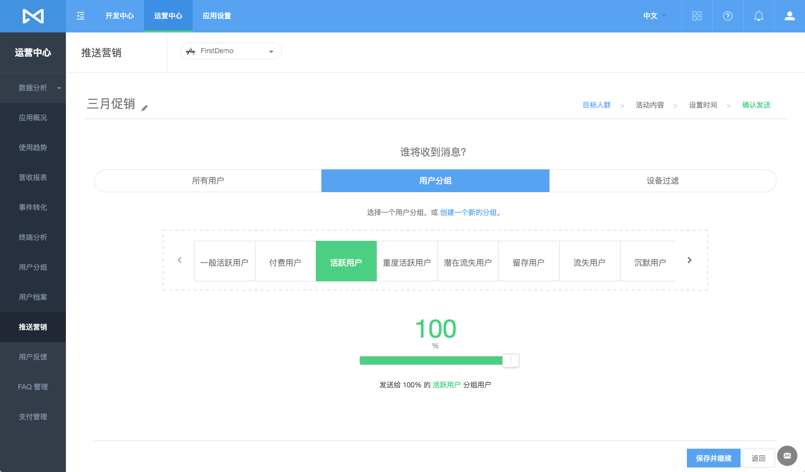

### 2、设置消息内容
一条推送消息包含以下内容，您需要在创建时填写，您还可以实时预览效果。

* 推送标题
* 推送消息内容文字
* 传递至客户端的参数
* 是否 A/B 测试

如下图显示，使用 **`A/B 测试`** 效果

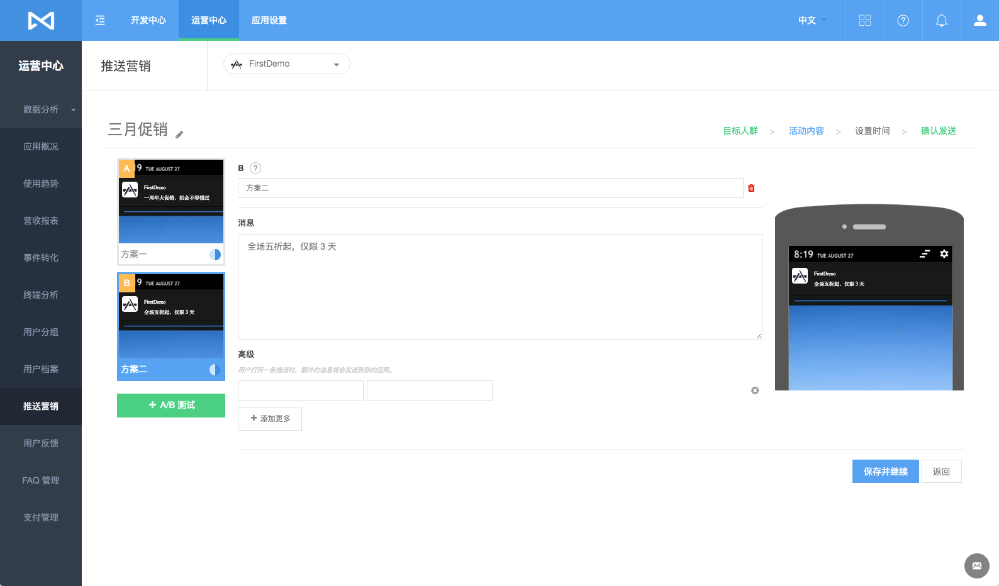

**A/B 测试** 

* 您可以对同一个活动设置不同方案推送
* 设置不同方案后，MaxLeap 将随机为每个方案推送对应 比例 用户

### 3、设置发送及结束时间
最后您需要指定该推送消息，何时开始发送及结束时间：

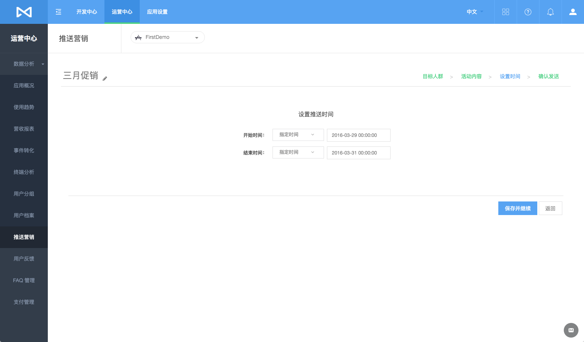

### 4、预览活动并确认发送
最后您需要指定该推送消息，何时开始发送及结束时间：

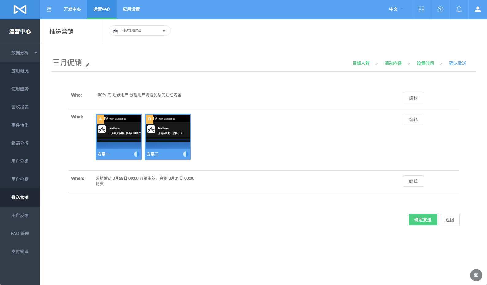

## 应用内消息
应用内消息，是当用户在应用内出现某些行为时，在应用内显示的消息。一个应用内消息，可包含文字，图片以及一个按钮，您可以自定义用户点击该按钮之后的跳转。

### 新建应用内消息活动

点击"＋创建活动"按钮，选择活动类型为**`应用内消息`**即可进入创建推应用内消息界面：

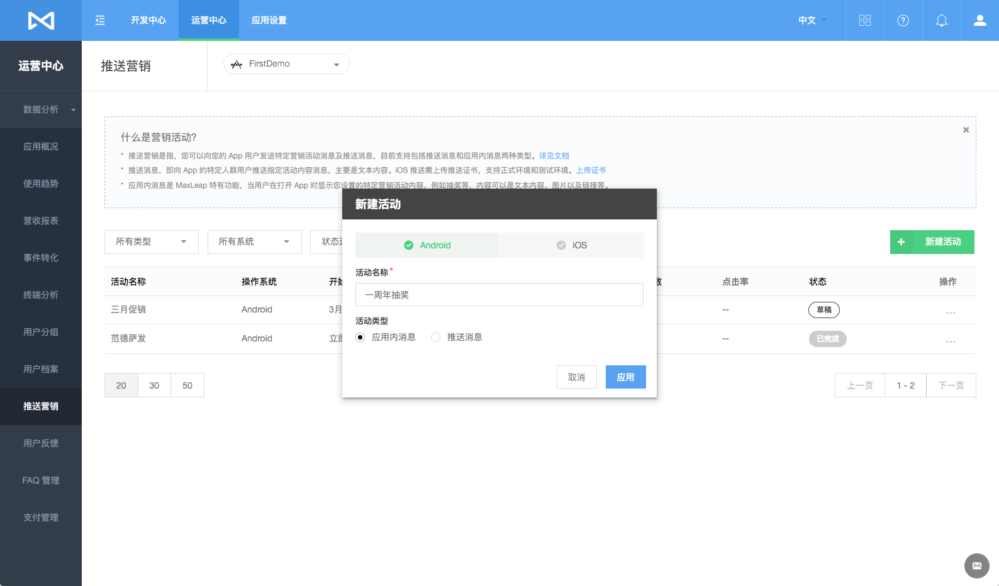

### 1、选择目标人群
选择接受推送的目标用户为下列三种类型之一：

* 所有用户
* 指定用户群体（**通过数据分析用户分组设置**）
* 指定设备过滤

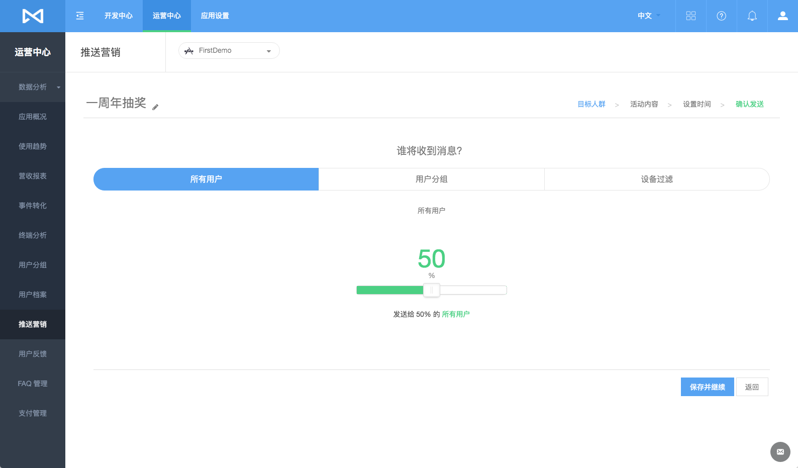

**注意** 

* 您还可以设置灰度测试，选择一定比例用户作为试验，效果好了以后再大规模推广

### 2、设置消息内容
一条推送消息包含以下内容，您需要在创建时填写。而且，您可以实时预览效果。

* 活动名：该应用内消息活动的名字
* 消息标题
* 选择位置：消息居中，顶部，底部或全屏显示
* 选择布局：图像文字的布局
* 选择背景：背景颜色或背景图片（支持上传图片）
* 设计&编辑内容：消息内容文字，以及文字颜色样式
* 设置点击行为：用户点击 对应 按钮之后，跳转的目标链接

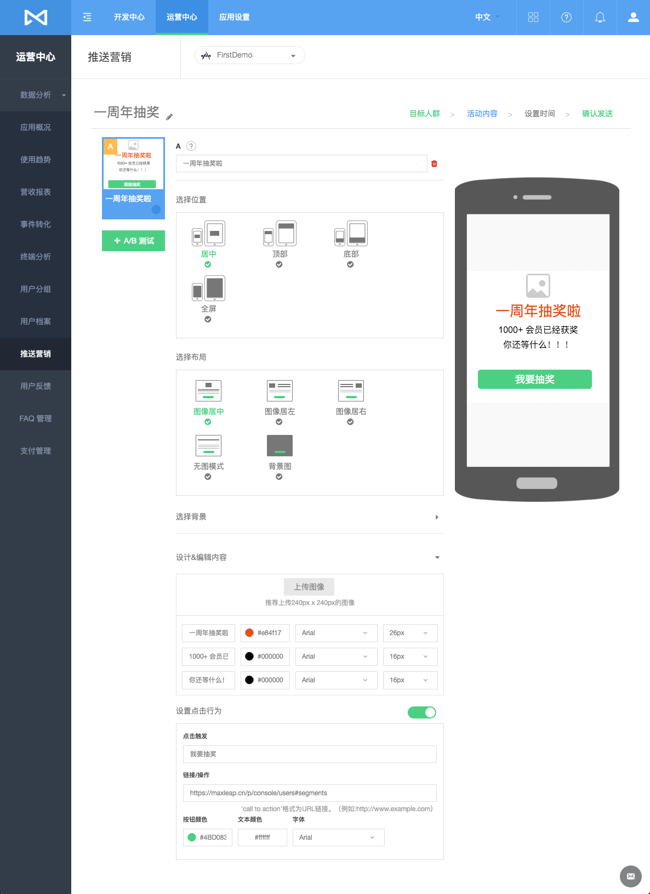

**A/B 测试** 

* 您可以对同一个活动设置不同方案推送
* 设置不同方案后，MaxLeap 将随机为每个方案推送对应比例用户

### 3、设置触发事件和时间

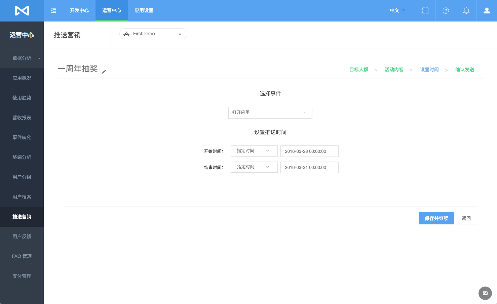

### 4、预览活动并确认发送
最后您需要指定该推送消息，何时开始发送及结束时间：

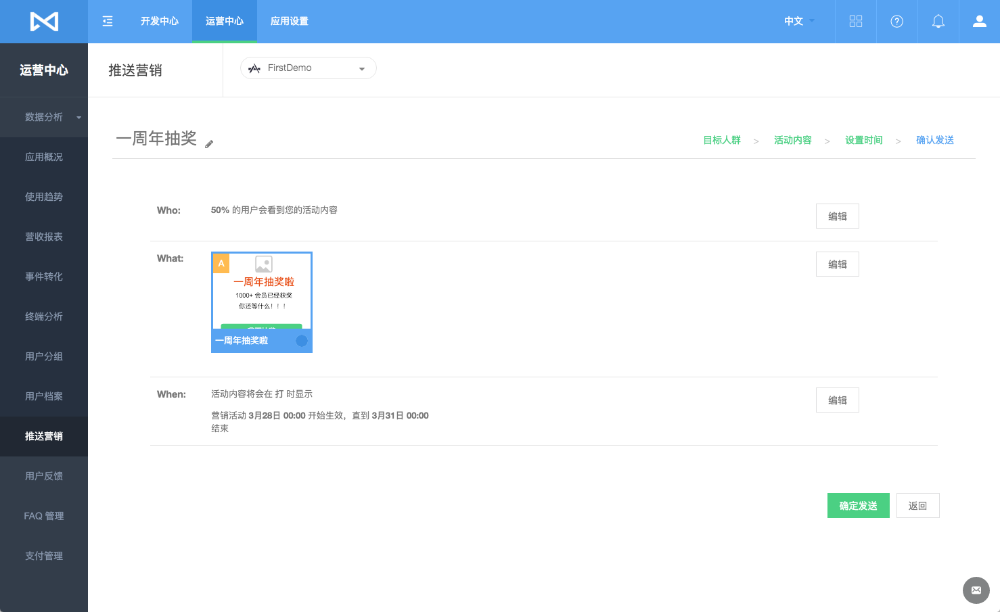

## 活动效果分析

### 查看效果详情

查看某个活动效果分析入口，点击操作下的查看按钮

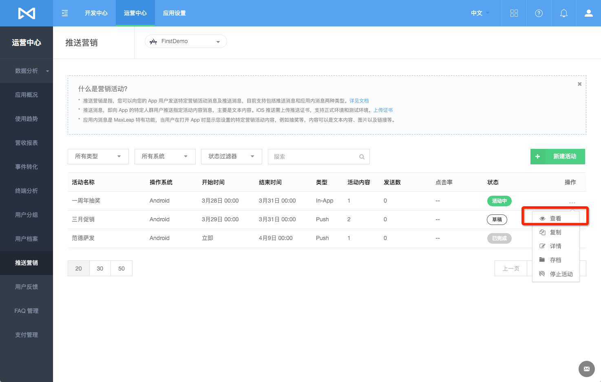

查看效果详情

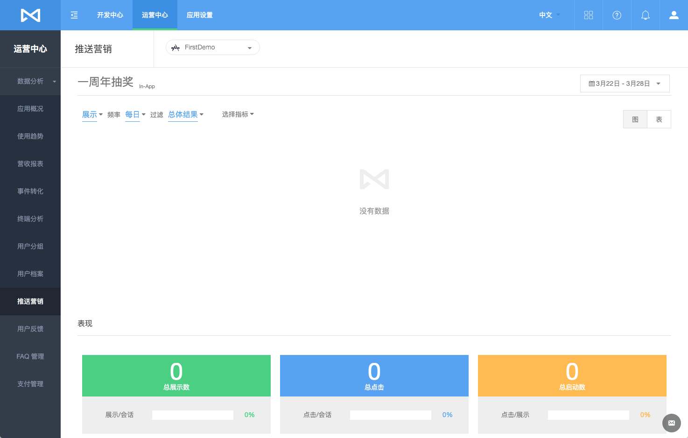

## FAQ
内容更新中

## SDK 开发指南
[iOS开发指南](ML_DOCS_GUIDE_LINK_PLACEHOLDER_IOS#MARKETING_ZH)

[Android开发指南](ML_DOCS_GUIDE_LINK_PLACEHOLDER_ANDROID#MARKETING_ZH)
