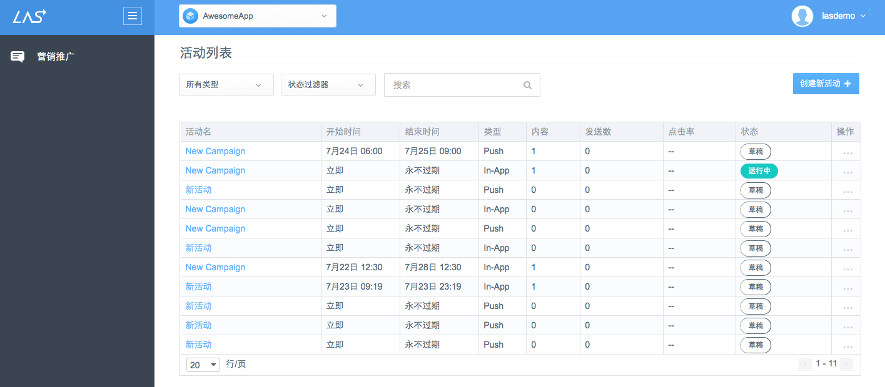
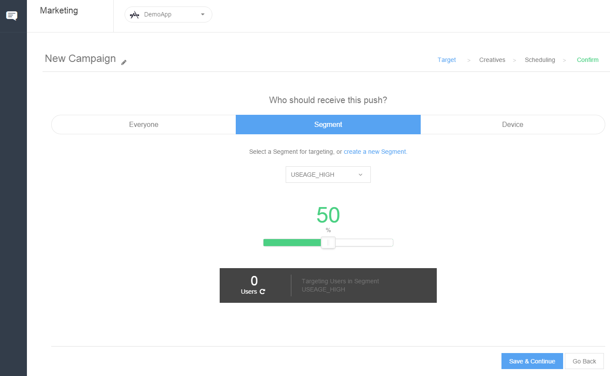
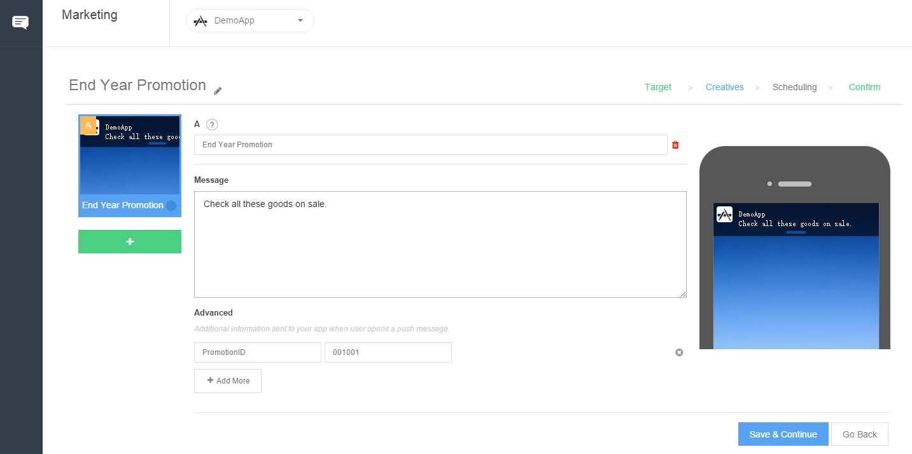
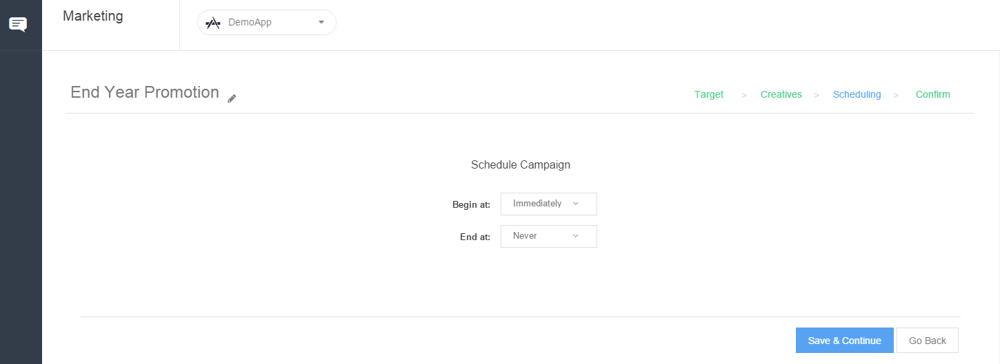
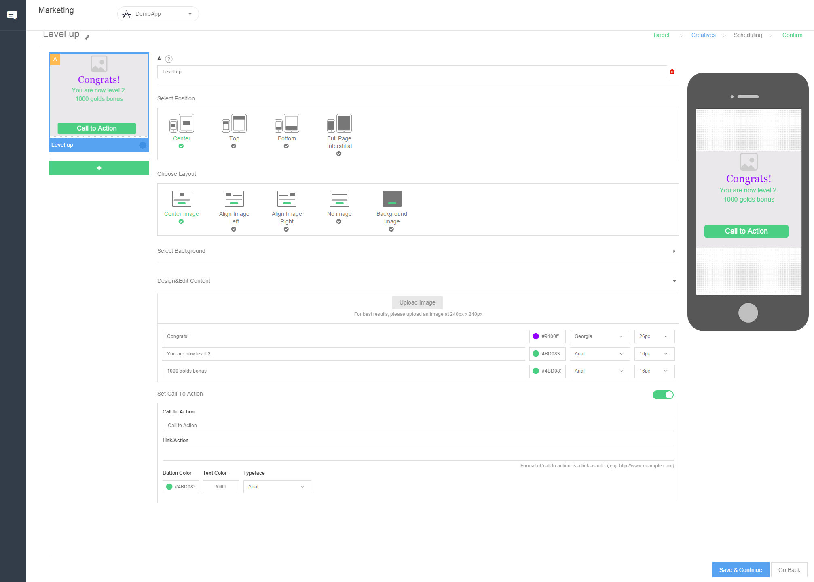
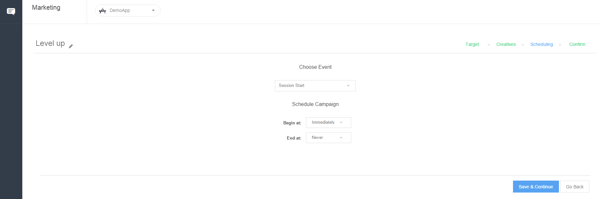
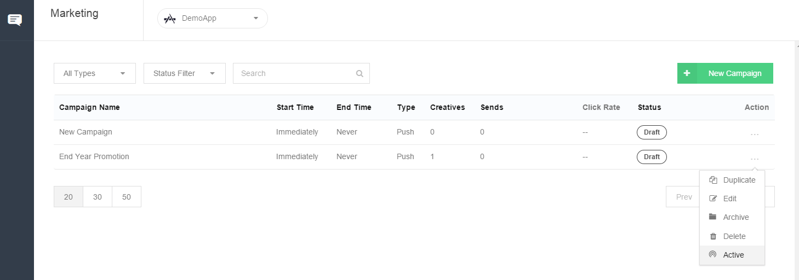

# 营销
##简介
###什么是LAS营销服务

营销服务是Leap Cloud提供的营销和信息发布功能。目前提供两种Marketing形式：Push Notification和In-App Message.您可以通过推送消息方式向指定人群推送消息，也可以通过In-App Message，在应用内向有某种行为的用户显示特定内容。您还可以在消息中设置用户点击后的跳转。消息的创建，设置和发送均在Console中完成。

###为何需要LAS营销服务

结合LAS分析服务提供的分析数据，以及LAS Users服务提供的Segment，您可以高效地制定营销策略，并且通过Marketing服务实施您的策略。LAS Marketing服务的优势在于：

* **提高转化率：**随时向用户发布营销活动，维持用户活跃度并提高转化率
* **保障用户体验：**选择向指定Segment发送消息，更具有针对性
* **动态内容管理：**Push Notification和In-App Message中的内容均在Console中设置，用户所见内容可实时更新

**如果您希望进一步了解LAS Marketing服务SDK，请参考[iOS开发指南 － Marketing]()或[Android开发指南 － Marketing](../../Android/Guide/Marketing.md)。**
##营销活动列表
在"营销推广"报表中，我们可以查看该应用下所有的活动（包括**应用内消息**和**活动**）的列表：

##新建推送消息
点击"＋创建新活动"按钮 >> 推送，即可进入创建推送消息界面：

####步骤一：选择推送目标
选择接受推送的目标用户为下列三种类型之一：

* 所有用户
* 指定Segment用户分群（关于**用户分群**的新建，请查看[用户分群使用手册](..)）
* 指定设备

####步骤二：创建推送消息内容
一条推送消息包含以下内容，您需要在创建时填写。而且，您可以实时预览效果。

* 推送标题
* 推送消息内容文字
* 传递至客户端的参数（详情请查看 [营销推广 － iOS开发指南](..) 或者 [营销推广 － Android开发指南](..)。）

注意：

* 您可以同一个推送中同时创建多条消息，点击该页面左侧的"＋"号即可

####步骤三：指定发送时间
最后您需要指定该推送消息，何时开始发送及有效期：

##新建应用内消息
应用内消息，是当用户在应用内出现某些行为时，在应用内显示的消息。一个应用内消息，可包含文字，图片以及一个按钮，您可以自定义用户点击该按钮之后的跳转。

点击"＋创建新活动"按钮 >> 应用内消息，即可进入创建应用内消息界面：

####步骤一：选择消息接收目标
与新建推送消息的步骤一相似。

####步骤二：创建消息内容
一条推送消息包含以下内容，您需要在创建时填写。而且，您可以实时预览效果。

* 活动名：该应用内消息活动的名字
* 消息标题
* 选择位置：消息居中，顶部，底部或全屏显示
* 选择布局：图像文字的布局
* 选择背景：背景颜色或背景图片（支持上传图片）
* 设计&编辑内容：消息内容文字，以及文字颜色样式
* 设置点击行为：用户点击Call to Action按钮之后，跳转的目标Activity（详情请查看 [营销推广 － iOS开发指南](..) 或者 [营销推广 － Android开发指南](..)。）

注意：

* 您可以同一个活动中中同时创建多条应用内消息，点击该页面左侧的"＋"号即可

####步骤三：指定触发事件和有效期

##激活推送消息/应用内消息
新建完毕的推送消息，将为“草稿”状态。您可以选中一个推送消息，点击“激活任务”，以将该活动的状态改为“运行中”。此时，活动将按照指定的计划执行。

## 下一步

**如果您希望进一步了解LAS Marketing服务SDK，请参考[iOS开发指南 － Marketing]()或[Android开发指南 － Marketing](/zh/Android/Guide/Marketing.md)。**
