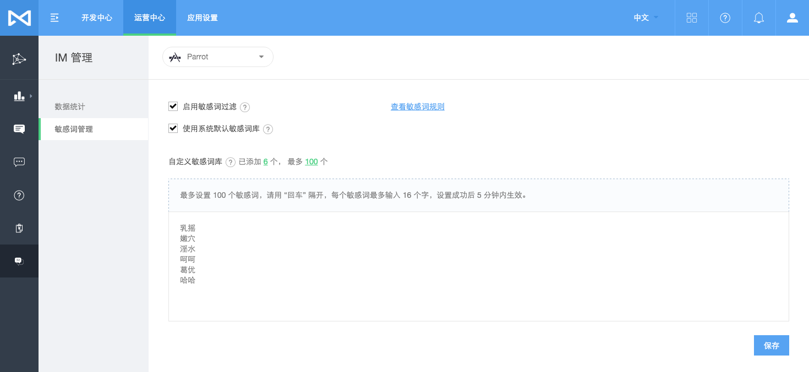
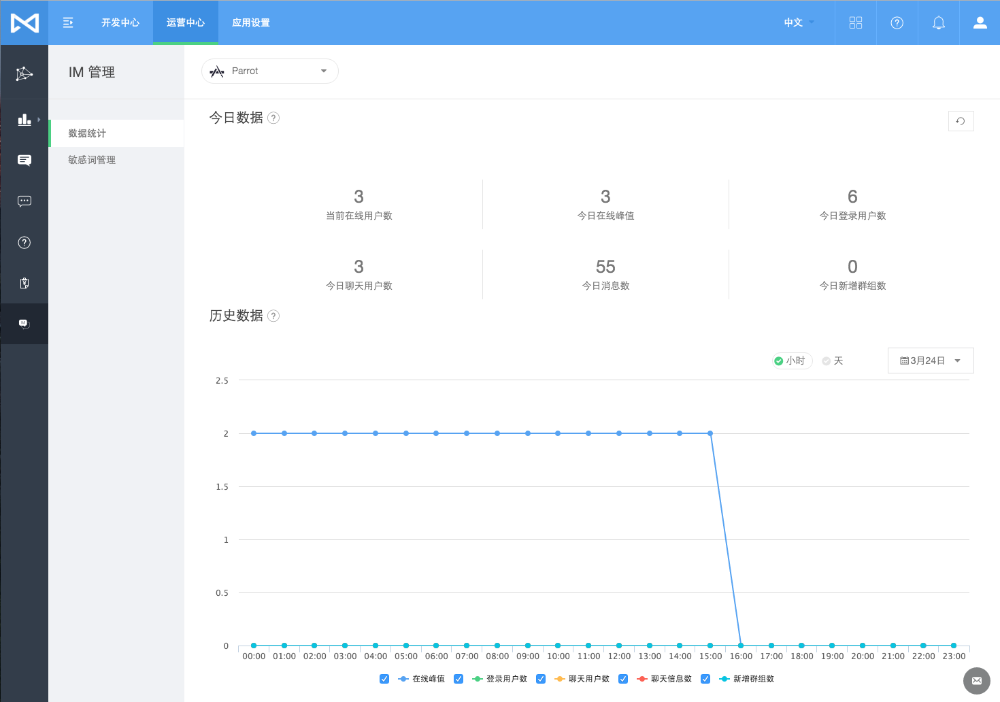
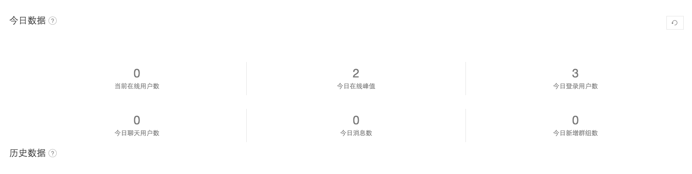
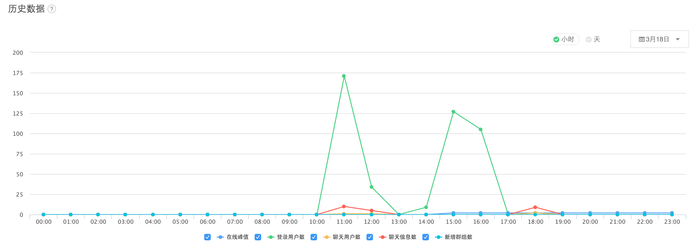
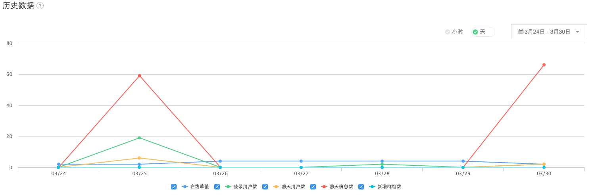

# 即时通讯
MaxLeap 为开发者免费提供的即时通讯基础能力和云端服务，即时通讯服务是 MaxLeap 研发组件中的重要基础组件。开发者可以直接在自己的应用中构建出即时通讯产品，也可以无限创意出自己的即时通讯场景，如：构建游戏聊天频道、大型的在线聊天室、电商客服系统等等。

## SDK

### IM 通讯能力库 MaxIMLib
MaxIMLib 是不含界面的基础 IM 通讯能力库，封装了通信能力和会话、消息等对象。引用到 App 工程中后，需要开发者自己实现 UI 界面，相对较轻量，适用于对 UI 有较高订制需求的开发者。
### IM 界面组件 MaxIMKit
MaxIMKit 是将即时通讯产品中最复杂的会话列表、聊天窗口、消息内容展现、会话设置等功能封装为组件，通过简短的代码，您就可以直接将以上界面集成到您的 App 产品中，省去大量的开发调试时间。您也可以针对自己界面需求自由设计开发。

MaxIMKit 目前正在内测中，尽请期待。

## 账号系统

MaxLeap 提供的即时通讯组件支持 **用户已有账号系统** 和 **使用 MaxLeap 账号系统** 两种模式。

### 用户已有账号系统
任何终端用户要加入实时聊天，只需要提供一个唯一标识自己的 clientId 即可，这样可以尽量避免已有账户系统的应用数据暴露，也可以促使 MaxLeap 即时通讯组件专注做好底层的角色。

### MaxLeap 账号系统
开发者也可以使用 MaxLeap 内置的账号系统来接入您的App，使用 MaxLeap 内置账号系统优势在于：

* 支持多种登录方式
  1. 用户名和密码登录模式
  2. 短信验证码登录模式
  3. 第三方社交平台认证信息登录模式
* 所有接入用户由 MaxLeap 账号系统认证后，才可以登录，安全性较高
* 用户无需自行维护账号系统，减少开发时间及运维成本

## 基础概念
### 用户
一个用户由用户标识、多个安装ID构成，是构成聊天系统最基本的元素。用户可以收发消息、建立好友关系、加入群组或聊天室进行多人交流等等。

### 消息
消息是指由用户或者系统发出，并由另一端用户接收的一段信息。消息支持多种媒体类型，其中包括: 文本，图片，音频和视频。

### 单聊
单聊是指两个已经成为好友的用户彼此进行消息收发。单聊具有私密性，仅好友之间可见。

当接收端的好友处于离线状态时，系统将会对其进行离线消息推送。

后台会保存7天的好友历史聊天记录以供查询。

### 群组
群组用于提供多个用户(上限为50个)进行交流的场所，群组聊天信息支持7天历史记录保存以及离线成员消息推送。

### 聊天室
聊天室是大型的群组，其人数上限为1000人，但与群组相比，其不支持历史记录保存以及离线成员消息推送

## 功能特性
### 系统消息
由管理员发送的消息，多用于系统通知。支持对某个用户、某个群组内的所有用户、某个聊天室内的所有用户，或者全体用户进行消息广播。

### 在线状态管理
开发者可以通过接口查询用户在线状态，也支持订阅上下线事件用于响应。

### 好友关系管理
开发者可以通过接口为两个用户建立好友关系，只有存在好友关系的两个用户才能彼此聊天。

### 多媒体消息支持
丰富的消息媒体类型支持： 纯文本、图片、音频、视频。

### 多设备同步
支持单个用户在不同设备上同时登录，不同的设备会同时收到消息。

### 离线推送
当用户处于未登录状态时，系统会将消息以离线推送的方式发送给用户。

## 敏感词管理

### 启用设置

* 开发者可选择是否启用敏感词过滤，启用后系统将根据默认敏感词库和自定义敏感词库，对聊天信息进行相应敏感词进行过滤.

* 开发者可选择是否使用系统默认敏感词库，您可以选择是否使用默认敏感词库，如果您觉得默认敏感词库过于严格，可不使用。

* 开发者也可以自己定义敏感词，最多设置 100 个敏感词，请用 “回车” 隔开，每个敏感词最多输入 16 个字，设置成功后 5 分钟内生效。

### 过滤规则

  1. 支持对中文简体、繁体自动智能过滤。

     即：设置中文简体敏感词后，对应繁体敏感词也会自动识别过滤。

  2. 完整的中文分词支持, 100% 真正语义分析, 而非机械式的替换(往往会导致错误的屏蔽)。

     如：系统会根据语境自动识别`曹操在操场上操老婆`中的`操`,最后仅会替换动词`操`。

## 数据统计

可以查看今日的数据和历史数据：

### 今日数据，实时统计今日数据，可刷新查看最新数据
今日数据，实时统计今日数据，可刷新查看最新数据

### 历史数据

分析应用某天中每小时的数据变化：

分析应用某些天的数据变化：

## 注意事项

1. MaxIM 不存储用户详细信息, 开发者维护自己的用户系统, 只需适配用户标识ID进行对接。您可以直接使用 MaxLeap 的账户系统，这样可以减少开发成本。

2. 离线推送必须在登录时提供应用安装ID。

## FAQ
内容更新中

## SDK 开发指南
[iOS 开发指南](ML_DOCS_GUIDE_LINK_PLACEHOLDER_IOS#MAXIM_ZH)

[Android 开发指南](ML_DOCS_GUIDE_LINK_PLACEHOLDER_ANDROID#MAXIM_ZH)

[JavaScript 开发指南](ML_DOCS_GUIDE_LINK_PLACEHOLDER_JS#IM_ZH)

## Demo 及源码
### iOS
[Module-MaxIM-iOS](https://github.com/MaxLeap/Module-MaxIM-iOS)

### Android
[Module-MaxIM-Android](https://github.com/MaxLeap/Module-MaxIM-Android)

## 样例应用

### iOS
[Sample-MaxChat-iOS](https://github.com/MaxLeap/Sample-MaxChat-iOS)

### Android

[Sample-MaxChat-Android](https://github.com/MaxLeap/Sample-MaxChat-Android)

### JavaScript
[Sample-IM-Javascript](https://github.com/MaxLeap/Demo-IM-Javascript)

