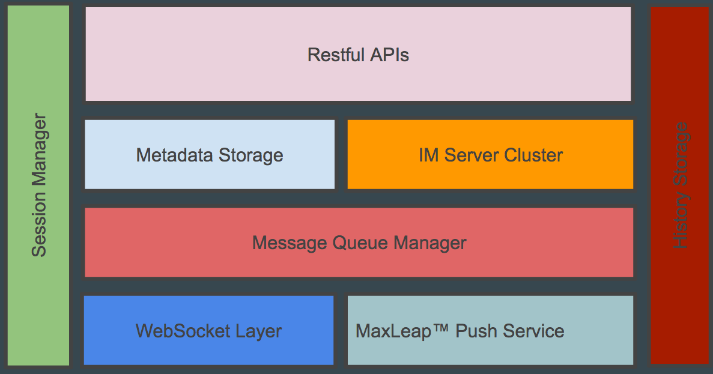

# MaxIM
MaxIM 是 MaxLeap 为开发者免费提供的即时通讯基础能力和云端服务，是 MaxLeap 研发组件中的重要基础组件。开发者可以直接在自己的应用中构建出即时通讯产品，也可以无限创意出自己的即时通讯场景。

### MaxIM SDK

#### IM 通讯能力库 MaxIMLib
MaxIMLib 是不含界面的基础 IM 通讯能力库，封装了通信能力和会话、消息等对象。引用到 App 工程中后，需要开发者自己实现 UI 界面，相对较轻量，适用于对 UI 有较高订制需求的开发者。
#### IM 界面组件 MaxIMKit
敬请期待

## 接入流程
图文并茂介绍
## 整体架构
IM整体架构基于NodeJS技术栈构建,整体架构图如下:

## SDK
#### iOS
[详见 iOS 开发指南](ML_DOCS_GUIDE_LINK_PLACEHOLDER_MAXIM_IOS)
#### Android
[详见 Android 开发指南](ML_DOCS_GUIDE_LINK_PLACEHOLDER_MAXIM_ANDROID)
#### Javascript
[详见 Javascript 开发指南](ML_DOCS_GUIDE_LINK_PLACEHOLDER_MAXIM_JS)

## 基础概念
### 用户
> 一个用户由用户标识、多个安装ID构成，是构成聊天系统最基本的元素。用户可以收发消息、建立好友关系、加入群组或聊天室进行多人交流等等。

### 消息
消息是指由用户或者系统发出，并由另一端用户接收的一段信息。消息支持多种媒体类型，其中包括: 文本，图片，音频和视频。

### 单聊
> 单聊是指两个已经成为好友的用户彼此进行消息收发。单聊具有私密性，仅好友之间可见。

> 当接收端的好友处于离线状态时，系统将会对其进行离线消息推送。

> 后台会保存7天的好友历史聊天记录以供查询。

### 群组
群组用于提供多个用户(上限为50个)进行交流的场所，群组聊天信息支持7天历史记录保存以及离线成员消息推送。

### 聊天室
> 聊天室是大型的群组，其人数上限为1000人，但与群组相比，其不支持历史记录保存以及离线成员消息推送

## 注意事项
## FAQ
