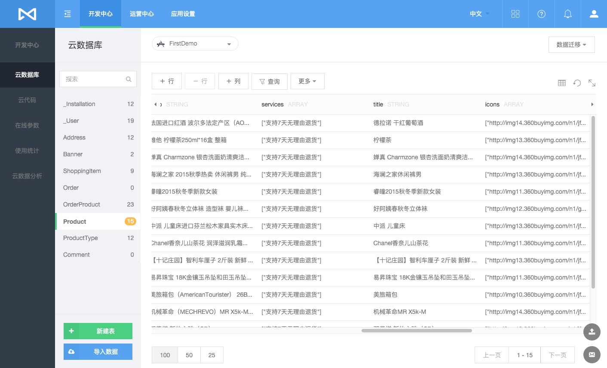
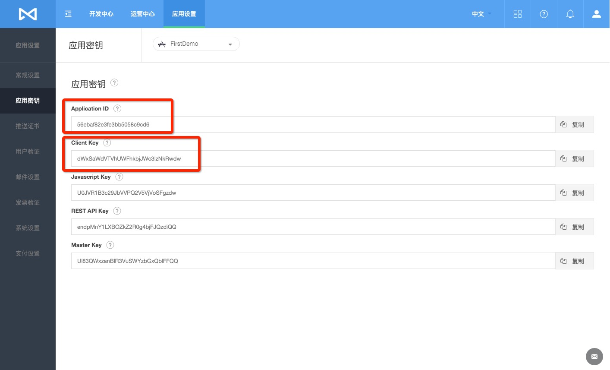

# MaxLeap 快速入门

## 准备

##### 安装 IDE（iOS 或者 Android 平台具体选择）

## 注册并登录 MaxLeap
首次登录会进入如下未创建过 App 页面

## 创建应用
MaxLeap 提供两种模式创建应用
### 自定义应用
用户自行创建工程项目并配置，根据具体业务设计数据库表结构和对应逻辑。

1、点击创建应用后，进入如下页面，输入应用名称并选择自定义应用，然后点击创建按钮

2、点击创建按钮后，应用创建成功，如果下图所示，可以应用相关密钥信息、移动端新手指南入口和我的应用列表入口

新手指南如下：[iOS 新手指南 ](https://maxleap.cn/s/web/zh_cn/quickstart/ios/core/new.html) ，[Android 新手指南 ](https://maxleap.cn/s/web/zh_cn/quickstart/android/core/new.html) ，[React Native 新手指南 ](https://maxleap.cn/s/web/zh_cn/quickstart/android/core/new.html) 

### 模板应用
直接基于 MaxLeap 提供的模板应用快速开发，模板应用包括配置好的移动端工程项目、后端工程项目（视具体模板应用而定，不一定都有）以及云端初始化数据，您可以基于模板应用开发您的应用。

1、点击创建应用，并输入用户名，下面选择模板应用

2、模板应用可以查看详情或者立即根据此模板创建，点击查看详情进入如下UI

3、点击立即使用后，MaxLeap 会自动生成配置好的移动端工程项目、后端工程项（视具体模板应用而定，不一定都有）和后端初始化云数据

4、生成好以后，您可以下载项目工程，里面包括：iOS、Android、ReactNative 等移动端工程，如果有后端工程项目（视具体模板应用而定），也会包含

5、可以直接进入我的应用列表页面查看刚创建好的应用

6、点击开发选择进入开发中心云数据库查看云端初始化数据

7、工程项目下载完成后解压出工程项目（以 iOS 为例）并导入Xcode，直接运行即可查看模板应用，AppId 和 ClientKey 已经自动配置完成

8、可以在应用设置下的应用密钥中查看应用的相关key，包括 AppId 和 ClientKey 等

 Ok，是不是很简单呢，您可以直接基于我们的模板应用快速构建您自己的应用，Happy Coding!!!!

## 了解更多
使用指南  | SDK 开发指南
------------- | -------------
[数据存储](ML_DOCS_LINK_PLACEHOLDER_USERMANUAL#CLOUD_DATA_ZH)  | [iOS 开发指南](ML_DOCS_GUIDE_LINK_PLACEHOLDER_IOS#CLOUD_DATA_ZH)，[Android 开发指南](ML_DOCS_GUIDE_LINK_PLACEHOLDER_ANDROID#CLOUD_DATA_ZH)，[JavaScript 开发指南](ML_DOCS_GUIDE_LINK_PLACEHOLDER_JS#CLOUD_DATA_ZH)
[数据源](ML_DOCS_LINK_PLACEHOLDER_USERMANUAL#DATASOURCE_ZH)  |  
[云容器](ML_DOCS_LINK_PLACEHOLDER_USERMANUAL#CLOUDCONTAINER_ZH)  |  
[云代码](ML_DOCS_LINK_PLACEHOLDER_USERMANUAL#CLOUD_CODE_ZH)  | [iOS 开发指南](ML_DOCS_GUIDE_LINK_PLACEHOLDER_IOS#CLOUD_CODE_ZH)，[Android 开发指南](ML_DOCS_GUIDE_LINK_PLACEHOLDER_ANDROID#CLOUD_CODE_ZH)   [Java 开发指南](ML_DOCS_GUIDE_LINK_PLACEHOLDER_JAVA#CLOUD_CODE_ZH)，[Python 开发指南](ML_DOCS_GUIDE_LINK_PLACEHOLDER_PYTHON#CLOUD_CODE_ZH)，[Node.js 开发指南](ML_DOCS_GUIDE_LINK_PLACEHOLDER_NODEJS#CLOUD_CODE_ZH)
[账号系统](ML_DOCS_LINK_PLACEHOLDER_USERMANUAL#ACCOUNTSYSTEM_ZH)  | [iOS 开发指南](ML_DOCS_GUIDE_LINK_PLACEHOLDER_IOS#ACCOUNT_SYSTEM_ZH)，[Android 开发指南](ML_DOCS_GUIDE_LINK_PLACEHOLDER_ANDROID#ACCOUNT_SYSTEM_ZH)
[在线参数](ML_DOCS_LINK_PLACEHOLDER_USERMANUAL#CLOUD_CONFIG_ZH)  | [iOS 开发指南](ML_DOCS_GUIDE_LINK_PLACEHOLDER_IOS#CLOUD_CONFIG_ZH)，[Android 开发指南](ML_DOCS_GUIDE_LINK_PLACEHOLDER_ANDROID#CLOUD_CONFIG_ZH)
[即时通讯](ML_DOCS_LINK_PLACEHOLDER_USERMANUAL#MAXIM_ZH)  | [iOS 开发指南](ML_DOCS_GUIDE_LINK_PLACEHOLDER_IOS#MAXIM_ZH)，[Android 开发指南](ML_DOCS_GUIDE_LINK_PLACEHOLDER_ANDROID#MAXIM_ZH)，[JavaScript 开发指南](ML_DOCS_GUIDE_LINK_PLACEHOLDER_JS#IM_ZH)
[移动支付](ML_DOCS_LINK_PLACEHOLDER_USERMANUAL#MAXPAY)  | [iOS 开发指南](ML_DOCS_GUIDE_LINK_PLACEHOLDER_IOS#MAXPAY_ZH)，[Android 开发指南](ML_DOCS_GUIDE_LINK_PLACEHOLDER_ANDROID#MAXPAY_ZH)，[PHP 开发指南](ML_DOCS_GUIDE_LINK_PLACEHOLDER_PHP#MAXPAY_ZH)
[应用内社交](ML_DOCS_LINK_PLACEHOLDER_USERMANUAL#INAPPSOCIAL_ZH)  | [iOS 开发指南](ML_DOCS_GUIDE_LINK_PLACEHOLDER_IOS#INAPPSOCIAL_ZH)，[Android 开发指南](ML_DOCS_GUIDE_LINK_PLACEHOLDER_ANDROID#INAPPSOCIAL_ZH)，[JavaScript 开发指南](ML_DOCS_GUIDE_LINK_PLACEHOLDER_JS#INAPPSOCIAL_ZH)
[社交分享](ML_DOCS_LINK_PLACEHOLDER_USERMANUAL#SOCIALSHARE_ZH)  | [iOS 开发指南](ML_DOCS_GUIDE_LINK_PLACEHOLDER_IOS#SOCIALSHARE_ZH)，[Android 开发指南](ML_DOCS_GUIDE_LINK_PLACEHOLDER_ANDROID#SOCIALSHARE_ZH)，[JavaScript 开发指南](ML_DOCS_GUIDE_LINK_PLACEHOLDER_JS#SOCIALSHARE_ZH)
[数据分析](ML_DOCS_LINK_PLACEHOLDER_USERMANUAL#ANALYTICS_ZH)  | [iOS 开发指南](ML_DOCS_GUIDE_LINK_PLACEHOLDER_IOS#ANALYTICS_ZH)，[Android 开发指南](ML_DOCS_GUIDE_LINK_PLACEHOLDER_ANDROID#ANALYTICS_ZH)
[推送营销](ML_DOCS_LINK_PLACEHOLDER_USERMANUAL#MARKETING)  | [iOS 开发指南](ML_DOCS_GUIDE_LINK_PLACEHOLDER_IOS#MARKETING_ZH)，[Android 开发指南](ML_DOCS_GUIDE_LINK_PLACEHOLDER_ANDROID#MARKETING_ZH)
[用户支持](ML_DOCS_LINK_PLACEHOLDER_USERMANUAL#SUPPORT_ZH)  | [iOS 开发指南](ML_DOCS_GUIDE_LINK_PLACEHOLDER_IOS#SUPPORT_ZH)，[Android 开发指南](ML_DOCS_GUIDE_LINK_PLACEHOLDER_ANDROID#USER_ZH)
