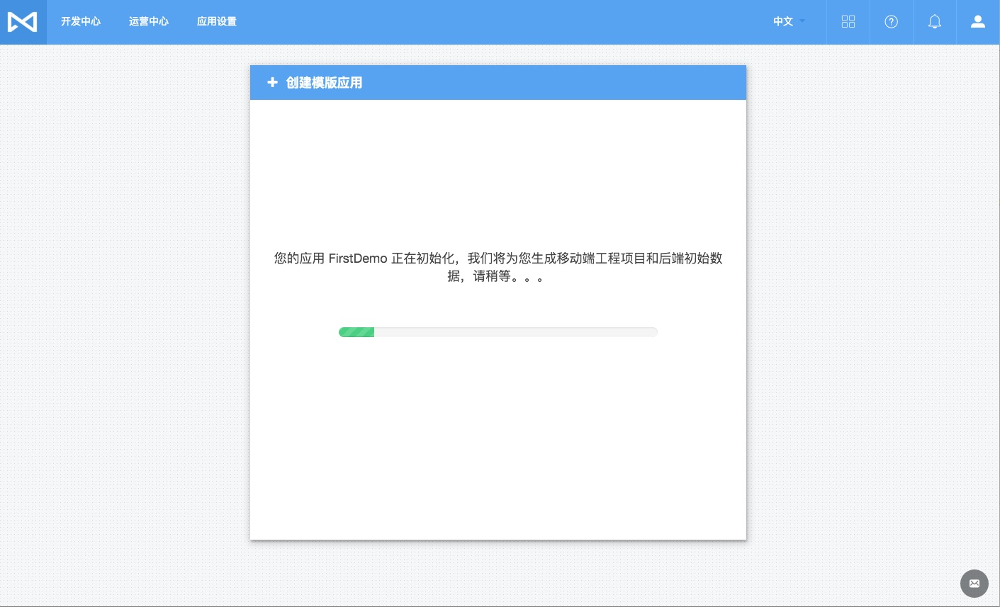
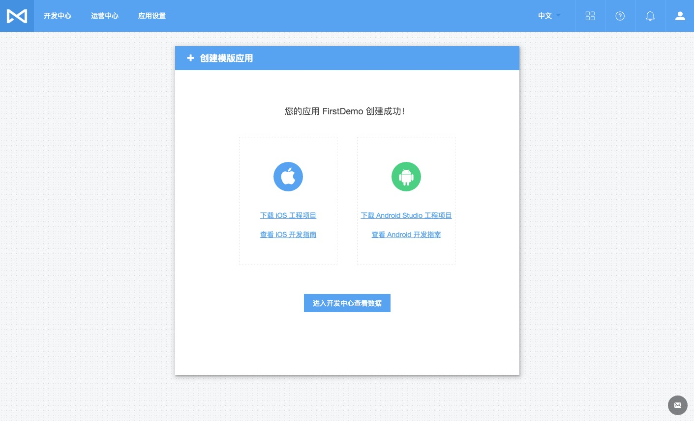

# MaxLeap 快速入门

## 准备
##### 注册并登录 MaxLeap
##### 安装 IDE（iOS 或者 Android 平台具体选择）
## 创建应用
MaxLeap 提供两种模式创建应用
#### 自定义应用
用户自行创建工程项目并配置，以及自行根据具体业务设计数据库表结构等
#### 模板应用
直接基于 MaxLeap 提供的模板应用快速开发，模板应用包括配置好的移动端工程项目以及云端初始化数据

我们今天演示使用模板应用快速构建 App

##### 1、未创建过 App 登录后页面

##### 2、点击创建应用，并输入用户名，下面选择模板应用

##### 3、模板应用可以查看详情或者立即使用，点击查看详情

##### 4、点击使用后，MaxLeap 会自动生成配置好的移动端工程项目和后端初始化云数据

##### 5、生成好以后，您可以根据需要选择下载 iOS 工程项目或者 Android 工程项目

##### 6、下载工程项目需要点时间，此时可以直接进入开发中心云数据库查看云端初始化数据

##### 7、工程项目下载完成后解压出工程项目（以 iOS 为例）并导入Xcode，直接运行即可查看模板应用，AppId 和 ClientKey 已经自动配置完成

##### 8、可以在应用设置下的应用密钥中查看应用的相关key，包括 AppId 和 ClientKey 等

 Ok，是不是很简单呢，您可以直接基于我们的模板应用快速构建您自己的应用，Happy Coding!!!!

### 了解更多
使用指南  | SDK 开发指南
------------- | -------------
[数据存储](ML_DOCS_LINK_PLACEHOLDER_USERMANUAL#CLOUD_DATA_ZH)  | [iOS 开发指南](ML_DOCS_GUIDE_LINK_PLACEHOLDER_IOS#CLOUD_DATA_ZH)，[Android 开发指南](ML_DOCS_GUIDE_LINK_PLACEHOLDER_ANDROID#CLOUD_DATA_ZH)，[JavaScript 开发指南](ML_DOCS_GUIDE_LINK_PLACEHOLDER_JS#CLOUD_DATA_ZH)
[云代码](ML_DOCS_LINK_PLACEHOLDER_USERMANUAL#CLOUD_CODE_ZH)  | [iOS 开发指南](ML_DOCS_GUIDE_LINK_PLACEHOLDER_IOS#CLOUD_CODE_ZH)，[Android 开发指南](ML_DOCS_GUIDE_LINK_PLACEHOLDER_ANDROID#CLOUD_CODE_ZH)，[Java 开发指南](ML_DOCS_GUIDE_LINK_PLACEHOLDER_JAVA#CLOUD_CODE_ZH)，[Python 开发指南](ML_DOCS_GUIDE_LINK_PLACEHOLDER_PYTHON#CLOUD_CODE_ZH)，[Node.js 开发指南](ML_DOCS_GUIDE_LINK_PLACEHOLDER_NODEJS#CLOUD_CODE_ZH)
[账号系统](ML_DOCS_LINK_PLACEHOLDER_USERMANUAL#ACCOUNTSYSTEM_ZH)  | [iOS 开发指南](ML_DOCS_GUIDE_LINK_PLACEHOLDER_IOS#ACCOUNT_SYSTEM_ZH)，[Android 开发指南](ML_DOCS_GUIDE_LINK_PLACEHOLDER_ANDROID#ACCOUNT_SYSTEM_ZH)
[在线参数](ML_DOCS_LINK_PLACEHOLDER_USERMANUAL#CLOUD_CONFIG_ZH)  | [iOS 开发指南](ML_DOCS_GUIDE_LINK_PLACEHOLDER_IOS#CLOUD_CONFIG_ZH)，[Android 开发指南](ML_DOCS_GUIDE_LINK_PLACEHOLDER_ANDROID#CLOUD_CONFIG_ZH)
[即时通讯](ML_DOCS_LINK_PLACEHOLDER_USERMANUAL#MAXIM_ZH)  | [iOS 开发指南](ML_DOCS_GUIDE_LINK_PLACEHOLDER_IOS#MAXIM_ZH)，[Android 开发指南](ML_DOCS_GUIDE_LINK_PLACEHOLDER_ANDROID#MAXIM_ZH)，[JavaScript 开发指南](ML_DOCS_GUIDE_LINK_PLACEHOLDER_JS#IM_ZH)
[移动支付](ML_DOCS_LINK_PLACEHOLDER_USERMANUAL#MAXPAY)  | [iOS 开发指南](ML_DOCS_GUIDE_LINK_PLACEHOLDER_IOS#MAXPAY_ZH)，[Android 开发指南](ML_DOCS_GUIDE_LINK_PLACEHOLDER_ANDROID#MAXPAY_ZH)，[PHP 开发指南](ML_DOCS_GUIDE_LINK_PLACEHOLDER_PHP#MAXPAY_ZH)
[应用内社交](ML_DOCS_LINK_PLACEHOLDER_USERMANUAL#INAPPSOCIAL_ZH)  | [iOS 开发指南](ML_DOCS_GUIDE_LINK_PLACEHOLDER_IOS#INAPPSOCIAL_ZH)，[Android 开发指南](ML_DOCS_GUIDE_LINK_PLACEHOLDER_ANDROID#INAPPSOCIAL_ZH)，[JavaScript 开发指南](ML_DOCS_GUIDE_LINK_PLACEHOLDER_JS#INAPPSOCIAL_ZH)
[社交分享](ML_DOCS_LINK_PLACEHOLDER_USERMANUAL#SOCIALSHARE_ZH)  | [iOS 开发指南](ML_DOCS_GUIDE_LINK_PLACEHOLDER_IOS#SOCIALSHARE_ZH)，[Android 开发指南](ML_DOCS_GUIDE_LINK_PLACEHOLDER_ANDROID#SOCIALSHARE_ZH)，[JavaScript 开发指南](ML_DOCS_GUIDE_LINK_PLACEHOLDER_JS#SOCIALSHARE_ZH)
[数据分析](ML_DOCS_LINK_PLACEHOLDER_USERMANUAL#ANALYTICS_ZH)  | [iOS 开发指南](ML_DOCS_GUIDE_LINK_PLACEHOLDER_IOS#ANALYTICS_ZH)，[Android 开发指南](ML_DOCS_GUIDE_LINK_PLACEHOLDER_ANDROID#ANALYTICS_ZH)
[推送营销](ML_DOCS_LINK_PLACEHOLDER_USERMANUAL#MARKETING)  | [iOS 开发指南](ML_DOCS_GUIDE_LINK_PLACEHOLDER_IOS#MARKETING_ZH)，[Android 开发指南](ML_DOCS_GUIDE_LINK_PLACEHOLDER_ANDROID#MARKETING_ZH)
[用户支持](ML_DOCS_LINK_PLACEHOLDER_USERMANUAL#SUPPORT_ZH)  | [iOS 开发指南](ML_DOCS_GUIDE_LINK_PLACEHOLDER_IOS#SUPPORT_ZH)，[Android 开发指南](ML_DOCS_GUIDE_LINK_PLACEHOLDER_ANDROID#USER_ZH)
