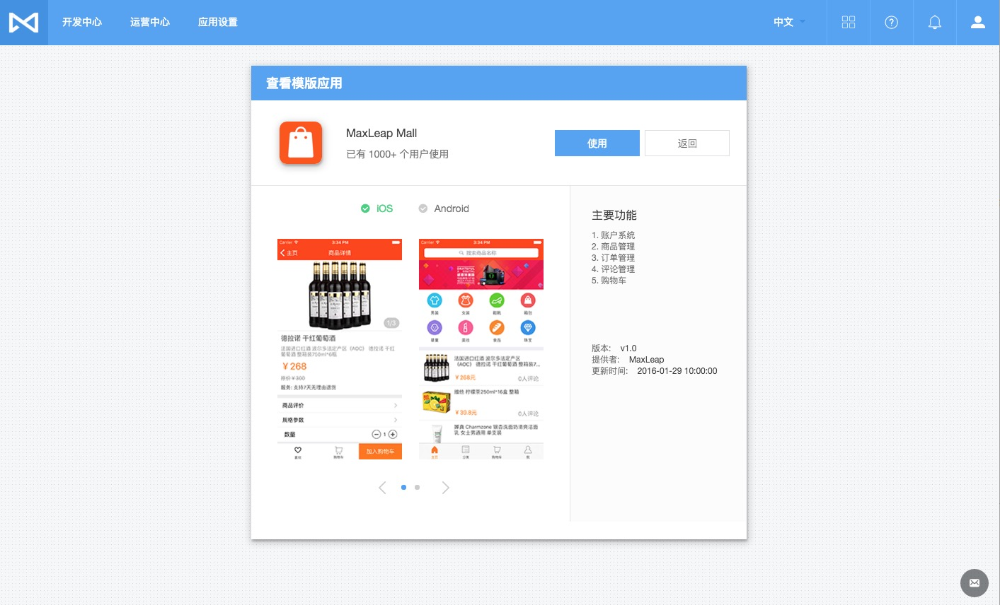

# MaxLeap 快速入门

## 准备
#### 注册并登录 MaxLeap
#### 安装 IDE
## 创建应用
MaxLeap 提供两种模式创建应用
#### 自定义应用
用户自行创建工程项目并配置，以及自行根据具体业务设计数据库表结构等
#### 模板应用
直接基于 MaxLeap 提供的模板应用快速开发，模板应用包括配置好的移动端工程项目以及云端初始化数据

我们今天演示使用模板应用快速构建 App

##### 1、未创建过 App 登录后页面

##### 2、点击创建应用，并输入用户名，下面选择模板应用

##### 3、模板应用可以查看详情或者立即使用，点击查看详情

##### 4、点击使用后，MaxLeap 会自动生成配置好的移动端工程项目和后端初始化云数据

##### 5、生成好以后，您可以根据需要选择下载 iOS 工程项目或者 Android 工程项目

##### 6、下载工程项目需要点时间，此时可以直接进入开发中心云数据库查看云端初始化数据

##### 7、工程项目下载完成后解压出工程项目（以 iOS 为例）并导入Xcode，直接运行即可查看模板应用，AppId 和 ClientKey 已经自动配置完成

##### 8、可以在应用设置下的应用密钥中查看应用的相关key，包括 AppId 和 ClientKey 等

##### Ok，是不是很简单呢，您可以直接基于我们的模板应用快速构建您自己的应用，Happy Coding!!!!

## 了解更多
使用指南  | SDK 开发指南
------------- | -------------
[数据存储]()  | [iOS 开发指南]()，[Android 开发指南]()，[JavaScript 开发指南]()
[代码托管]()  | [iOS 开发指南]()，[Android 开发指南]()，[Java 开发指南]()，[Python 开发指南]()，[Node.js 开发指南]()
[账号系统]()  | [iOS 开发指南]()，[Android 开发指南]()
[即时通讯]()  | [iOS 开发指南]()，[Android 开发指南]()，[JavaScript 开发指南]()
[移动支付]()  | [iOS 开发指南]()，[Android 开发指南]()，[PHP 开发指南]()
[应用内社交]()  | [iOS 开发指南]()，[Android 开发指南]()，[JavaScript 开发指南]()
[社交分享]()  | [iOS 开发指南]()，[Android 开发指南]()，[JavaScript 开发指南]()
[在线参数]()  | [iOS 开发指南]()，[Android 开发指南]()
[数据分析]()  | [iOS 开发指南]()，[Android 开发指南]()
[推送营销]()  | [iOS 开发指南]()，[Android 开发指南]()
[用户支持]()  | [iOS 开发指南]()，[Android 开发指南]()
