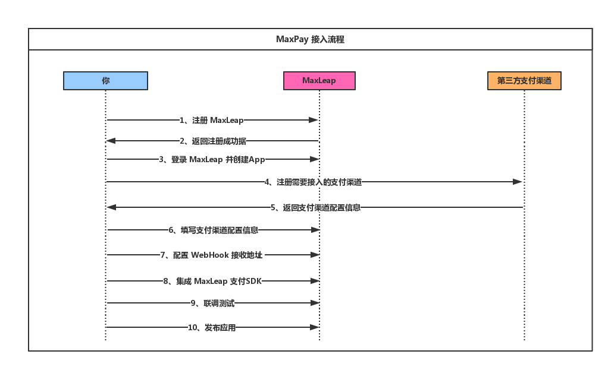
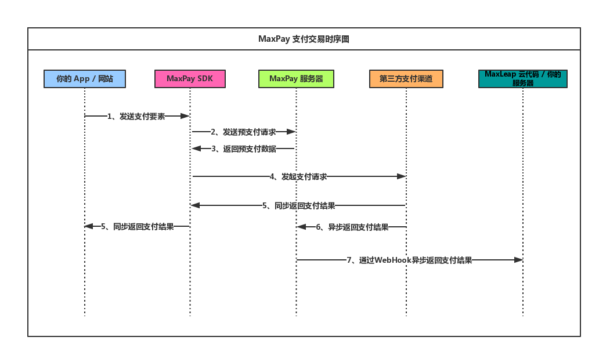
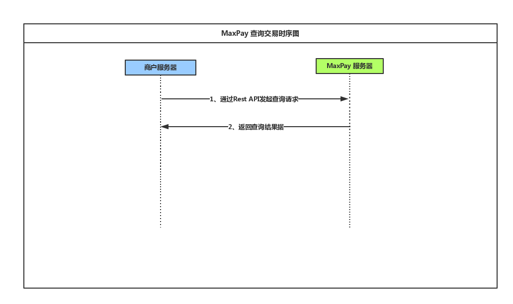

# MaxPay

MaxPay 是为移动端应用以及 PC 网页量身打造的下一代支付系统，通过一个 SDK 便可以同时支持移动端以及 PC 端网页的多种主流支付渠道。

## 接入流程

## 交易流程
这里我们将介绍 MaxPay 是如何完成交易的，包括支付和查询两部分。

#### 支付

#### 查询

## SDK支持平台
##### iOS
[详见iOS开发指南](ML_DOCS_GUIDE_LINK_PLACEHOLDER_IOS)
##### Android
[详见Android开发指南](ML_DOCS_GUIDE_LINK_PLACEHOLDER_ANDROID)
##### PHP
[详见PHP开发指南](ML_DOCS_GUIDE_LINK_PLACEHOLDER_PHP)

## 开放 RestAPI
[详见开放API文档](ML_DOCS_REST_API_MAXPAY)

## 支持渠道
渠道配置 [详见 MaxPay 管理后台使用指南](ML_DOCS_LINK_PLACEHOLDER_USERMANUAL#MAXPAY_ADMIN)
#### 支付宝
#### 微信支付
#### 银联支付
#### Apple Pay
尽请期待

## WebHook
为了便于客户系统或者第三方系统处理客户的交易信息， MaxPay 提供 Webhooks 功能，可以按照客户要求把特定的事件结果推送到指定的地址以便于客户做后续处理。[详见 WebHook 使用指南](ML_DOCS_LINK_PLACEHOLDER_USERMANUAL#MAXPAY_WEBHOOK)

## 费用
MaxLeap 不收取任何费用，各支付渠道单独收费与 MaxLeap 无关

## FAQ
