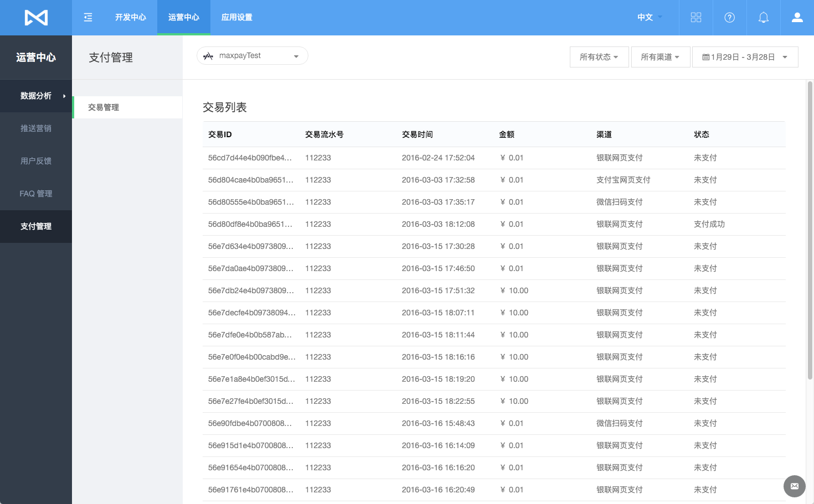
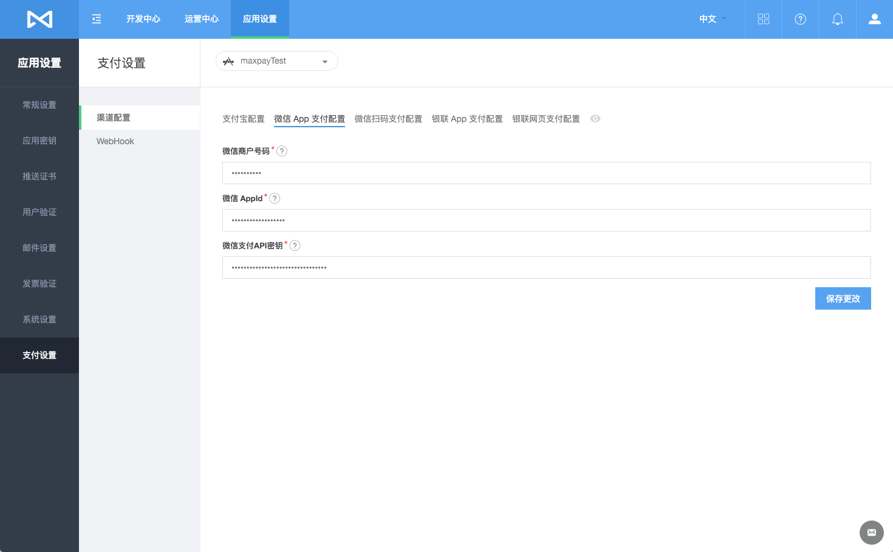
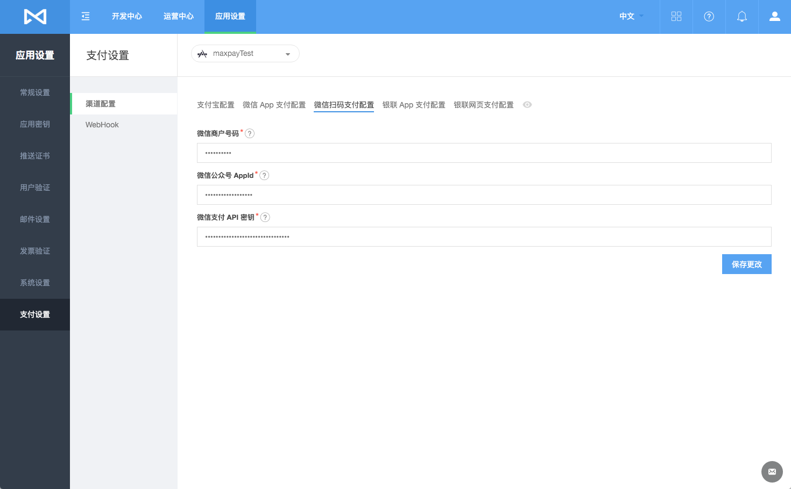
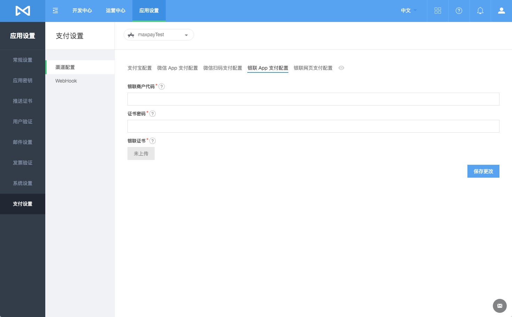
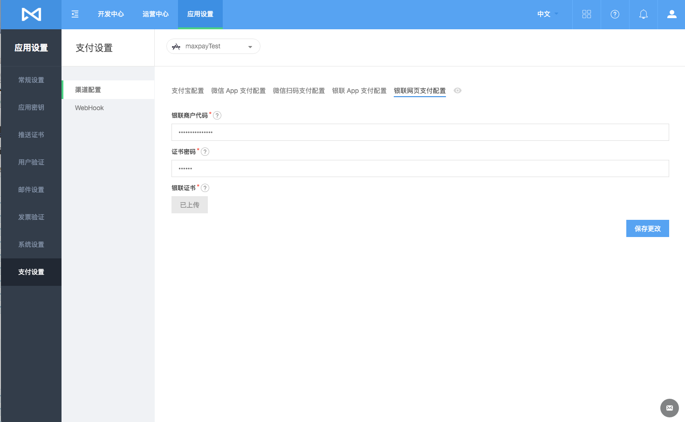
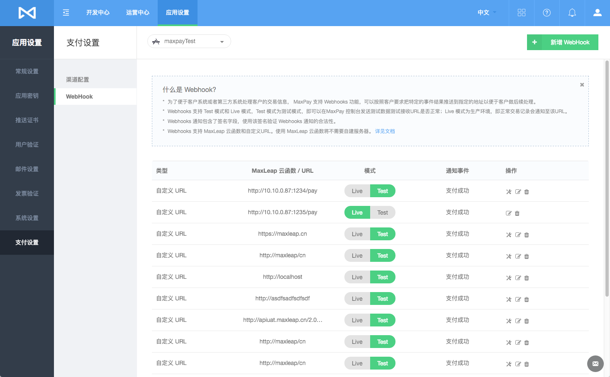
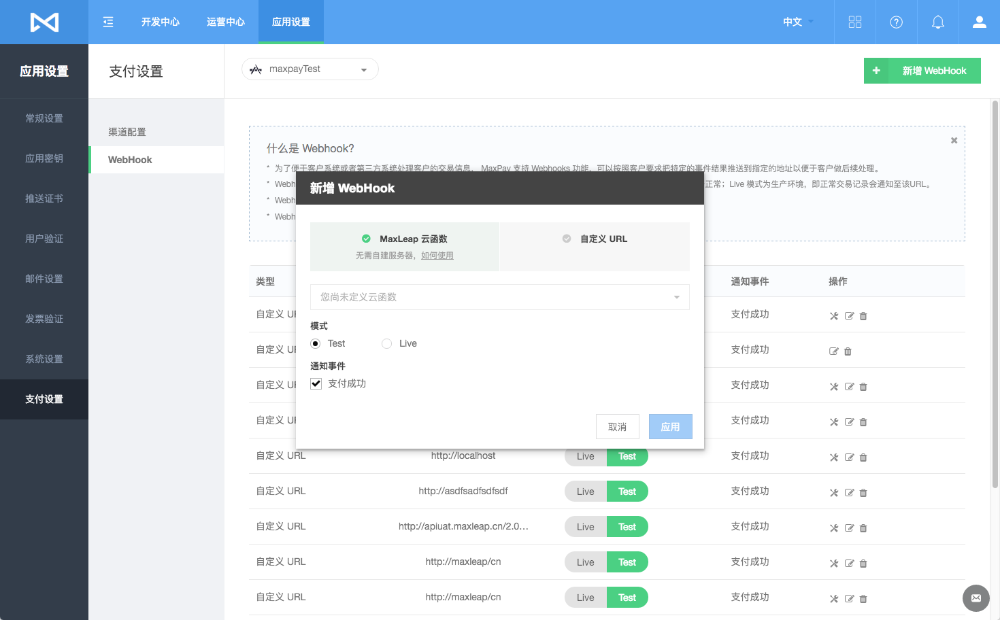
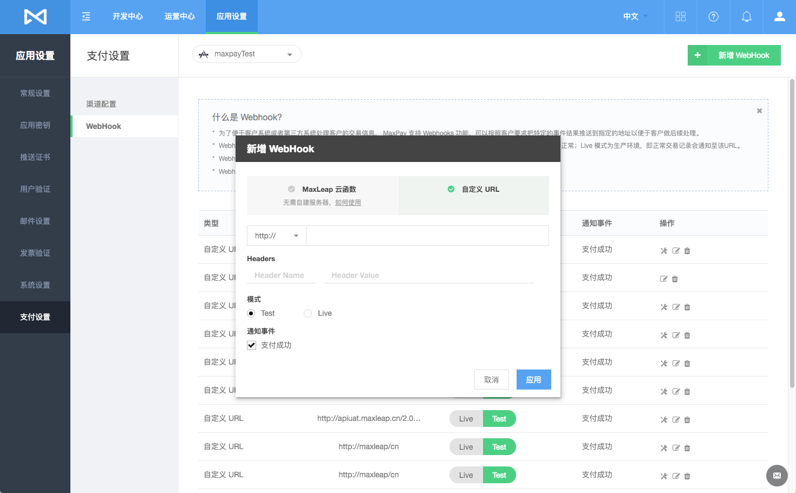
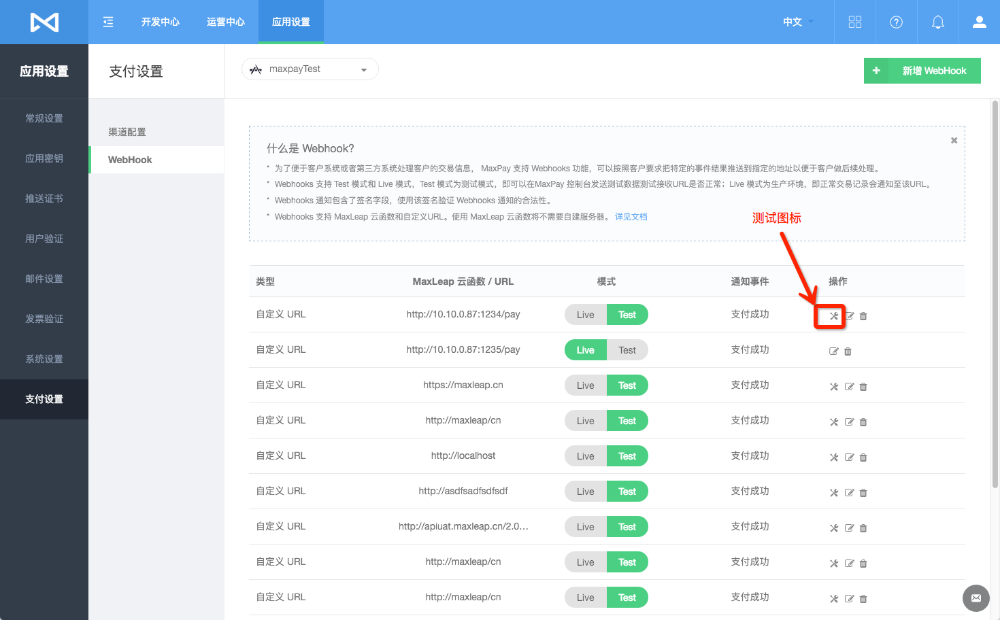

# 支付服务

MaxLeap 支付服务是为移动端应用以及 PC 网页量身打造的下一代支付系统，通过一个 SDK 便可以同时支持移动端以及 PC 端网页的多种主流支付渠道。

简称：MaxPay

## 接入流程

## 交易流程
这里我们将介绍 MaxPay 是如何完成交易的，包括支付和查询两部分。

### 支付

### 查询

## 交易管理
在“交易管理”中，我们可以查看当前 App 中发生的交易记录：

列表提供了组合过滤功能:

* 状态过滤：可以过滤不同状态的订单 （支付成功，退款成功，未支付等）
* 渠道过滤：可以过滤不同渠道的订单 （支付宝移动支付，支付宝PC网页支付，支付宝二维码支付，微信App支付，微信公众号支付，微信公众号扫码支付等）
* 时间过滤：可以选择当天、最近7天、最近30天、最近60天以及自定义时间段的订单

## 配置渠道参数

### 支付宝

在“渠道配置”中，我们可以配置相应的支付渠道：

### 微信支付

微信支付分为 “微信 App 支付” 和 “微信公众号支付”。

微信 App 支付的配置

微信公众号支付的配置

### 银联支付
银联支付氛围 “银联 App 支付” 和 “银联网页支付”。

银联 App 支付的配置

银联网页支付的配置

### Apple Pay
尽请期待

## WebHook 设置

为了便于客户系统或者第三方系统处理客户的交易信息， MaxLeap 移动支付服务提供 WebHook 功能，可以按照客户要求把特定的事件结果推送到指定的地址以便于客户做后续处理。

MaxLeap 支持 **MaxLeap 云函数** 和 **自定义 URL** 两种类型 WebHook

#### MaxLeap 云函数

您可以使用 MaxLeap 云代码中的云函数来实现您的 WebHook 功能，MaxLeap 云函数会处理来自 移动支付的通知事件。使用 MaxLeap 云函数意味着您将不用自建服务器，详情请参考 [MaxLeap － 云代码](ML_DOCS_LINK_PLACEHOLDER_USERMANUAL#CLOUD_CODE_ZH)。
    
#### 自定义URL

  您也可以自建服务器来接收来自移动支付服务的通知事件。
    

### WebHook 列表

### 配置你的 WebHook

#### 新增 WebHook
登录 MaxLeap 管理平台，在应用设置选项中配置。

新建一个 WebHook 事件的基本操作如下图所示，用户需要设置接收 WebHook 事件的地址、模式和事件类型。

其中，WebHook 的服务器可以选择 MaxLeap 提供的云函数，也可以是自己服务器的 URL。

下图演示使用 MaxLeap 云函数：

自定义 URL:

* WebHook 的云函数

	当支付事件发生时，MaxLeap 会向用户注册的 WebHook 推送消息，用户可以直接使用 MaxLeap 提供的云函数来处理这些消息，这样就不需要自己建立服务器了。
	
* WebHook 的URL

	MaxLeap 可以向用户自己的服务器推送消息，你也可以根据自己的需要添加特殊的 Http Headers。

* WebHook 的模式

    WebHook 支持 Test 模式和 Live 模式，即事件中包含的数据内容可以源于测试环境也可以源于生产环境。
    
* WebHook 支持的事件

	目前 WebHook 仅支持支付成功事件。

#### 编辑 WebHook
在 WebHook 列表中，点击“编辑”图标可以编辑该条 WebHook。

#### 切换 WebHook 模式
WebHook 支持 Test 模式和 Live 模式，

* Test 模式为测试模式，即可以在 MaxPay 控制台发送测试数据测试接收URL是否正常；
* Live 模式为生产环境，即正常交易记录会通知至该URL。
在 WebHook 列表中， 点击对应的模式按钮即可切换模式：

#### 删除 WebHook
如果一个 WebHook 不再使用，可以点击 WebHook 列表中的“删除”图标来删除它。

### 接收 WebHook 通知
* 当一个支付事件发生后，将 POST 一个 HTTP 请求到 Webhook，数据是以 Json 的形式放到 body 里。
* 你需要接受该请求并处理数据：返回 http 状态码 200 表示成功；返回的状态码不是 200 或者超时未返回，即表示失败
* 失败后 MaxLeap 将尝试发送多达 10 次的 Webhook 通知直到返回 200 的状态码，
* 间隔为 1分钟,5分钟,10分钟,30分钟,1小时,2小时,4小时,8小时,16小时,24小时，若超过该次数，便不再尝试。

### 验证 WebHook 签名（可选）
MaxPay 的 WebHook 通知中包含的签名信息，签名放在了请求的 Json 里 sign中，除此之外还有一个 timestamp 字段。

* 用户需用自己的 MaxLeap 的 Appid，MasterKey 和 timestamp 依次连接成一个字符串。
* 后用 Md5 算法对该字符串加密得到 16 进制表示的字符串。
* 得到的字符串与 sign 进行比较，若内容相同，则验证通过，否则失败。

用户再自行确认金额等订单信息是否正确。

### 测试 WebHook

完成 WebHook 的配置后，你可以使用 WebHook 的测试功能对你填写的地址进行测试。

你可以在已配置的 WebHook 中选择事件类型发起测试，你将看到 MaxLeap 向你填写的 URL 发送的请求内容以及你的服务器向 MaxLeap 服务器返回的内容。

MaxLeap 将根据你返回的 HTTP 状态码判断你的服务器是否接收成功。

在 Webhook 列表中，点击“测试”图标可以测试该条 WebHook 是否配置成功。

MaxLeap 云函数类型的 WebHook 测试：

自定义 URL 的 WebHook 测试：

## 费用
MaxLeap 不收取任何费用，各支付渠道单独收费与 MaxLeap 无关

## FAQ
内容更新中

## SDK 开发指南

[iOS开发指南](ML_DOCS_GUIDE_LINK_PLACEHOLDER_IOS#MAXPAY_ZH)

[Android开发指南](ML_DOCS_GUIDE_LINK_PLACEHOLDER_ANDROID#MAXPAY_ZH)

[PHP开发指南](ML_DOCS_GUIDE_LINK_PLACEHOLDER_PHP#MAXPAY_ZH)

## 开放 REST API
[开放API文档](ML_DOCS_REST_API_MAXPAY)

