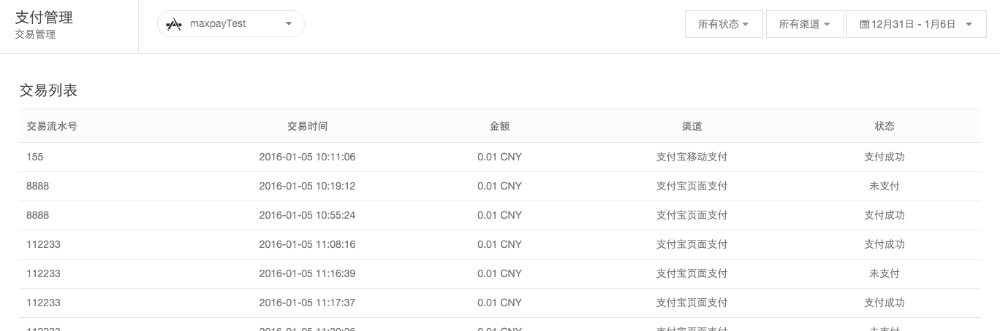
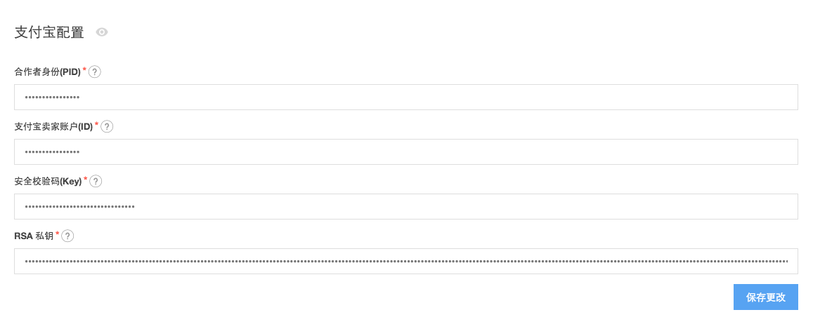

# MaxPay 管理后台使用指南

## 交易管理
在“交易列表”中，我们可以查看当前 app 中发生的交易记录：

列表提供了组合过滤功能:

* 状态过滤：可以过滤不同状态的订单 （支付成功，退款成功，未支付等）
* 渠道过滤：可以过滤不同渠道的订单 （支付宝移动支付，支付宝PC网页支付，支付宝二维码支付，微信App支付，微信公众号支付，微信公众号扫码支付等）
* 时间过滤：可以选择当天、最近7天、最近30天、最近60天以及自定义时间段的订单

## 配置渠道参数

#### 支付宝

在“渠道配置”中，我们可以配置相应的支付渠道：

#### 微信支付

尽请期待

## WebHook 配置
详见 [WebHook 使用指南](ML_DOCS_LINK_PLACEHOLDER_USERMANUAL#MAXPAY_WEBHOOK)
