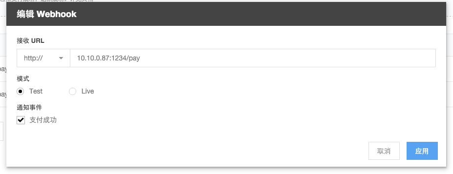

# MaxPay WebHook
   为了便于客户系统或者第三方系统处理客户的交易信息， MaxPay 提供 Webhooks 功能，可以按照客户要求把特定的事件结果推送到指定的地址以便于客户做后续处理。
 
## 如何使用 WebHooks

### 第一步：配置你的 Webhooks

####新增 Webhook
点击页面右上角的“新增 Webhook”按钮可以创建一个 Webhook, 在其中可以指定接收事件的 url, 模式以及接收的通知事件：

####编辑 Webhook
在 Webhook 列表中，点击“编辑”图标可以编辑该条 Webhook。

####切换 Webhook 模式
Webhooks 支持 Test 模式和 Live 模式，Test 模式为测试模式，即可以在MaxPay 控制台发送测试数据测试接收URL是否正常；Live 模式为生产环境，即正常交易记录会通知至该URL。
在 Webhook 列表中， 点击对应的模式按钮即可切换模式：

####删除 Webhook
如果一个 Webhook 不再使用，可以点击 Webhook 列表中的“删除”图标来删除它。

### 第二步：接收 Webhooks 通知
图文并茂
### 第三步：验证 Webhooks 签名（可选）
图文并茂
## 如何测试 Webhooks
###测试 Webhook
在 Webhook 列表中，点击“测试”图标可以测试该条 Webhook 是否配置成功：

