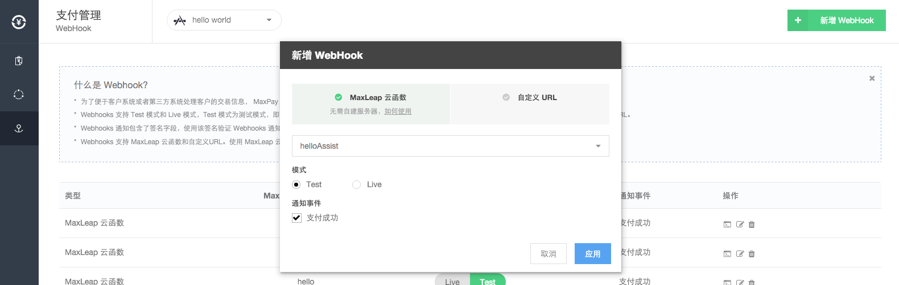
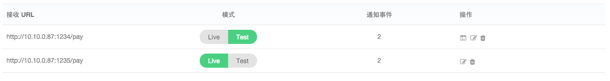
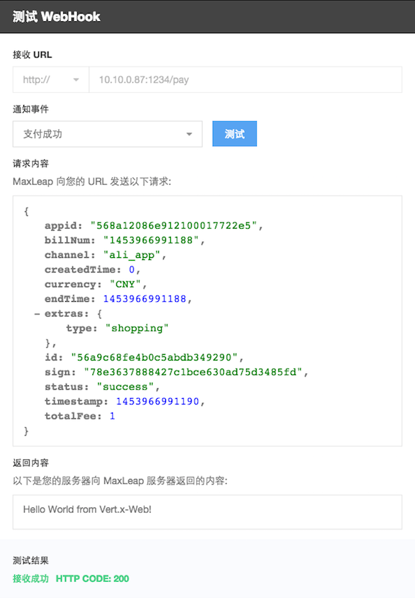

# MaxPay Webhook
   为了便于客户系统或者第三方系统处理客户的交易信息， MaxPay 提供 Webhook 功能，可以按照客户要求把特定的事件结果推送到指定的地址以便于客户做后续处理。
 
## 如何使用 Webhook

### 第一步：配置你的 Webhook

####新增 Webhook
登录 MaxLeap 支付管理平台，点击你创建的应用,点击左侧 Webhook 选项。新建一个 Webhook 事件的基本操作如下图所示，用户需要设置接收 Webhook 事件的地址、模式和事件类型。

* Webhook 的模式
    Webhook 支持 Test 模式和 Live 模式，即事件中包含的数据内容可以源于测试环境也可以源于生产环境。
* Webhook 支持的事件
	目前 Webhook 仅支持支付成功事件。

####编辑 Webhook
在 Webhook 列表中，点击“编辑”图标可以编辑该条 Webhook。

####切换 Webhook 模式
Webhook 支持 Test 模式和 Live 模式，Test 模式为测试模式，即可以在MaxPay 控制台发送测试数据测试接收URL是否正常；Live 模式为生产环境，即正常交易记录会通知至该URL。
在 Webhook 列表中， 点击对应的模式按钮即可切换模式：

####删除 Webhook
如果一个 Webhook 不再使用，可以点击 Webhook 列表中的“删除”图标来删除它。

### 第二步：接收 Webhook 通知
后端写
### 第三步：验证 Webhook 签名（可选）
后端写
## 如何测试 Webhook
###测试 Webhook
完成 Webhook 的配置后，你可以使用 Webhook 的测试功能对你填写的地址进行测试。你可以在已配置的 Webhook 中选择事件类型发起测试，你将看到 MaxLeap 向你填写的 URL 发送的请求内容以及你的服务器向 MaxLeap 服务器返回的内容，MaxLeap 将根据你返回的 HTTP 状态码判断你的服务器是否接收成功。
在 Webhook 列表中，点击“测试”图标可以测试该条 Webhook 是否配置成功：

