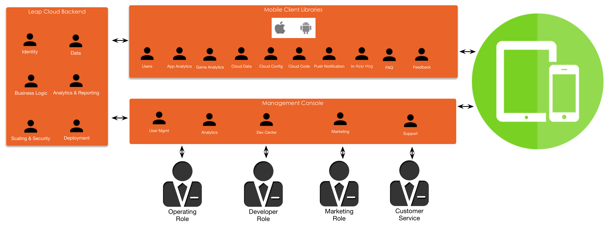

#LAS云服务概览

##什么是LAS云服务

LAS云服务为移动应用的开发，运营，市场营销及客户服务提供一套完整，强大而又稳定的MBaaS解决方案。

随着移动设备的普及，移动端的用户及消费逐年增长，移动开发的机遇与竞争将越来越激烈。在这样的形势下，越来越多的企业IT部门及开发者意识到，若要提高移动应用的竞争力，必需：

* 将更多精力投入应用创意的实现，而非庞大复杂的后端系统及基础设施运维
* 缩短产品上市时间（Time to Market）
* 数字化用户服务及数字化营销
* 高效的跨职能协作

LAS云服务能够很好的帮助您实现上述策略。其愿景便是帮助您，将创意快速的转化为移动应用，并且实施高效的用户运营及市场营销，从而提高用户活跃度及应用营收。

[图片仅为原型，待改进]

##专注于创意

传统的移动应用者在移动开发过程中，通常会遇到二八法则的困扰：约有80%的时间被花在对提高应用体验或营收无关的事情上，而只有20%的时间真正用以实现创意/提高营收。当我们深入分析，我们会发现：

####传统的移动开发流程包括：

* 购买服务器：包括数据服务器/后端服务器
* 搭建数据库，开发后端服务
* 开发移动端SDK：包括各个平台的SDK
* 大量的测试：包括数据库稳定性，服务器的稳定性，SDK的准确性等
* 实现应用创意

而LAS云服务，能帮助您扫除实现应用创意前的所有障碍。Leap Cloud提供的后端基础设施架构上，已成功的支持着亿级用户量的应用，保证了其稳定性及安全性。当您开始使用LAS云服务构建您的应用时，您已经拥有了所有以下功能：

##数字化战略
随着移动应用开发的普及，以及越来越短的Time to Market，移动应用市场早已过了“酒香不怕巷子深”的时期，数据分析，用户运营及市场营销的重要性不言而喻。

#####数据分析
为了帮助您全面分析运营状况，深度了解用户并优化运营策略，LAS云服务将从客户端采集重要数据，并且生成专业的报表。同时，您还可以通过这些数据，对用户进行分群，以使所有的LAS云服务更精准，高效和个性化。
#####数字化营销
LAS云服务能帮助您精准地对**指定用户分群**进行广告推送，并且采集相应数据至LAS分析服务生成报表。您可以通过分析报表
#####数字化用户运营
借助LAS云服务，您可以通过管理页面与客户端用户进行沟通，及时地为用户解决疑问。同时，您还可以将常见的问题生成FAQ列表，动态地发布至客户端，更高效地帮助用户。

##一揽子服务
从移动应用的开发，运营，市场营销及客户服务，我们为客户同时解决和移动应用有关的所有问题：

[图片仅为原型，待改进] （加入Cloud Code）

