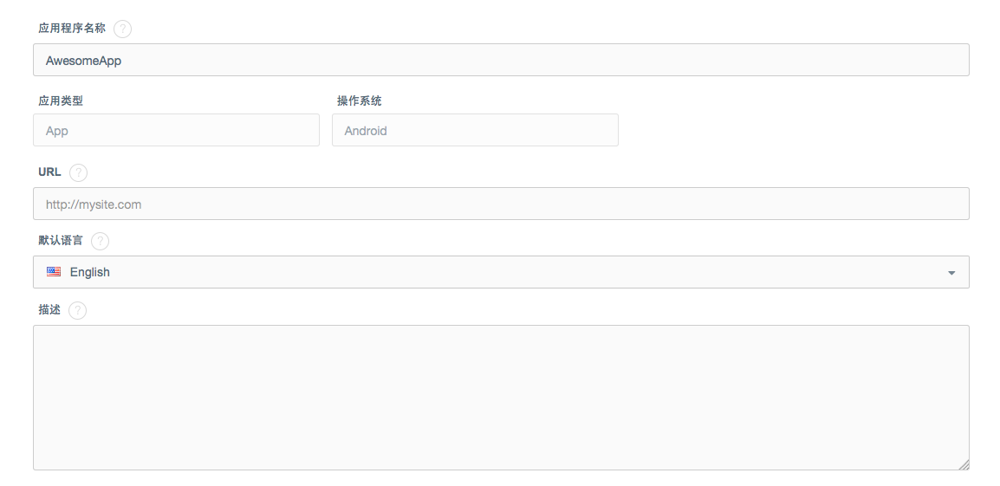
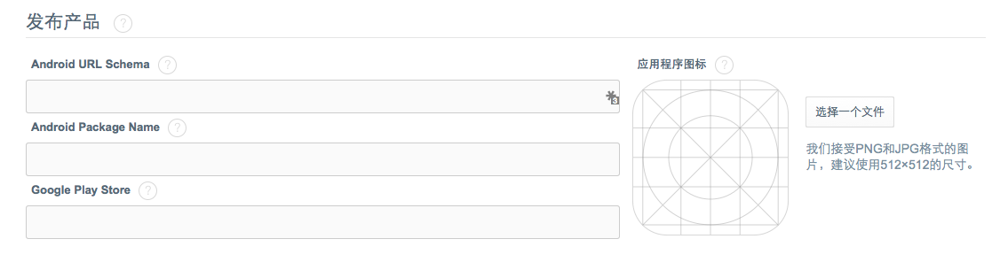

# 设置
##简介
在设置中，您可以获取并设置应用相关的配置：

* 应用密匙信息
* 应用发布信息：
* 应用配置信息：如推送配置，用户认证配置，电子邮件配置，应用权限等。

##常规设置
在常规设置中，您可以配置应用的以下信息：

####应用基本信息
* Leap Cloud应用名，应用类型（App或Game），操作系统（Android或iOS）
* URL：应用主页
* 默认语言：该应用管理页面使用的默认语言
* 描述

####产品发布信息
您可以通过API调用的方式，获取此处的所有信息：

Android：

* Android URL Schema
* Android Package Name
* Google Play Store
* 应用图标

iOS：

* iOS URL Schema
* App Store ID
* iTunes App Store
* 应用图标

####删除应用
您可以通过点击左下角的“删除应用”按钮，彻底删除该应用。同时，该应用下的所有数据都将被删除。

##应用秘钥
您可以查看的应用秘钥包括：

* Application ID：
* Client Key：
* Javascript Key：
* REST API Key：
* Master Key：

##推送通知

填写GCM推送凭据：

推送服务的详细介绍，请查看[iOS开发指南 － Marketing](LC_DOCS_GUIDE_LINK_PLACEHOLDER_IOS#MARKETING_ZH) or [Android开发指南 － Marketing](LC_DOCS_GUIDE_LINK_PLACEHOLDER_ANDROID#MARKETING_ZH)

##用户验证
您可以打开或关闭以下用户认证方式：

* 用户名密码认证
* 匿名用户
* 第三方用户认证：包括Facebook和Twitter

有关用户认证的详细介绍，请查看[iOS开发指南 － Marketing](LC_DOCS_GUIDE_LINK_PLACEHOLDER_IOS#MARKETING_ZH) or [Android开发指南 － Marketing](LC_DOCS_GUIDE_LINK_PLACEHOLDER_ANDROID#MARKETING_ZH)

##电子邮件设置
Leap Cloud可以在以下场景，帮助您自动发送邮件：
* **验证邮箱**：您可以通过打开或关闭“验证电子邮箱”，设置新用户注册或修改邮箱时是否需要验证。
* 重置密码

同时，并且您可以自定义各种邮件的模版：

