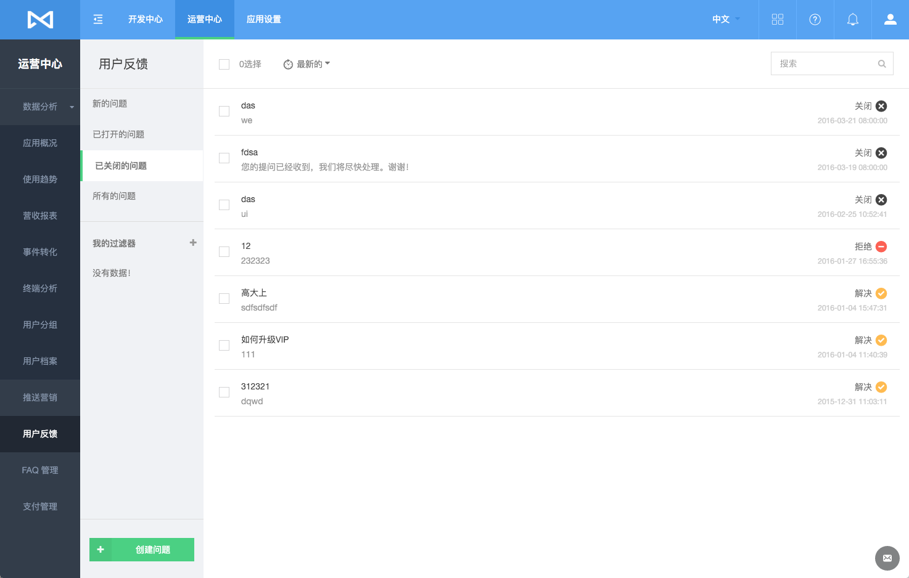
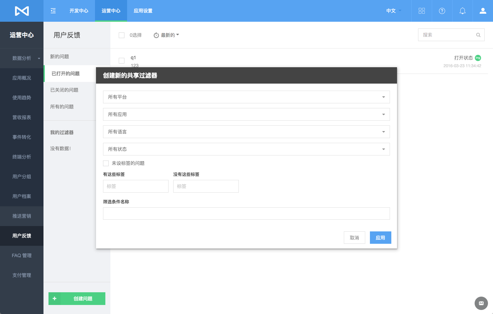
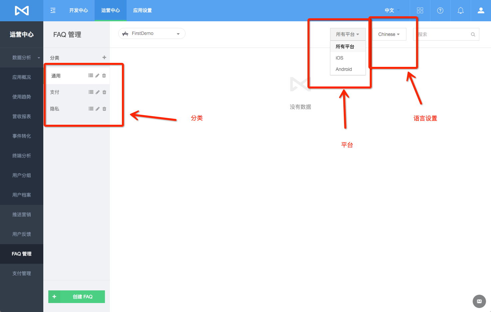
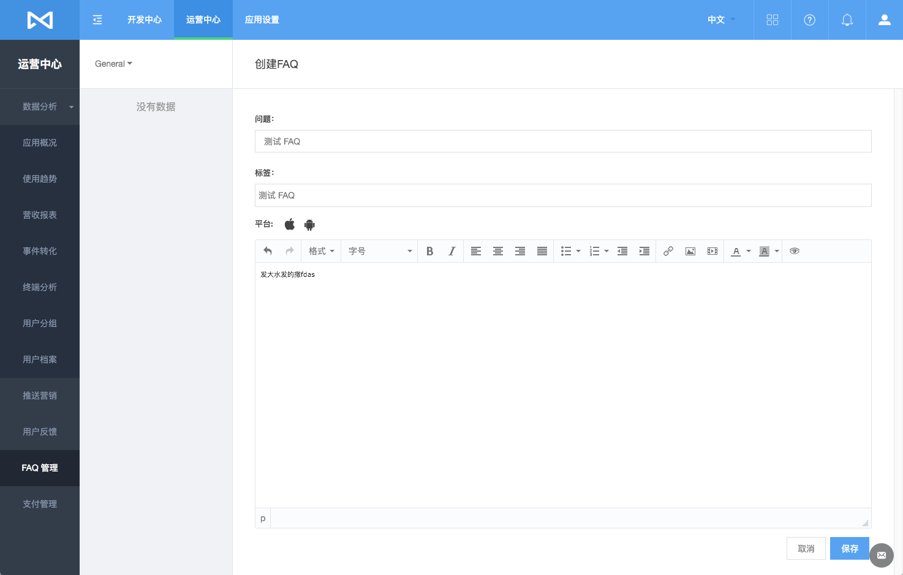

# 用户支持
## 简介
用户支持服务是 MaxLeap 为开发者提供的一套标准应用客服方案。在移动端，此方案提供完整的应用 FAQ 的显示页面及用户反馈对话页面。在 Console 端，用户支持服务提供应用 FAQ 的管理及用户反馈的处理界面。

## 用户反馈

### 查看用户反馈列表
用户反馈被分为以下几个分类：

* 新的问题：包含未被查看的
* 待解决问题：包含正在与用户沟通解决中的问题
* 已关闭问题：包含已经解决的历史问题
* 所有问题

列表中，您可以看见每个问题的概况：问题标题，来自于哪个应用，处理状态及使用的语言。

此外，您还可以通过添加**过滤器**，对反馈进行筛选：

### 处理用户反馈

选中反馈后，您可以进入该反馈的详情页面，在这里您能发现：

* 该用户提出的所有其他反馈列表
* 与用户沟通的文本对话框：您在此处提交的消息讲实时地发送至用户的客户端
* 反馈来源：从哪个应用提交
* 标签：您可以通过为该问题加上标签，进行分类，以便在创建过滤器时使用

注意：

在与用户沟通，处理反馈时，您可以插入图片或FAQ（FAQ详细介绍请见下文）

## 应用 FAQ 管理
### 查看应用 FAQ 列表
所有的应用 FAQ 都会被存放在不同的分类中，并且分类数据会在客户端与 Console 之间自动同步。

* FAQ 区分不同语言
* FAQ 类别，MaxLeap 默认创建：通用，支付及隐私三个类别
* FAQ 区分不同平台

您可以通过点击 FAQ 分类列表上方的"＋"摁钮，添加自定义的 FAQ 分类。此外，您还可以拖动，修改和删除任意分类。

### 添加应用 FAQ

在某个分类下点击“创建 FAQ”，您便可以在该分类下添加 FAQ.

## FAQ
内容更新中

## SDK 开发指南

[iOS开发指南](ML_DOCS_GUIDE_LINK_PLACEHOLDER_IOS#SUPPORT_ZH)

[Android开发指南](ML_DOCS_GUIDE_LINK_PLACEHOLDER_ANDROID#SUPPORT_ZH)
