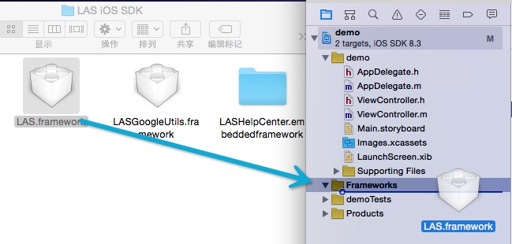
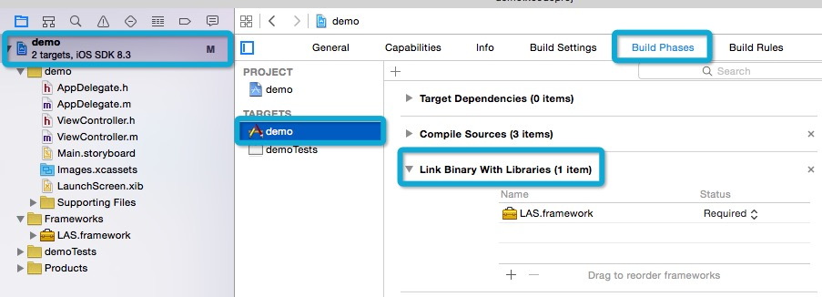
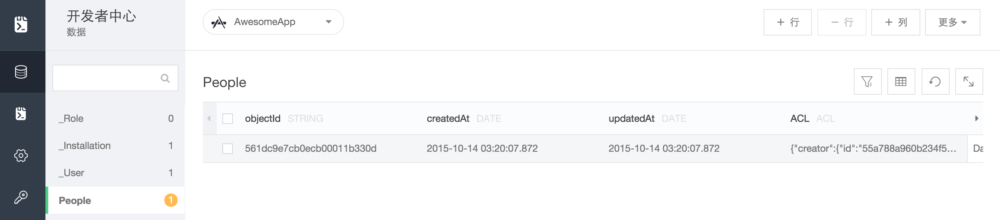

# 安装SDK

1. 下载并解压缩 SDK

	请确认您使用的是Xcode最新版本（5.0+），目标平台为iOS 6.0 或者更高版本。

	<a class="download-sdk" href="https://raw.githubusercontent.com/LeapAppServices/LAS-SDK-Release/master/iOS/v1.5.0/LASAll-v1.5.0.zip">下载SDK</a>

2. 添加SDK到您的应用

	将下载的 `MaxLeap.framework` 拖至Xcode项目目标文件夹下。确保已勾选“Copy items to destination’s group folder”的复选框。
	
	<p class="image-wrapper">
	

3. 添加依赖

	点击Targets→应用名→“Build Phases”栏。</br>
	将“Link Binary With Libraries”如下图展开。
	
	<p class="image-wrapper">
	
	
    确保“Enable Modules (C and Objective-C)” 和 “Link Frameworks Automatically”的生成设置为Yes。
    
    <p class="image-wrapper">
    
    
	点击“Link Binary With Libraries”左下角+号按钮，添加下列框架：
	
	MobileCoreServices.framework</br>
	CoreTelephony.framework</br>
	SystemConfiguration.framework</br>
	libsqlite3.dylib</br>
	libz.dylib</br>

# 连接云端应用

打开AppDelegate.m文件，并将如下import添加到文件顶部：

```objc
#import <MaxLeap/MaxLeap.h>
```

然后将以下代码复制到 `application:didFinishLaunchingWithOptions:` 方法中：

```objc
[MaxLeap setApplicationId:@"your_application_id" clientKey:@"your_client_id"];
```

把 `your_application_id` 和 `your_client_id ` 替换成您自己的 MaxLeap 应用的。

编译并运行！


# 测试是否可以连接到 MaxLeap 服务器

为了检测是否可以连接 MaxLeap 云服务和目标应用，我们可以在 `appDelegate.m` 的 `application:didFinishLaunchingWithOptions:` 方法中加入以下代码：


```objc
#import <MaxLeap/MaxLeap.h>

- (BOOL)application:(UIApplication *)application didFinishLaunchingWithOptions:(NSDictionary *)launchOptions
{
[MaxLeap setApplicationId:@"your_application_id" clientKey:@"your_client_key"];

// 创建一条数据
MLObject *testObject = [MLObject objectWithClassName:@"Person"];
testObject[@"Name"] = @"David Wang";
[MLDataManager saveObjectInBackground:testObject block:nil];
```

这段代码目的是在云端创建一条类名为 `Person` 的数据。如果云端还没有 `Person` 这个类，则会先创建这个类，然后再插入数据。

运行您的应用。然后可以在 开发者中心 -> 云存储 中看到刚创建的数据。


