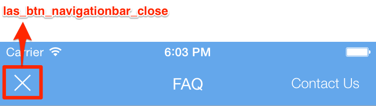
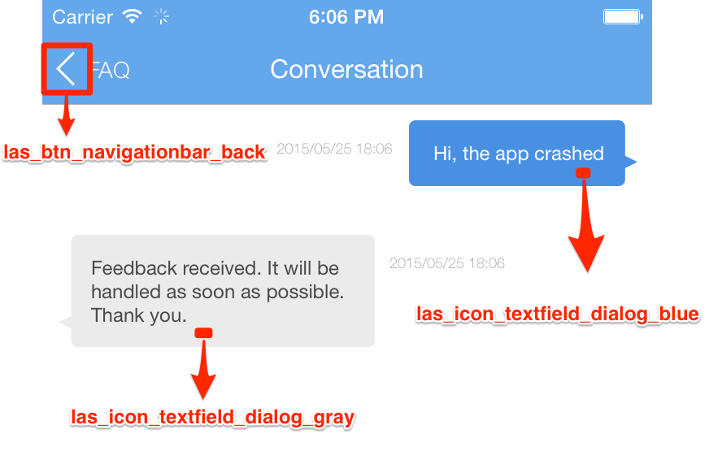
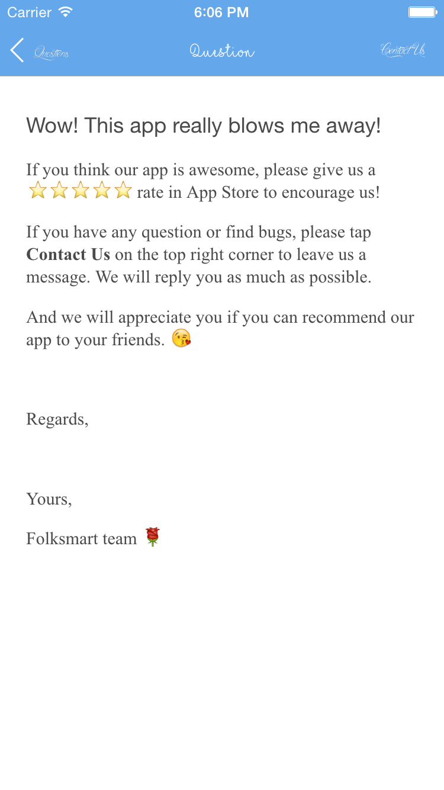

#支持
##简介
Support服务是MaxLeap为开发者提供的一套标准应用客服方案。在客户端，此方案提供完整的FAQ的显示页面及问题反馈对话页面。在Console端，Support服务提供FAQ的管理及用户反馈的处理界面。

## 准备工作

1. 安装并配置MaxLeap Core SDK. 详细步骤，请查看[QuickStart - Core SDK](ML_DOCS_LINK_PLACEHOLDER_SDK_QUICKSTART_IOS)
2. 安装并配置HelpCenter SDK. 详细步骤，请查看[QuickStart - HelpCenter](ML_DOCS_LINK_PLACEHOLDER_SDK_QUICKSTART_IOS)

## 展示 FAQ 页面

1. 调用下面的方法展示 FAQ 界面
	
	```
	[[MLHelpCenter sharedInstance] showFAQs:self]; // self 为弹出 App Issues 界面的 ViewController
	```

2. 调出问题反馈界面

	在 FAQ 界面的右上角会有一个按钮 Contact Us，点击后会进入问题界面。
	
	你也可以在任何有需要的地方调用下面的代码直接进入问题反馈界面：

	```
	[[MLHelpCenter sharedInstance] showConversation:self]; // self 为弹出 App Issues 界面的 ViewController
	```

## 自定义 UI

### 简介

你可以改变 SDK UI 的字体、颜色和背景图片。这些可以通过编辑一个 .plist 文件做到。

### 开始自定义

在 HelpCenter.emmbeddedframework 中有三个 bundle: 

**LASHCThemes.bundle**        | 字体、颜色、图片等设置
:-----------------------------|:----------------------------------
**LASHCImages.bundle**        | 图片资源
**LASHCLocalization.bundle**  | SDK 界面使用的 strings 文件，用于本地化

SDK 的 UI 自定义是通过编辑 LASHCThemes.bundle/HelpCenterTheme.plist 文件来完成的. <br>
请确保项目中加入了 LASHCThemes.bundle 并且存在 HelpCenterTheme.plist 这个文件。<br>

**颜色** | 颜色以十六进制的格式指定，例如：FF0000 是红色
:--------|:----------
**图片** | 图片需要在 LASHCImages.bundle 里面，你可以通过图片的文件名来指定。<br> LASHelpCenter 支持 iOS image naming convention(例如：在 retina 屏幕上使用 @2x 的图片，如果能找到的话)。
**字体** | 你可以通过查阅 [iosfons.com](http://iosfonts.com/) 来获取不同版本 iOS 上可用的字体。

[using custom fonts]: #using_custom_fonts

<aside class="notice">
    <span class="icon"></span>
    <span class="text">
        **注意：字体大小和字体名字必须同时设置**<br>
        字体大小需要根据字体设置，否则文字显示可能会变得奇怪。
    </span>
</aside>

### Navigation Bar

这些属性会应用到所有界面的导航栏上。

**Title font name** 					| NavigationBar Title 的字体
:--------------------------------------|:----------------------------------
**Title font size** 					| Navigation bar 的 title 字体大小。它是一个无单位的数字，例如：18。
**Title color**     					| Navigation bar 的 title 颜色。
**Background color**					| Navigation bar 背景颜色
**Bar button font name**				| Navigation bar 上按钮的字体。
**Bar button font size**				| Navigation bar 上按钮的字体大小。它是一个无单位的数字。
**Bar button text color**				| Navigation bar 上按钮的文字颜色。
**Contact us button image**				| Contact Us 按钮的图标。默认情况下，这个按钮只显示文字 "Contact Us" 。
**Contact us button image highlighted**| Contact Us 按钮高亮时的图标。

还有一些只能在 iOS 6 上生效的属性：

**Title shadow color (iOS 6)**			| Navigation bar 的 title 阴影颜色，只在 iOS 6 上生效。
:--------------------------------------|:--------------------------------
**Title shadow offset (iOS 6)**			| Navigation bar 的 title 阴影偏移量，只在 iOS 6 上生效。
**Background image (iOS 6)**			| Navigation bar 背景图片，只在 iOS 6 上生效。
**Background image landscape (iOS 6)** | 用于横屏时 navigation bar 的背景图片，只在 iOS 6 上生效。
**Bar shadow image name (iOS 6)**		| Navigation bar 阴影图片，只在 iOS 6 上生效。


#### Title Images

除了上面的一些应用于全局的 navigation bar 的一些属性，你还可以为每个界面设置不同的 title image 来替换以文字方式显示的标题。能够设置 title image 的界面有以下五个：

1. **FAQ section list view**:      FAQ section 列表界面
2. **FAQ item list view**:         FAQ item 列表界面，就是进入一个 section 之后的界面
3. **FAQ item content view**:      显示一条 FAQ 内容的界面
4. **New conversation view**:      新建回话界面
5. **Conversation view**:          会话界面

在 .plist 文件中相应条目下都有 **Title image** 这个字段，对其指定一个图片名字就可以将相应的界面的标题文字换成图片。


### Conversation View

可以设置会话界面的消息框背景和消息字体、颜色等。

**Title image**             | 会话界面的标题图片
:---------------------------|:-------------------
**Message text font name**  | 消息文本字体
**Message text font size**  | 消息文本字体大小
**Message text color left** | 左侧消息文本颜色
**Message text color right**| 右侧消息文本颜色
**Date text font name**     | 表示消息日期的文字字体
**Date text font size**     | 表示消息日期的文字文字字体大小
**Date text color**         | 表示消息日期的文字颜色


### Using custom image bundle

**Image bundle name**: 自定义的图片包的相对于 main bundle 的相对路径，例如: LASHCImages.bundle。

部分图片名字对照图：




### <span id="using_custom_fonts">使用自定义字体</span>

1. 把字体文件添加到项目中。在应用 info.plist 文件中添加一个键 "Fonts provided by application"。在这个键下面，列出你想要在应用中使用的所有的字体的名字。
    

2. 复制字体全名。字体全名可以在字体文件简介中获取。选中字体文件，按下 <kbd>COMMAND ⌘</kbd>+<kbd>I</kbd>(查看简介) 可以打开字体简介面板。
    

3. 把字体名字粘贴到 LASHCThemes.bundle/HelpCenterTheme.plist 需要的地方。
    

4. 在模拟器中测试字体。错误的字体名字将被 SDK 忽略。
    
